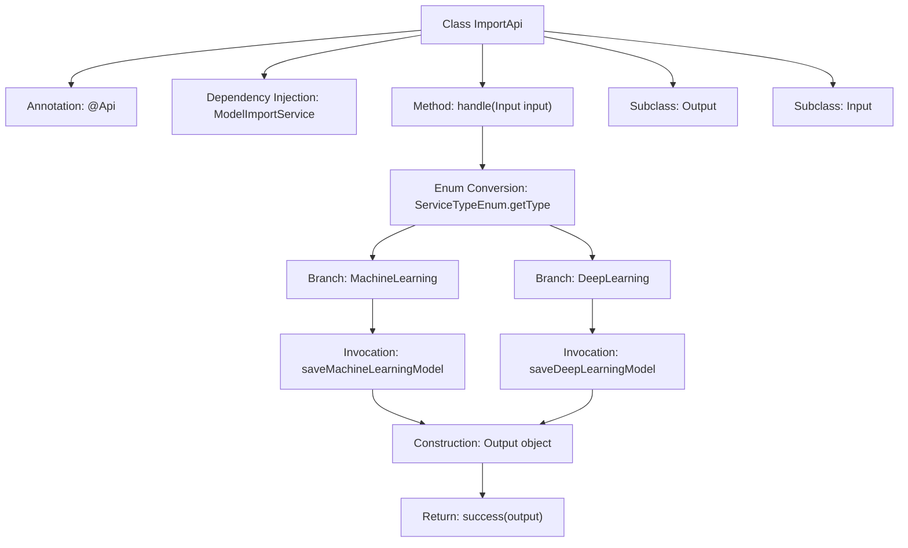

# Basic Information

|      |      |
|------|------|
| Name | ImportApi |
| Language | .java |
| Code Path | WeFe/serving/serving-service/src/main/java/com/welab/wefe/serving/service/api/model/ImportApi.java |
| Package Name | com.welab.wefe.serving.service.api.model |
| Dependencies | ['com.welab.wefe.common.fieldvalidate.annotation.Check', 'com.welab.wefe.common.web.api.base.AbstractApi', 'com.welab.wefe.common.web.api.base.Api', 'com.welab.wefe.common.web.dto.AbstractApiInput', 'com.welab.wefe.common.web.dto.ApiResult', 'com.welab.wefe.serving.service.enums.ServiceTypeEnum', 'com.welab.wefe.serving.service.service.model.ModelImportService', 'org.springframework.beans.factory.annotation.Autowired'] |
| Brief Description | API class for importing model files, which invokes different methods to save models based on service types and returns the model ID. Input requires file name, service type, and model name. |

# Description

The code defines an API class named ImportApi, which is used for importing model files. It inherits from AbstractApi, accepts an Input parameter, and returns an Output result. The Input includes required fields: file name, service type, and model name. Depending on the service type (machine learning or deep learning), it invokes different modelImportService methods to save the model and returns the generated ID. The Output contains an ID field. The API path is "model/import", and its name is "Import Model File".

# Class Summary

| Name   | Type  | Description |
|-------|------|-------------|
| ImportApi | class | API class for importing model files, which invokes different methods to save models based on service types and returns the model ID. Input requires file name, service type, and name. |


## Class ImportApi

|      |      |
|------|------|
| Access Modifier | @Api(path = "model/import", name = "导入模型文件", desc = "导入模型文件");public |
| Type | class |
| Name | ImportApi |
| Description | API class for importing model files, which invokes different methods to save models based on service types and returns the model ID. Input requires file name, service type, and name. |


### UML Class Diagram

```mermaid
classDiagram
    class ImportApi {
        -ModelImportService modelImportService
        +handle(Input input) ApiResult~Output~
    }
    <<Interface>> ImportApi
    ImportApi --> ModelImportService : depends on

    class AbstractApi~Input, Output~ {
        <<Abstract>>
    }
    ImportApi --|> AbstractApi~Input, Output~

    class ModelImportService {
        +saveMachineLearningModel(String name, String filename) String
        +saveDeepLearningModel(String name, String filename) String
    }

    class ImportApi$Output {
        -String id
        +getId() String
        +setId(String id) void
    }

    class AbstractApiInput {
        <<Abstract>>
    }
    class ImportApi$Input {
        -String filename
        -int serviceType
        -String name
        +getFilename() String
        +setFilename(String filename) void
        +getServiceType() int
        +setServiceType(int serviceType) void
        +getName() String
        +setName(String name) void
    }
    ImportApi$Input --|> AbstractApiInput

    class ServiceTypeEnum {
        <<Enumeration>>
        +MachineLearning
        +DeepLearning
        +getType(int type) ServiceTypeEnum
    }
    ImportApi --> ServiceTypeEnum : depends on
```

Class Diagram Description: The diagram illustrates the structure of the ImportApi class and its related components. ImportApi inherits from the generic class AbstractApi<Input, Output> and contains nested classes Input and Output, where Input extends AbstractApiInput. ImportApi depends on ModelImportService for model import operations and utilizes the ServiceTypeEnum enumeration to determine service types. The overall structure clearly demonstrates class relationships and data flow within the API processing workflow.


### Internal Method Call Graph



The flowchart illustrates the core processing flow of the ImportApi class. It begins with defining interface metadata through the @Api annotation and injecting the ModelImportService. The handle method invokes different model saving methods based on the service type enum from input parameters, constructs an output object, and returns a success result. The Input subclass contains three mandatory validation fields, while the Output subclass only includes an id field. The entire process implements categorized processing logic for model file imports.

### Field List

| Name  | Type  | Description |
|-------|-------|------|
| modelImportService | ModelImportService | Using @Autowired to automatically inject an instance of ModelImportService. |

### Method List

| Name  | Type  | Description |
|-------|-------|------|
| handle | ApiResult<Output> | The method invokes different model saving methods based on the input service type and returns a successful result containing the generated ID. |


