# Basic Information

|      |      |
|------|------|
| Name | ModelStatusCheckApi |
| Language | .java |
| Code Path | WeFe/serving/serving-service/src/main/java/com/welab/wefe/serving/service/api/model/ModelStatusCheckApi.java |
| Package Name | com.welab.wefe.serving.service.api.model |
| Dependencies | ['com.welab.wefe.common.fieldvalidate.annotation.Check', 'com.welab.wefe.common.web.api.base.AbstractApi', 'com.welab.wefe.common.web.api.base.Api', 'com.welab.wefe.common.web.dto.AbstractApiInput', 'com.welab.wefe.common.web.dto.AbstractApiOutput', 'com.welab.wefe.common.web.dto.ApiResult', 'com.welab.wefe.serving.service.dto.ModelStatusOutput', 'com.welab.wefe.serving.service.enums.MemberModelStatusEnum', 'com.welab.wefe.serving.service.service.ModelMemberService', 'org.springframework.beans.factory.annotation.Autowired', 'java.util.List'] |
| Brief Description | This API is used to check the model status, accepting model ID and member ID parameters, and invoking the ModelMemberService to return the model availability result. |

# Description

The code defines an API class named `ModelStatusCheckApi` for checking model status. The API path is `"model/status/check"`, which accepts input parameters including a model ID and a member ID. It checks the availability of the specified model and member through the `ModelMemberService` and returns a list of status results. The input class `Input` inherits from `AbstractApiInput` and contains two fields: a required `serviceId` and an optional `memberId`, both with getter and setter methods. The processing logic is implemented in the `handle` method, which invokes the service and returns a successful result.

# Class Summary

| Name   | Type  | Description |
|-------|------|-------------|
| ModelStatusCheckApi | class | API interface for checking model status, which receives model ID and member ID parameters, calls the service, and returns a list of available model statuses. |


## Class ModelStatusCheckApi

|      |      |
|------|------|
| Access Modifier | @Api(path = "model/status/check", name = "检查模型状态");public |
| Type | class |
| Name | ModelStatusCheckApi |
| Description | API interface for checking model status, which receives model ID and member ID parameters, calls the service, and returns a list of available model statuses. |


### UML Class Diagram

```mermaid
classDiagram
    class ModelStatusCheckApi {
        -ModelMemberService modelMemberService
        +handle(Input input) ApiResult~List~ModelStatusOutput~~
    }
    
    class AbstractApi~T, R~ {
        <<Abstract>>
        +handle(T input) ApiResult~R~
    }
    
    class ModelStatusOutput {
    }
    
    class ModelMemberService {
        +checkAvailableByModelIdAndMemberId(String serviceId, String memberId) List~ModelStatusOutput~
    }
    
    class Input {
        -String serviceId
        -String memberId
        +getServiceId() String
        +setServiceId(String serviceId)
        +getMemberId() String
        +setMemberId(String memberId)
    }
    
    class AbstractApiInput {
    }
    
    class ApiResult~T~ {
    }
    
    ModelStatusCheckApi --> AbstractApi~Input, List~ModelStatusOutput~~ : extends
    ModelStatusCheckApi --> ModelMemberService : dependency
    ModelStatusCheckApi ..> Input : nested class
    Input --> AbstractApiInput : extends
    ModelMemberService --> ModelStatusOutput : returns
    AbstractApi~T, R~ --> ApiResult~R~ : returns
```

This code demonstrates the implementation structure of a model status check API. ModelStatusCheckApi inherits from the generic abstract class AbstractApi, processes Input parameters, and returns an ApiResult containing a list of ModelStatusOutput. The core business logic is implemented through the checkAvailableByModelIdAndMemberId method of ModelMemberService. The Input class serves as a nested class inheriting from AbstractApiInput and includes fields for model ID and member ID. The overall design adopts a layered architecture, achieving service invocation through dependency injection, which aligns with standard API development patterns.


### Internal Method Call Graph

```mermaid
graph TD
    A["Class ModelStatusCheckApi"]
    B["Annotation: @Api(path='model/status/check', name='Model Status Check')"]
    C["Inheritance: AbstractApi<Input, List<ModelStatusOutput>>"]
    D["Dependency Injection: @Autowired ModelMemberService"]
    E["Overridden Method: handle(Input input)"]
    F["Invocation: modelMemberService.checkAvailableByModelIdAndMemberId"]
    G["Return: ApiResult<List<ModelStatusOutput>>"]
    H["Nested Class Input"]
    I["Field: @Check String serviceId"]
    J["Field: @Check String memberId"]
    K["Getter/Setter Methods"]

    A --> B
    A --> C
    A --> D
    A --> E
    E --> F
    F --> G
    A --> H
    H --> I
    H --> J
    H --> K
```



This flowchart illustrates the structure of the ModelStatusCheckApi class, including its class annotation, inheritance relationship, dependency-injected service, core handler method with internal invocation chain, and the composition of the nested input class Input. The handle method implements business logic by calling the ModelMemberService's method, ultimately returning encapsulated results. The nested class Input contains two fields with validation annotations and corresponding accessor methods.

### Field List

| Name  | Type  | Description |
|-------|-------|------|
| modelMemberService | ModelMemberService | Using @Autowired to automatically inject an instance of ModelMemberService. |

### Method List

| Name  | Type  | Description |
|-------|-------|------|
| handle | ApiResult<List<ModelStatusOutput>> | Method override, calls the service to check model and member availability, returns the result. |


