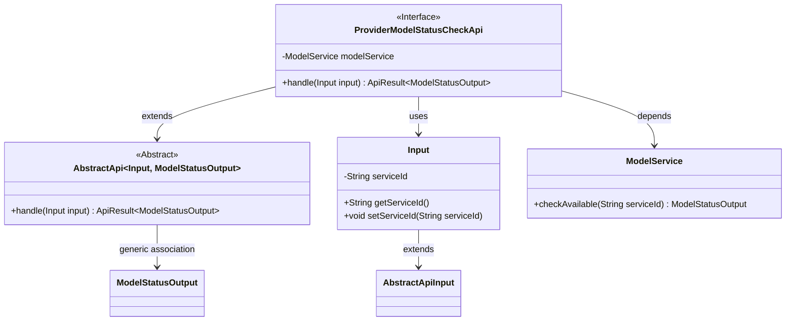
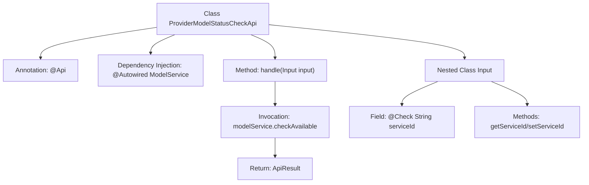

# Basic Information

|      |      |
|------|------|
| Name | ProviderModelStatusCheckApi |
| Language | .java |
| Code Path | WeFe/serving/serving-service/src/main/java/com/welab/wefe/serving/service/api/model/ProviderModelStatusCheckApi.java |
| Package Name | com.welab.wefe.serving.service.api.model |
| Dependencies | ['com.welab.wefe.common.fieldvalidate.annotation.Check', 'com.welab.wefe.common.web.api.base.AbstractApi', 'com.welab.wefe.common.web.api.base.Api', 'com.welab.wefe.common.web.api.base.Caller', 'com.welab.wefe.common.web.dto.AbstractApiInput', 'com.welab.wefe.common.web.dto.ApiResult', 'com.welab.wefe.serving.service.dto.ModelStatusOutput', 'com.welab.wefe.serving.service.service.ModelService', 'org.springframework.beans.factory.annotation.Autowired'] |
| Brief Description | This is an API provided by a collaborator for checking model status. The endpoint is model/provider/status/check, requiring signed access with the caller being Customer. The input parameter is a mandatory model ID, and the output is the model status. |

# Description

The code defines an API class named `ProviderModelStatusCheckApi` for checking model status. The API path is `model/provider/status/check`, allowing signed access with the caller being `Customer`. This API inherits from `AbstractApi`, takes an `Input` class containing the mandatory field `serviceId` as the parameter, and outputs `ModelStatusOutput`. The core logic is implemented by calling the `checkAvailable` method of `modelService`, passing the `serviceId` parameter and returning the result. The entire API encapsulates the model status check functionality for collaborators to invoke.

# Class Summary

| Name   | Type  | Description |
|-------|------|-------------|
| ProviderModelStatusCheckApi | class | The model status check interface provided by the collaborating party requires passing the model ID and returns the model availability status. It supports signed access, with the caller being Customer. |

## Class ProviderModelStatusCheckApi

|      |      |
|------|------|
| Access Modifier | @Api(path = "model/provider/status/check", name = "检查模型状态（协作方提供接口）", allowAccessWithSign = true, domain = Caller.Customer);public |
| Type | class |
| Name | ProviderModelStatusCheckApi |
| Description | The model status check interface provided by the collaborating party requires passing the model ID and returns the model availability status. It supports signed access, with the caller being Customer. |

### UML Class Diagram

This code represents an API interface implementation for checking model status, which inherits from the AbstractApi abstract class. ProviderModelStatusCheckApi performs actual status checks through the dependency-injected ModelService, with input parameters encapsulated in the inner class Input containing the mandatory serviceId field. The class diagram illustrates inheritance relationships, dependency injection, and the use of generic parameters, demonstrating clear separation of responsibilities and modular design.

### Internal Method Call Graph

This flowchart illustrates the core structure of the ProviderModelStatusCheckApi class, including API annotation configuration, dependency-injected ModelService, the main request handling method handle with its internal call to modelService.checkAvailable, and the definition of the nested input parameter class Input. The Input class contains a serviceId field with validation annotation and its getter/setter methods, collectively forming a typical Spring Boot API controller structure.

### Field List

| Name  | Type  | Description |
|-------|-------|------|
| modelService | ModelService | Automatically inject the ModelService instance. |

### Method List

| Name  | Type  | Description |
|-------|-------|------|
| handle | ApiResult<ModelStatusOutput> | This method overrides the parent class logic, invokes the model service to check the availability of the specified service ID, and returns the successful result encapsulated as an ApiResult. |

