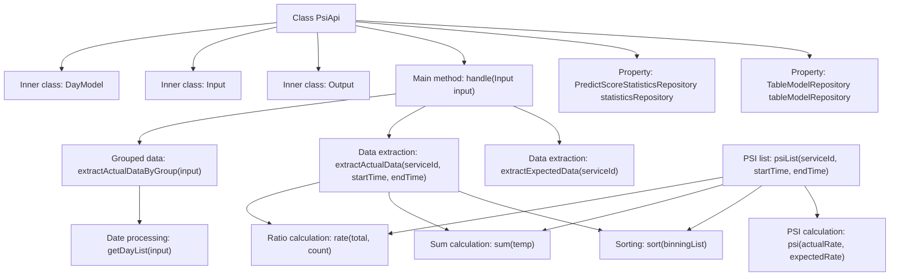

# Basic Information

|      |      |
|------|------|
| Name | PsiApi |
| Language | .java |
| Code Path | WeFe/serving/serving-service/src/main/java/com/welab/wefe/serving/service/api/model/PsiApi.java |
| Package Name | com.welab.wefe.serving.service.api.model |
| Dependencies | ['com.welab.wefe.common.fieldvalidate.annotation.Check', 'com.welab.wefe.common.util.DateUtil', 'com.welab.wefe.common.util.JObject', 'com.welab.wefe.common.web.api.base.AbstractApi', 'com.welab.wefe.common.web.api.base.Api', 'com.welab.wefe.common.web.dto.AbstractApiInput', 'com.welab.wefe.common.web.dto.AbstractApiOutput', 'com.welab.wefe.common.web.dto.ApiResult', 'com.welab.wefe.serving.service.database.entity.StatisticsSumModel', 'com.welab.wefe.serving.service.database.entity.TableModelMySqlModel', 'com.welab.wefe.serving.service.database.repository.PredictScoreStatisticsRepository', 'com.welab.wefe.serving.service.database.repository.TableModelRepository', 'org.apache.commons.compress.utils.Lists', 'org.springframework.beans.factory.annotation.Autowired', 'java.math.BigDecimal', 'java.util', 'java.util.stream.Collectors'] |
| Brief Description | Model Stability Metrics API Class, handling input and output data, calculating PSI values, including expected and actual data extraction and grouped statistics functionality. |

# Description

The code defines a class named `PsiApi` for calculating and returning the model stability metric (PSI). This class inherits from `AbstractApi`, processes input parameters, and generates output results containing expected data, actual data, and grouped data. Key functionalities include extracting binning information from a database, calculating the ratio between actual and expected distributions, sorting data, formatting dates, and computing PSI values. Input parameters consist of a service ID, time range, and period step, while the output includes expected distributions, actual distributions, and time-grouped data. The code also includes helper methods for data processing, sorting, ratio calculation, and date formatting.

# Class Summary

| Name   | Type  | Description |
|-------|------|-------------|
| PsiApi | class | The PsiApi class is used to calculate model stability metrics, process input data, and return comparisons between expected and actual results. It includes functionalities for data extraction, sorting, grouping, and PSI calculation. |


## Class PsiApi

|      |      |
|------|------|
| Access Modifier | @Api(path = "model/psi", name = "模型稳定性指标", desc = "模型稳定性指标");public |
| Type | class |
| Name | PsiApi |
| Description | The PsiApi class is used to calculate model stability metrics, process input data, and return comparisons between expected and actual results. It includes functionalities for data extraction, sorting, grouping, and PSI calculation. |


### UML Class Diagram

```mermaid
classDiagram
    class PsiApi {
        -TableModelRepository tableModelRepository
        -PredictScoreStatisticsRepository statisticsRepository
        +handle(PsiApi~Input~ input) ApiResult~PsiApi~Output~~
        -extractActualData(String serviceId, Date startTime, Date endTime) List~List~Object~~
        -sort(List~StatisticsSumModel~ count) List~StatisticsSumModel~
        -getBinningInfo(String serviceId, Date startTime, Date endTime) List~StatisticsSumModel~
        -extractActualDataByGroup(PsiApi~Input~ input) List~Object~
        -rate(int total, double count) double
        +psiList(String serviceId, Date startTime, Date endTime) List~List~Object~~
        -psi(double actual, double expected) double
        -subtract(double actual, double expected) double
        -ln(double actual, double expected) double
        -sum(List~StatisticsSumModel~ count) int
        -formatDate(Date date) String
        -getDayList(PsiApi~Input~ input) List~DayModel~
        -extractExpectedData(String serviceId) List~List~Object~~
        -extractYAxis2(JObject result, String key) double
        -extractYAxis(JObject result, String key) int
        -extractXAxis(List~Double~ dataKey, int i, Double key) String
        -extractXAxis2(List~StatisticsSumModel~ dataKey, int i, Double key) String
        -newScale(double value, int scale) double
    }

    class PsiApi~Input~ {
        -String serviceId
        -Date startTime
        -Date endTime
        -int step
        +getServiceId() String
        +setServiceId(String serviceId)
        +getStartTime() Date
        +setStartTime(Date startTime)
        +getEndTime() Date
        +setEndTime(Date endTime)
        +getStep() int
        +setStep(int step)
    }

    class PsiApi~Output~ {
        -Object expected
        -Object actual
        -Object dataGrid
        +getExpected() Object
        +setExpected(Object expected)
        +getActual() Object
        +setActual(Object actual)
        +getDataGrid() Object
        +setDataGrid(Object dataGrid)
        +create(Object expected, Object actual, Object dataGrid) PsiApi~Output~
    }

    class DayModel {
        -Date startTime
        -Date endTime
        +getStartTime() Date
        +setStartTime(Date startTime)
        +getEndTime() Date
        +setEndTime(Date endTime)
        +of(Date beginTime, Date endTime) DayModel
    }

    class AbstractApi~T~Input~, ~R~Output~~ {
        <<Interface>>
    }

    class AbstractApiOutput {
        <<Interface>>
    }

    class AbstractApiInput {
        <<Interface>>
    }

    class TableModelRepository {
        <<Interface>>
        +findOne(String field, String value, Class~T~ clazz) T
    }

    class PredictScoreStatisticsRepository {
        <<Interface>>
        +countBy(String serviceId, Date startTime, Date endTime) List~StatisticsSumModel~
    }

    PsiApi --> AbstractApi : Implements
    PsiApi~Input~ --> AbstractApiInput : Implements
    PsiApi~Output~ --> AbstractApiOutput : Implements
    PsiApi --> TableModelRepository : Depends on
    PsiApi --> PredictScoreStatisticsRepository : Depends on
    PsiApi --> DayModel : Uses
```

This code implements an API service for calculating the Population Stability Index (PSI). The PsiApi class inherits from AbstractApi, processes input (Input) and output (Output) data, and primarily includes functionalities such as extracting expected data (extractExpectedData) and actual data (extractActualData) from the database, calculating PSI values (psi), and processing data by time groups (extractActualDataByGroup). The class diagram illustrates the core classes and their relationships, including the input/output data structures, the utility class DayModel, and the Repository interfaces for database interactions.


### Internal Method Call Graph



This code implements a Population Stability Index (PSI) calculation service. Its core functionalities include: processing input parameters via the handle method, extracting expected data (extractExpectedData), actual data (extractActualData), and grouped data (extractActualDataByGroup). The key computational logic involves data sorting, summation, ratio calculation, and PSI value computation, where PSI is derived from the difference and logarithmic operation between actual and expected ratios. The code also includes auxiliary functions like date processing and data formatting, with three inner classes (Output/Input/DayModel) encapsulating data structures and parameters. The overall implementation adopts a streaming processing and functional programming style, featuring clear structure but relatively complex computational logic.

### Field List

| Name  | Type  | Description |
|-------|-------|------|
| tableModelRepository | TableModelRepository | Automatically inject the TableModelRepository instance. |
| statisticsRepository | PredictScoreStatisticsRepository | Automated Injection Prediction Score Statistics Repository Instance. |

### Method List

| Name  | Type  | Description |
|-------|-------|------|
| extractExpectedData | List<List<Object>> | The method queries model data from the database by serviceId and returns an empty list if no data or null is found. It parses the bin_result in JSON, extracts the sorted numeric keys, and iterates to generate a two-dimensional list containing X-axis, Y-axis 1, and Y-axis 2 data for return. |
| subtract | double | This method calculates the difference between two double-precision floating-point numbers, returning the result of the actual value minus the expected value. |
| psiList | List<List<Object>> | The method `psiList` retrieves binned data based on the service ID and time range, sorts it, and calculates the sum. After querying the model data, it iterates through the binned results to compute the actual ratio, expected ratio, and PSI value, ultimately returning a list containing the bin points, counts, ratios, and PSI. |
| rate | double | Calculate the ratio, return 0 if the total is 0, otherwise return the result of count divided by total. |
| getDayList | List<DayModel> | This method generates a list of dates based on the input parameters. Starting from the initial time, it iteratively increments the days by the specified step size, producing a list of DayModel objects that includes both the start and end times, until the end time is exceeded. The resulting list is then returned. |
| extractActualData | List<List<Object>> | Extract statistics for the specified service within a given time period, sort them, calculate the total, and generate a list containing the X-axis, counts, and ratios. |
| handle | ApiResult<Output> | Rewrite the handle method to process the input and return an output containing expected data, actual data, and grouped data. |
| sum | int | This method takes a list of StatisticsSumModel, uses stream processing to convert the count value of each element into an integer and sums them up, then returns the total. |
| extractYAxis | int | This method extracts the value of a specified key from a JSON object and returns the integer value of its "count" field. |
| ln | double | Calculate the natural logarithm ratio of actual values to expected values, ignoring zero-value handling. |
| sort | List<StatisticsSumModel> | This method sorts the input list of statistical models by segmentation points and returns the sorted list. |
| main | void | Java code snippet: Calculate the difference between the actual value and the expected value multiplied by the logarithmic ratio. If the actual value is 0, set it to 0.1, and output the (temp * ln) result. |
| extractActualDataByGroup | List<Object> | The method retrieves a list of dates through input parameters, converts each date into a mapping containing formatted start times and corresponding PSI lists, and ultimately returns a list of mappings. |
| extractYAxis2 | double | This method extracts the value of a specified key from a JSON object, retrieves the "count_rate" field, converts it to a double-precision number, and finally calls the newScale method to round it to two decimal places before returning. |
| extractXAxis2 | String | Extract the X-axis range string, generate formatted intervals based on the previous point and the current point, retaining 3 decimal places. |
| newScale | double | The method newScale rounds a double value to the specified decimal places using BigDecimal's ROUND_HALF_UP mode. |
| getBinningInfo | List<StatisticsSumModel> | Retrieve the statistical summary data list for the specified service ID and time range. |
| psi | double | Calculate the difference between the actual value and the expected value multiplied by the natural logarithm of both. |
| formatDate | String | This method converts a Date object into a date string in the specified format, using the YYYY-MM-DD format. |
| extractXAxis | String | Extract X-axis range string: Based on the data list and index, generate a formatted interval from the previous value to the current value (retaining 3 decimal places). If it is the first item, the previous value defaults to 0.0. |


