# Basic Information

|      |      |
|------|------|
| Name | QueryApi |
| Language | .java |
| Code Path | WeFe/serving/serving-service/src/main/java/com/welab/wefe/serving/service/api/model/QueryApi.java |
| Package Name | com.welab.wefe.serving.service.api.model |
| Dependencies | ['java.util.Date', 'org.springframework.beans.factory.annotation.Autowired', 'com.welab.wefe.common.fieldvalidate.annotation.Check', 'com.welab.wefe.common.web.api.base.AbstractApi', 'com.welab.wefe.common.web.api.base.Api', 'com.welab.wefe.common.web.dto.AbstractApiInput', 'com.welab.wefe.common.web.dto.ApiResult', 'com.welab.wefe.common.wefe.enums.Algorithm', 'com.welab.wefe.common.wefe.enums.FederatedLearningType', 'com.welab.wefe.common.wefe.enums.JobMemberRole', 'com.welab.wefe.common.wefe.enums.PredictFeatureDataSource', 'com.welab.wefe.serving.service.dto.PagingInput', 'com.welab.wefe.serving.service.dto.PagingOutput', 'com.welab.wefe.serving.service.service.ModelService'] |
| Brief Description | The QueryApi class is used for paginated querying of model data, including input parameters such as model ID, algorithm type, federated learning type, creator, and name. It outputs model details such as ID, service ID, name, algorithm, etc. |

# Description

The code defines an API class named QueryApi for querying model information. The API path is "model/query", which inherits from AbstractApi, with QueryApi.Input as the input and paginated QueryApi.Output as the output. The Input class includes query parameters such as model ID, algorithm type, federated learning type, creator, and model name, all annotated with validation annotations. The Output class contains detailed information such as model ID, service ID, name, algorithm type, federated learning type, creator, model parameters, creation time, update time, user role, feature data source, and enabled status. The API processes query requests through the injected ModelService and returns paginated results. All fields are provided with getter and setter methods.

# Class Summary

| Name   | Type  | Description |
|-------|------|-------------|
| QueryApi | class | The QueryApi class is used to query model information, including input parameters (model ID, algorithm type, federated learning type, etc.) and output results (model ID, service ID, name, algorithm type, etc.). It processes query requests through ModelService and returns paginated results. |


## Class QueryApi

|      |      |
|------|------|
| Access Modifier | @Api(path = "model/query", name = "Get model");public |
| Type | class |
| Name | QueryApi |
| Description | The QueryApi class is used to query model information, including input parameters (model ID, algorithm type, federated learning type, etc.) and output results (model ID, service ID, name, algorithm type, etc.). It processes query requests through ModelService and returns paginated results. |


### UML Class Diagram

```mermaid
classDiagram
    class QueryApi {
        -ModelService modelService
        +handle(Input input) ApiResult~PagingOutput~Output~~
    }
    class Input {
        -String modelId
        -Algorithm algorithm
        -FederatedLearningType flType
        -String creator
        -String name
        +getModelId() String
        +setModelId(String modelId) void
        +getAlgorithm() Algorithm
        +setAlgorithm(Algorithm algorithm) void
        +getFlType() FederatedLearningType
        +setFlType(FederatedLearningType flType) void
        +getCreator() String
        +setCreator(String creator) void
        +getName() String
        +setName(String name) void
    }
    class Output {
        -String id
        -String serviceId
        -String name
        -Algorithm algorithm
        -FederatedLearningType flType
        -String creator
        -String modelParam
        -Date createdTime
        -Date updatedTime
        -JobMemberRole myRole
        -PredictFeatureDataSource featureSource
        -boolean enable
        // Omitted getter/setter methods
    }
    class ModelService {
        +query(Input input) PagingOutput~Output~
    }
    class PagingInput {
        <<Abstract>>
    }
    class AbstractApiInput {
        <<Abstract>>
    }
    class PagingOutput~T~ {
        <<Generic>>
    }
    class ApiResult~T~ {
        <<Generic>>
    }

    QueryApi --> ModelService : Dependency
    QueryApi --|> AbstractApi~Input, PagingOutput~Output~~
    Input --|> PagingInput
    Output --|> AbstractApiInput
    ModelService ..> Input : Uses
    ModelService ..> Output : Uses
```

This code demonstrates the implementation of a model query API, including the QueryApi class with its nested Input and Output classes. QueryApi inherits from the generic abstract class AbstractApi and relies on ModelService for actual query operations. The Input class extends PagingInput containing query parameters, while the Output class extends AbstractApiInput containing response fields. The class diagram clearly illustrates inheritance, dependency relationships between classes, and the use of generic parameters, reflecting a layered architecture design.


### Internal Method Call Graph

```mermaid
graph TD
    A["Class QueryApi"]
    B["Annotation: @Api(path='model/query', name='Get model')"]
    C["Inheritance: AbstractApi<Input, PagingOutput<Output>>"]
    D["Dependency Injection: @Autowired ModelService modelService"]
    E["Overridden Method: handle(Input input)"]
    F["Inner Class: Input"]
    G["Inner Class: Output"]
    H["Input Properties: String modelId, Algorithm algorithm, FederatedLearningType flType, String creator, String name"]
    I["Output Properties: String id, String serviceId, String name, Algorithm algorithm, FederatedLearningType flType, String creator, String modelParam, Date createdTime, Date updatedTime, JobMemberRole myRole, PredictFeatureDataSource featureSource, boolean enable"]
    J["Input Methods: getter/setter"]
    K["Output Methods: getter/setter"]

    A --> B
    A --> C
    A --> D
    A --> E
    A --> F
    A --> G
    F --> H
    F --> J
    G --> I
    G --> K
    E --> D
    E --> F
    E --> G
```



This code defines an API class named QueryApi for handling model query requests. The class inherits from AbstractApi, with generics specifying the input type as inner class Input and output type as paginated Output. Its primary functionality is processing query requests through the injected ModelService. The Input class contains query conditions like model ID and algorithm type, while the Output class includes model details such as creation time and role permissions. The flowchart illustrates the class structure, inheritance relationships, dependency injection, and organization of inner class properties/methods.

### Field List

| Name  | Type  | Description |
|-------|-------|------|
| modelService | ModelService | Using @Autowired to automatically inject an instance of ModelService. |

### Method List

| Name  | Type  | Description |
|-------|-------|------|
| handle | ApiResult<PagingOutput<Output>> | Java method override, calling modelService.query to process the input and return paginated results. |


