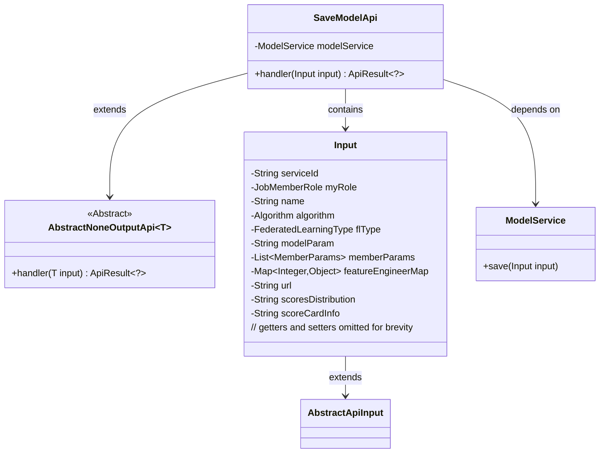
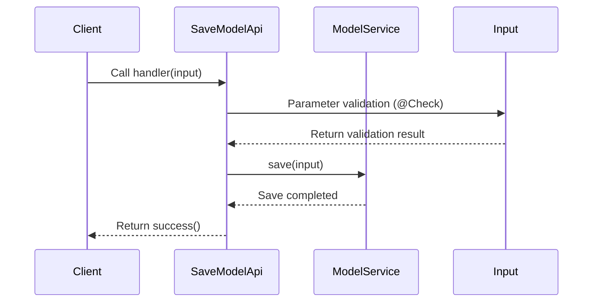

# Basic Information

|      |      |
|------|------|
| Name | SaveModelApi |
| Language | .java |
| Code Path | WeFe/serving/serving-service/src/main/java/com/welab/wefe/serving/service/api/model/SaveModelApi.java |
| Package Name | com.welab.wefe.serving.service.api.model |
| Dependencies | ['java.util.List', 'java.util.Map', 'org.springframework.beans.factory.annotation.Autowired', 'com.welab.wefe.common.fieldvalidate.annotation.Check', 'com.welab.wefe.common.web.api.base.AbstractNoneOutputApi', 'com.welab.wefe.common.web.api.base.Api', 'com.welab.wefe.common.web.api.base.Caller', 'com.welab.wefe.common.web.dto.AbstractApiInput', 'com.welab.wefe.common.web.dto.ApiResult', 'com.welab.wefe.common.wefe.enums.Algorithm', 'com.welab.wefe.common.wefe.enums.FederatedLearningType', 'com.welab.wefe.common.wefe.enums.JobMemberRole', 'com.welab.wefe.serving.service.dto.MemberParams', 'com.welab.wefe.serving.service.service.ModelService'] |
| Brief Description | API interface for saving model information, including required parameters such as model ID, role, algorithm, federated learning type, etc., which calls the ModelService to save the data. |

# Description

The code defines an API class named `SaveModelApi`, which is used to save model information. The API path is `model_save`, allowing access with a signature and belonging to the `Caller.Board` domain. The class inherits from `AbstractNoneOutputApi` and uses `ModelService` to process input data. The input class `Input` includes multiple required and optional fields, such as model ID, role, algorithm type, federated learning type, model parameters, member parameters, etc., and provides corresponding getter and setter methods. The processing logic involves calling `modelService` to save the input data and return a success result.

# Class Summary

| Name   | Type  | Description |
|-------|------|-------------|
| SaveModelApi | class | The SaveModelApi class is used to save model information, including mandatory fields such as model ID, algorithm, federated learning type, etc. It saves the input data through the ModelService and returns a successful result. |

## Class SaveModelApi

|      |      |
|------|------|
| Access Modifier | @Api(;        path = "model_save",;        name = "保存模型信息",;        allowAccessWithSign = true,;        domain = Caller.Board;);public |
| Type | class |
| Name | SaveModelApi |
| Description | The SaveModelApi class is used to save model information, including mandatory fields such as model ID, algorithm, federated learning type, etc. It saves the input data through the ModelService and returns a successful result. |

### UML Class Diagram

This code describes a model-saving API class `SaveModelApi`, which inherits from the generic class `AbstractNoneOutputApi` with `Input` specified as the parameter type. `SaveModelApi` saves model data through `ModelService`, and its input parameter `Input` is a nested class containing multiple validation fields, inheriting from `AbstractApiInput`. The class diagram illustrates inheritance relationships, dependency relationships, and composition relationships, clearly presenting the interaction patterns between components.

### Internal Method Call Graph

```mermaid
graph TD
    A["Class SaveModelApi"]
    B["Annotation: @Api"]
    C["Inheritance: AbstractNoneOutputApi<Input>"]
    D["Dependency Injection: @Autowired ModelService"]
    E["Overridden Method: handler(Input input)"]
    F["Inner Class: Input"]
    G["Inheritance: AbstractApiInput"]
    H["Validation Annotation: @Check"]
    I["Fields: serviceId/myRole/name etc."]
    J["getter/setter methods"]

    A --> B
    A --> C
    A --> D
    A --> E
    A --> F
    F --> G
    F --> H
    F --> I
    F --> J
    E --> D
    E --> F
```

This code implements a model saving API, primarily consisting of the SaveModelApi class and its inner Input class. The flowchart illustrates class structure relationships including annotations, inheritance, dependency injection, etc. The sequence diagram depicts the API call flow: client request → parameter validation → service layer saving → result return. The Input class encapsulates model-related parameters with @Check annotation for validation, and all fields follow standard getter/setter conventions. This design achieves separation of business logic from parameter validation, adhering to the Single Responsibility Principle.

### Field List

| Name  | Type  | Description |
|-------|-------|------|
| modelService | ModelService | Using @Autowired to automatically inject an instance of ModelService. |

### Method List

| Name  | Type  | Description |
|-------|-------|------|
| handler | ApiResult<?> | Rewrite the handler method to call modelService for saving input data and return a successful result. |

