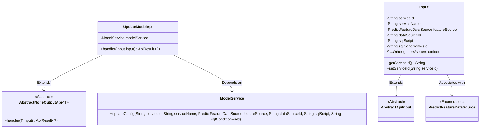

# Basic Information

|      |      |
|------|------|
| Name | UpdateModelApi |
| Language | .java |
| Code Path | WeFe/serving/serving-service/src/main/java/com/welab/wefe/serving/service/api/model/UpdateModelApi.java |
| Package Name | com.welab.wefe.serving.service.api.model |
| Dependencies | ['com.welab.wefe.common.exception.StatusCodeWithException', 'com.welab.wefe.common.fieldvalidate.annotation.Check', 'com.welab.wefe.common.web.api.base.AbstractNoneOutputApi', 'com.welab.wefe.common.web.api.base.Api', 'com.welab.wefe.common.web.dto.AbstractApiInput', 'com.welab.wefe.common.web.dto.ApiResult', 'com.welab.wefe.common.wefe.enums.PredictFeatureDataSource', 'com.welab.wefe.serving.service.service.ModelService', 'org.springframework.beans.factory.annotation.Autowired'] |
| Brief Description | The UpdateModelApi class is used to update SQL configurations for models. It processes input parameters (such as model ID, name, data source, etc.) via the ModelService.updateConfig method and returns a success result. The input class includes both required and optional fields. |

# Description

This is an API class for updating model SQL configurations, with the path `model/update`. The class inherits from `AbstractNoneOutputApi`, and the input parameter is the inner class `Input`. Its primary function is to update model configurations via `ModelService`, including the model ID, name, configuration source, data source ID, SQL statement, and query condition fields. The input parameters contain multiple required and optional fields, which are accessed and modified through getter/setter methods. Upon successful processing, it returns a success result.

# Class Summary

| Name   | Type  | Description |
|-------|------|-------------|
| UpdateModelApi | class | The UpdateModelApi class is used to update model SQL configurations. It takes inputs such as model ID, name, and data source, invokes the modelService to update the configurations, and returns a success result. |

## Class UpdateModelApi

|      |      |
|------|------|
| Access Modifier | @Api(path = "model/update", name = "Update model SQL configuration");public |
| Type | class |
| Name | UpdateModelApi |
| Description | The UpdateModelApi class is used to update model SQL configurations. It takes inputs such as model ID, name, and data source, invokes the modelService to update the configurations, and returns a success result. |

### UML Class Diagram

This class diagram illustrates the structure of UpdateModelApi and its related classes. UpdateModelApi inherits from the generic class AbstractNoneOutputApi<Input> and contains a ModelService dependency for updating configurations. The Input class, as an inner class, extends AbstractApiInput and includes multiple fields with validation annotations along with their corresponding getter/setter methods. PredictFeatureDataSource is an enumeration type representing feature data sources. The overall structure reflects the operation of updating model configurations when the API processes requests.

### Internal Method Call Graph

```mermaid
graph TD
    A["Class UpdateModelApi"]
    B["Annotation: @Api"]
    C["Inheritance: AbstractNoneOutputApi<Input>"]
    D["Dependency Injection: @Autowired ModelService"]
    E["Overridden Method: handler(Input input)"]
    F["Invocation: modelService.updateConfig"]
    G["Return: success()"]
    H["Static Inner Class Input"]
    I["Inheritance: AbstractApiInput"]
    J["Fields: serviceId/serviceName/featureSource/dataSourceId/sqlScript/sqlConditionField"]
    K["Validation Annotation: @Check"]
    L["getter/setter Methods"]

    A --> B
    A --> C
    A --> D
    A --> E
    E --> F
    E --> G
    A --> H
    H --> I
    H --> J
    J --> K
    H --> L
```

This code describes an API class UpdateModelApi for updating model SQL configurations, which inherits from an abstract base class and implements the handler method. The flowchart illustrates class structural relationships, including key elements such as API annotations, service injection, and input parameter processing. The core workflow involves updating configuration parameters through ModelService and returning a success result, with input parameters defined via the static inner class Input containing strict data validation rules. The entire design demonstrates a clear hierarchical structure and parameter validation mechanism.

### Field List

| Name  | Type  | Description |
|-------|-------|------|
| modelService | ModelService | Automatically inject the ModelService instance. |

### Method List

| Name  | Type  | Description |
|-------|-------|------|
| handler | ApiResult<?> | This method overrides the parent class handler, accepts an Input parameter, invokes modelService to update configurations (including fields such as service ID, name, data source, etc.), and returns ApiResult upon success. It throws StatusCodeWithException in case of exceptions. |

