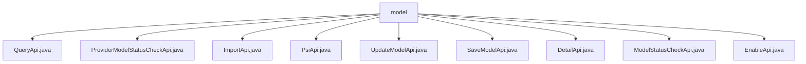

# Basic Information

|      |      |
|------|------|
| Name | model |
| Language | .java |
| Code Path | WeFe/serving/serving-service/src/main/java/com/welab/wefe/serving/service/api/model |
| Package Name | docs.serving.serving-service.src.main.java.com.welab.wefe.serving.service.api.model |
| Brief Description | QueryApi queries model information, ProviderModelStatusCheckApi checks model status, ImportApi imports model files, PsiApi calculates model stability metrics, UpdateModelApi updates SQL configurations, SaveModelApi saves model information, DetailApi retrieves model details, ModelStatusCheckApi checks model status, EnableApi handles model activation/deactivation. |

# Description

## Overview  
The core responsibility of this module is to provide APIs for managing the entire lifecycle of models, including operations such as querying, status checks, importing, PSI calculations, and configuration updates. The interface specifications adhere to a unified design: inheriting from the AbstractApi base class, using Input/Output parameter classes, and processing business logic through components like ModelService. Key data structures include fields such as model ID, service ID, algorithm type, federated learning type, and creator. For example, QueryApi.Output extends pagination and detailed model attributes. External dependencies include ModelService, ModelMemberService, and TableModelRepository, among others. Specific implementations, such as ImportApi, invoke different import methods based on the service type (machine learning/deep learning).  

## Key Business Scenarios  
The module supports the end-to-end process of model collaboration: clients paginate and query models via QueryApi, ProviderModelStatusCheckApi checks the status of collaborating parties, ImportApi imports model files (e.g., deep learning models), and SaveApi saves parameters. In operational scenarios, EnableApi is used to activate or deactivate models, while UpdateModelApi modifies SQL configurations. Monitoring scenarios include PsiApi calculating stability metrics, akin to quality watermarks. A typical integration pattern involves chained calls: query → check → import → configure. For example, ModelStatusCheckApi checks the status before enabling EnableApi. API types encompass CRUD, status checks, and data analysis.

### Package Internal Structure View

This flowchart illustrates the API file structure under the model directory in the WeFe service project. The root node is the model folder, which directly contains 9 different API implementation class files, including functionalities such as query, status check, import, and update. All API files reside at the same level without further subdirectory structures.

# File List

| Name   | Type  | Description |
|-------|------|-------------|
| [QueryApi.java](QueryApi.md) | file | The QueryApi class is used for paginated querying of model data, including input parameters such as model ID, algorithm type, federated learning type, creator, and name. It outputs detailed model information such as ID, service ID, name, algorithm, etc. |
| [ProviderModelStatusCheckApi.java](ProviderModelStatusCheckApi.md) | file | This is an API provided by a collaborator for checking model status. The endpoint is model/provider/status/check, requiring signed access, with the caller being Customer. The input parameter is the mandatory model ID, and the output is the model status. |
| [ImportApi.java](ImportApi.md) | file | API class for importing model files, which invokes different methods to save models based on service types and returns the model ID. Input requires file name, service type, and model name. |
| [PsiApi.java](PsiApi.md) | file | Model Stability Metrics API Class, handling input and output data, calculating PSI values, including expected vs. actual data extraction and grouped statistical functions. |
| [UpdateModelApi.java](UpdateModelApi.md) | file | The UpdateModelApi class is used to update model SQL configurations. It processes input parameters (model ID, name, data source, etc.) through the ModelService.updateConfig method and returns a successful result. The input class includes both required and optional fields. |
| [SaveModelApi.java](SaveModelApi.md) | file | The API interface for saving model information includes mandatory parameters such as model ID, role, algorithm, and federated learning type. It invokes the ModelService to store the data. |
| [DetailApi.java](DetailApi.md) | file | The DetailApi class retrieves model details by ID, including model parameters, roles, status, and other information, with support for XGBoost tree structure processing. |
| [ModelStatusCheckApi.java](ModelStatusCheckApi.md) | file | This API is used to check the model status, receiving the model ID and member ID parameters, and invoking the ModelMemberService to return the model availability result. |
| [EnableApi.java](EnableApi.md) | file | EnableApi is used to update the model's enable status. It accepts the id and enable parameters, calls the modelService.enable method for processing, and returns a successful result. |

