# Basic Information

|      |      |
|------|------|
| Name | LogQueryApi |
| Language | .java |
| Code Path | WeFe/serving/serving-service/src/main/java/com/welab/wefe/serving/service/api/operation/LogQueryApi.java |
| Package Name | com.welab.wefe.serving.service.api.operation |
| Dependencies | ['org.springframework.beans.factory.annotation.Autowired', 'com.welab.wefe.common.exception.StatusCodeWithException', 'com.welab.wefe.common.fieldvalidate.annotation.Check', 'com.welab.wefe.common.web.api.base.AbstractApi', 'com.welab.wefe.common.web.api.base.Api', 'com.welab.wefe.common.web.dto.ApiResult', 'com.welab.wefe.serving.service.dto.OperationLogOutputModel', 'com.welab.wefe.serving.service.dto.PagingInput', 'com.welab.wefe.serving.service.dto.PagingOutput', 'com.welab.wefe.serving.service.service.OperationLogService'] |
| Brief Description | The LogQueryApi is used for paginated querying of operation logs. The input includes the interface, operator ID, and time range, while the output is a paginated list of operation logs. |

# Description

This is a Java class named LogQueryApi, designed for querying operation logs. It extends AbstractApi and defines an input type Input and a paginated output type PagingOutput<OperationLogOutputModel>. The class injects the OperationLogService and processes query requests by invoking the service's query method through the handle method. The Input inner class extends PagingInput and includes four fields: logInterface, operatorId, startTime, and endTime. The first two fields have validation annotations, while the latter two are equipped with getter and setter methods. The entire API path is operation_log/query, and its name is query log.

# Class Summary

| Name   | Type  | Description |
|-------|------|-------------|
| LogQueryApi | class | The LogQueryApi is used for paginated querying of operation logs, accepting parameters such as interface names, operator IDs, and time ranges, and returning paginated results. |


## Class LogQueryApi

|      |      |
|------|------|
| Access Modifier | @Api(path = "operation_log/query", name = "query log");public |
| Type | class |
| Name | LogQueryApi |
| Description | The LogQueryApi is used for paginated querying of operation logs, accepting parameters such as interface names, operator IDs, and time ranges, and returning paginated results. |


### UML Class Diagram

```mermaid
classDiagram
    class LogQueryApi {
        -OperationLogService service
        +handle(Input input) ApiResult~PagingOutput~OperationLogOutputModel~~
    }
    <<Interface>> AbstractApi~Input, PagingOutput~OperationLogOutputModel~~
    LogQueryApi --|> AbstractApi~Input, PagingOutput~OperationLogOutputModel~~ : extends
    LogQueryApi --> OperationLogService : depends

    class Input {
        +String logInterface
        +String operatorId
        -Long startTime
        -Long endTime
        +Long getStartTime()
        +void setStartTime(Long startTime)
        +Long getEndTime()
        +void setEndTime(Long endTime)
    }
    Input --|> PagingInput : extends

    class OperationLogService {
        +query(Input input) PagingOutput~OperationLogOutputModel~
    }
```

This code illustrates the implementation structure of a log query API. LogQueryApi extends the generic abstract class AbstractApi to handle paginated operation log queries. It depends on OperationLogService for actual query operations, using the inner class Input as request parameters. Input inherits from PagingInput and includes query conditions such as log interface, operator ID, and time range. The design demonstrates clear hierarchical structure and separation of responsibilities.


### Internal Method Call Graph

```mermaid
graph TD
    A["Class LogQueryApi"]
    B["Annotation: @Api"]
    C["Inheritance: AbstractApi<Input, PagingOutput<OperationLogOutputModel>>"]
    D["Dependency Injection: @Autowired OperationLogService"]
    E["Overridden Method: handle(Input input)"]
    F["Inner Class Input"]
    G["Inheritance: PagingInput"]
    H["Validation Field: @Check String logInterface"]
    I["Validation Field: @Check String operatorId"]
    J["Private Fields: Long startTime/endTime"]
    K["Methods: get/setStartTime()"]
    L["Methods: get/setEndTime()"]
    M["Invocation: service.query(input)"]
    N["Return: success()"]

    A --> B
    A --> C
    A --> D
    A --> E
    E --> M
    M --> N
    A --> F
    F --> G
    F --> H
    F --> I
    F --> J
    J --> K
    J --> L
```



This flowchart illustrates the core structure of the log query API, including the inheritance relationships between the main class and its nested input class. LogQueryApi defines the interface path via @Api annotation, inherits from an abstract template class, and injects the OperationLogService. The overridden handle method invokes service.query for paginated queries, while the Input inner class extends pagination parameters and includes validated query condition fields. The process clearly presents the complete data flow path from API entry to service invocation, along with the validation and encapsulation mechanisms for input parameters.

### Field List

| Name  | Type  | Description |
|-------|-------|------|
| service | OperationLogService | The code snippet uses @Autowired to automatically inject an instance of the OperationLogService. |

### Method List

| Name  | Type  | Description |
|-------|-------|------|
| handle | ApiResult<PagingOutput<OperationLogOutputModel>> | Rewrite the handle method to call service.query for processing the input and return paginated operation log results. |


