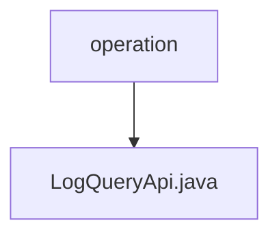

# Basic Information

|      |      |
|------|------|
| Name | operation |
| Language | .java |
| Code Path | WeFe/serving/serving-service/src/main/java/com/welab/wefe/serving/service/api/operation |
| Package Name | docs.serving.serving-service.src.main.java.com.welab.wefe.serving.service.api.operation |
| Brief Description | The LogQueryApi is used for paginated querying of operation logs. The input includes the interface, operator ID, and time range, while the output is a paginated list of operation logs. |

# Description

This is a Java class named LogQueryApi, designed for querying operation logs. It extends AbstractApi and defines an input type Input along with a paginated output type PagingOutput<OperationLogOutputModel>. The class injects an OperationLogService and processes query requests by invoking the service's query method through the handle method. The inner class Input inherits from PagingInput and contains four fields: logInterface, operatorId, startTime, and endTime. The first two fields have validation annotations, while the latter two are equipped with getter and setter methods. The API's full path is operation_log/query, and its name is query log.

### Package Internal Structure View

This flowchart illustrates the API operation path structure in the serving-service module of the WeFe project. The `operation` serves as the parent directory node, containing a specific API implementation file `LogQueryApi.java`. This structure adheres to typical Java project layering conventions, where the `operation` directory is used to store operation-related API interfaces, and `LogQueryApi.java` is the controller class file implementing the specific log query functionality.

# File List

| Name   | Type  | Description |
|-------|------|-------------|
| [LogQueryApi.java](LogQueryApi.md) | file | The LogQueryApi is used for paginated querying of operation logs. The input includes the interface, operator ID, and time range, while the output is a paginated list of operation logs. |

