# Basic Information

|      |      |
|------|------|
| Name | DownloadApi |
| Language | .java |
| Code Path | WeFe/serving/serving-service/src/main/java/com/welab/wefe/serving/service/api/orderstatistics/DownloadApi.java |
| Package Name | com.welab.wefe.serving.service.api.orderstatistics |
| Dependencies | ['com.welab.wefe.common.StatusCode', 'com.welab.wefe.common.exception.StatusCodeWithException', 'com.welab.wefe.common.fieldvalidate.annotation.Check', 'com.welab.wefe.common.util.StringUtil', 'com.welab.wefe.common.web.api.base.AbstractApi', 'com.welab.wefe.common.web.api.base.Api', 'com.welab.wefe.common.web.dto.AbstractApiInput', 'com.welab.wefe.common.web.dto.ApiResult', 'com.welab.wefe.serving.service.enums.DateTypeEnum', 'com.welab.wefe.serving.service.service.OrderStatisticsService', 'org.springframework.beans.factory.annotation.Autowired', 'org.springframework.core.io.FileSystemResource', 'org.springframework.http.HttpHeaders', 'org.springframework.http.MediaType', 'org.springframework.http.ResponseEntity', 'java.io.File', 'java.util.Date', 'java.util.List', 'java.util.regex.Matcher'] |
| Brief Description | The DownloadApi class handles the download of order statistics files. The input parameters include time, partner information, and service details. It outputs a CSV file response, incorporating caching and content configuration. |

# Description

The `DownloadApi` class is an API designed for downloading order statistics data, inheriting from `AbstractApi`. It processes the input parameters (`Input`) and returns a file response. The `Input` class includes multiple validation fields such as start time, end time, requester and responder information, service ID and name, as well as the mandatory statistics granularity. The API downloads the file via `OrderStatisticsService`, throwing an exception if the file does not exist. The response settings include cache control, content disposition, last modified time, and ETag headers, returning a CSV-format file.

# Class Summary

| Name   | Type  | Description |
|-------|------|-------------|
| DownloadApi | class | The DownloadApi class handles the download of order statistics files, accepting parameters such as time, partners, and services, and returns a CSV file response. It checks file existence and sets HTTP headers. |


## Class DownloadApi

|      |      |
|------|------|
| Access Modifier | @Api(path = "orderstatistics/download", name = "download order statistics");public |
| Type | class |
| Name | DownloadApi |
| Description | The DownloadApi class handles the download of order statistics files, accepting parameters such as time, partners, and services, and returns a CSV file response. It checks file existence and sets HTTP headers. |


### UML Class Diagram

```mermaid
classDiagram
    class DownloadApi {
        -OrderStatisticsService orderStatisticsService
        +handle(Input input) ApiResult~ResponseEntity~?~~
        +file(File file) ApiResult~ResponseEntity~?~~
    }
    DownloadApi --> OrderStatisticsService : Dependency

    class AbstractApi~T, R~ {
        <<Abstract>>
        +handle(T input) ApiResult~R~
        +file(File file) ApiResult~R~
    }
    DownloadApi --|> AbstractApi~Input, ResponseEntity~?~~ : Inheritance

    class Input {
        -Date startTime
        -Date endTime
        -String requestPartnerId
        -String requestPartnerName
        -String responsePartnerId
        -String responsePartnerName
        -String serviceId
        -String serviceName
        -String statisticalGranularity
        +getStartTime() Date
        +setStartTime(Date startTime)
        // ...Other getters/setters omitted...
    }
    Input --|> AbstractApiInput : Inheritance

    class AbstractApiInput {
        <<Abstract>>
    }

    class OrderStatisticsService {
        <<Interface>>
        +downloadFile(DownloadApi$Input input) File
    }
```

This code describes the implementation of an order statistics download API. DownloadApi inherits from the generic abstract class AbstractApi, processes Input-type parameters, and returns ResponseEntity responses. The core functionality involves downloading files through OrderStatisticsService and encapsulating them into file responses with HTTP headers. The Input class inherits from AbstractApiInput and contains validation fields such as time range, partner information, and service details. The class diagram illustrates the dependency between DownloadApi and OrderStatisticsService, as well as the inheritance structure of Input as a nested class, reflecting a Spring-style API implementation approach.


### Internal Method Call Graph

```mermaid
graph TD
    A["Class DownloadApi"]
    B["Inheritance: AbstractApi<Input, ResponseEntity<?>>"]
    C["Dependency: OrderStatisticsService"]
    D["Method: handle(Input input)"]
    E["Invocation: orderStatisticsService.downloadFile(input)"]
    F["Method: file(File file)"]
    G["Check: file.exists()"]
    H["Exception Handling: StatusCode.PARAMETER_VALUE_INVALID"]
    I["Set HTTP Headers: HttpHeaders"]
    J["Build Response: ResponseEntity"]
    K["Return: ApiResult<ResponseEntity<?>>"]
    L["Inner Class Input"]
    M["Properties: Date startTime/endTime etc."]
    N["Validation Annotations: @Check"]
    O["Getter/Setter Methods"]

    A --> B
    A --> C
    A --> D
    D --> E
    D --> F
    F --> G
    G -->|false| H
    G -->|true| I
    I --> J
    J --> K
    A --> L
    L --> M
    M --> N
    L --> O
```



This flowchart illustrates the complete structure and workflow of the DownloadApi class. The class inherits from AbstractApi and implements file download functionality, with its core processing flow involving the handle method invoking the service layer to retrieve files, and the file method verifying file existence and constructing HTTP responses. The inner class Input defines multiple date and string fields with validation annotations, accessible through standard Getter/Setter methods. The exception handling branch throws a status code exception when files are absent, while successful cases set cache control and other HTTP headers to return file resources.

### Field List

| Name  | Type  | Description |
|-------|-------|------|
| orderStatisticsService | OrderStatisticsService | Automatically inject the order statistics service instance. |

### Method List

| Name  | Type  | Description |
|-------|-------|------|
| handle | ApiResult<ResponseEntity<?>> | Rewrite the method to handle input and return a file download result. After calling the service layer to generate the file, encapsulate it as an ApiResult response. |
| file | ApiResult<ResponseEntity<?>> | Check if the file exists, set HTTP response headers, and return the file content, including cache control and download information. |


