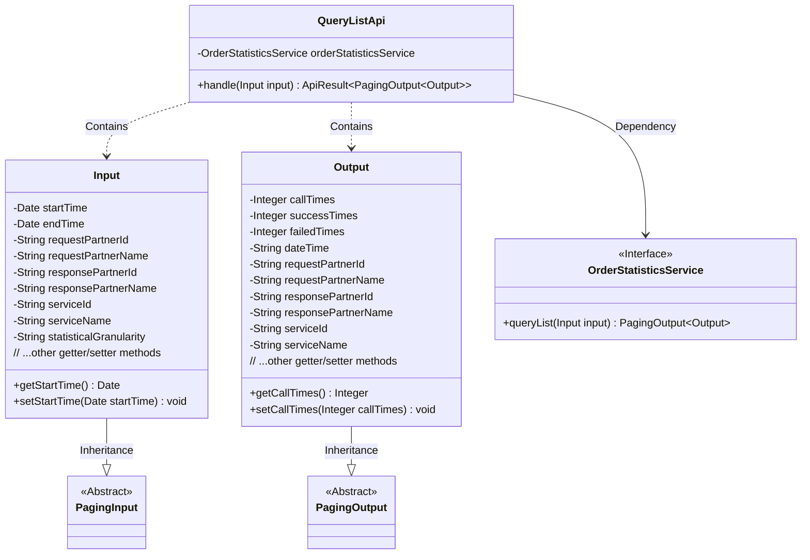

# Basic Information

|      |      |
|------|------|
| Name | QueryListApi |
| Language | .java |
| Code Path | WeFe/serving/serving-service/src/main/java/com/welab/wefe/serving/service/api/orderstatistics/QueryListApi.java |
| Package Name | com.welab.wefe.serving.service.api.orderstatistics |
| Dependencies | ['com.welab.wefe.common.fieldvalidate.annotation.Check', 'com.welab.wefe.common.web.api.base.AbstractApi', 'com.welab.wefe.common.web.api.base.Api', 'com.welab.wefe.common.web.dto.ApiResult', 'com.welab.wefe.serving.service.dto.PagingInput', 'com.welab.wefe.serving.service.dto.PagingOutput', 'com.welab.wefe.serving.service.enums.DateTypeEnum', 'com.welab.wefe.serving.service.service.OrderStatisticsService', 'org.springframework.beans.factory.annotation.Autowired', 'javax.persistence.Column', 'java.util.Date'] |
| Brief Description | API for querying order statistics list, including query conditions such as time, partner, and service, returning paginated statistical results such as request count, success/failure count, etc. |

# Description

QueryListApi is an API class designed for querying order statistics lists, inheriting from AbstractApi and handling paginated input and output. The input class Input includes pagination parameters and multiple query conditions, such as time range, requester and responder information, service ID and name, and statistical granularity, with the default granularity set to minute. The output class Output contains paginated results and statistical information, such as request count, success and failure counts, statistical time, requester and responder information, service ID and name, etc. The API processes query logic through OrderStatisticsService and returns paginated statistical results.

# Class Summary

| Name   | Type  | Description |
|-------|------|-------------|
| QueryListApi | class | Order Statistics Query API supports paginated queries for order statistics data of requesters, responders, services, and time ranges, returning information such as call counts, success/failure counts, etc. |

## Class QueryListApi

|      |      |
|------|------|
| Access Modifier | @Api(path = "orderstatistics/query-list", name = "search order statistics list");public |
| Type | class |
| Name | QueryListApi |
| Description | Order Statistics Query API supports paginated queries for order statistics data of requesters, responders, services, and time ranges, returning information such as call counts, success/failure counts, etc. |

### UML Class Diagram

This code demonstrates the implementation structure of an order statistics query API. The QueryListApi class inherits from AbstractApi, handles paginated query requests, and relies on the OrderStatisticsService interface to fetch data. The Input class inherits from PagingInput and contains query condition parameters, while the Output class inherits from PagingOutput and encapsulates returned statistical result data. The overall design adopts a layered architecture, achieves type safety through generics, and uses annotations for parameter validation and result mapping, reflecting clear responsibility division and extensibility considerations.

### Internal Method Call Graph

```mermaid
graph TD
    A["Class QueryListApi"]
    B["Inheritance: AbstractApi<Input, PagingOutput<Output>>"]
    C["Annotation: @Api(path='orderstatistics/query-list', name='search order statistics list')"]
    D["Dependency Injection: @Autowired OrderStatisticsService"]
    E["Overridden Method: handle(Input input)"]
    F["Inner Class: Input"]
    G["Inner Class: Output"]
    H["Input Properties: Date startTime/endTime, String requestPartnerId/Name, responsePartnerId/Name, serviceId/Name, statisticalGranularity"]
    I["Output Properties: Integer callTimes/successTimes/failedTimes, String dateTime/requestPartnerId/Name/responsePartnerId/Name/serviceId/Name"]
    J["Method Invocation: orderStatisticsService.queryList(input)"]

    A --> B
    A --> C
    A --> D
    A --> E
    A --> F
    A --> G
    F --> H
    G --> I
    E --> J
```

This code describes the implementation of an order statistics query API, primarily consisting of the QueryListApi class and its two inner classes Input and Output. The Input class encapsulates query parameters including time range, partner information, service details, and statistical granularity fields; the Output class encapsulates paginated query results containing statistical information such as call counts, success/failure counts. The flowchart illustrates inheritance relationships between classes, property composition, and core method invocation chains, particularly showing how the handle method performs actual queries via orderStatisticsService. The overall structure reflects a standard API layered design pattern.

### Field List

| Name  | Type  | Description |
|-------|-------|------|
| orderStatisticsService | OrderStatisticsService | The code snippet uses the @Autowired annotation to automatically inject an instance of OrderStatisticsService. |

### Method List

| Name  | Type  | Description |
|-------|-------|------|
| handle | ApiResult<PagingOutput<Output>> | Process the input and return paginated output of order statistics query results. |

