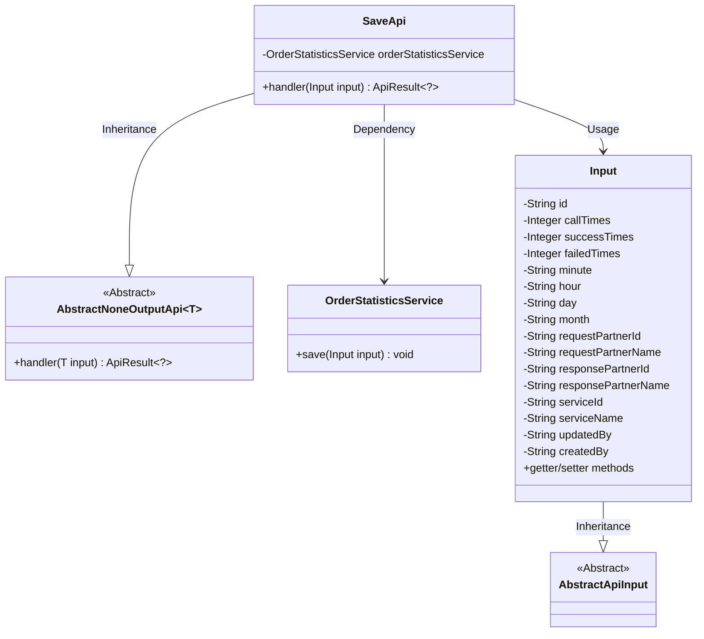

# Basic Information

|      |      |
|------|------|
| Name | SaveApi |
| Language | .java |
| Code Path | WeFe/serving/serving-service/src/main/java/com/welab/wefe/serving/service/api/orderstatistics/SaveApi.java |
| Package Name | com.welab.wefe.serving.service.api.orderstatistics |
| Dependencies | ['com.welab.wefe.common.exception.StatusCodeWithException', 'com.welab.wefe.common.fieldvalidate.annotation.Check', 'com.welab.wefe.common.web.api.base.AbstractNoneOutputApi', 'com.welab.wefe.common.web.api.base.Api', 'com.welab.wefe.common.web.dto.AbstractApiInput', 'com.welab.wefe.common.web.dto.ApiResult', 'com.welab.wefe.serving.service.service.OrderStatisticsService', 'org.springframework.beans.factory.annotation.Autowired'] |
| Brief Description | Added an order statistics interface that accepts inputs such as request count, success/failure count, time, requester/responder, and service information, and invokes the service to save the data. |

# Description

This is a Java class named SaveApi, designed for adding order statistics. It inherits from AbstractNoneOutputApi and takes an Input class as its parameter. Its primary function is to save order statistics data via the OrderStatisticsService.  

The Input class includes multiple fields such as id, total request count, total success count, total failure count, time-related fields (minute, hour, day, month), requester and responder IDs and names, service ID and name, updater and creator, etc. Each field has corresponding getter and setter methods.  

The handler method processes the input parameters and invokes the service to save the data.

# Class Summary

| Name   | Type  | Description |
|-------|------|-------------|
| SaveApi | class | Added an order statistics interface to receive and save order statistical data, including fields such as request count, success/failure count, time information, partner and service information. |

## Class SaveApi

|      |      |
|------|------|
| Access Modifier | @Api(path = "orderstatistics/save", name = "新增订单统计");public |
| Type | class |
| Name | SaveApi |
| Description | Added an order statistics interface to receive and save order statistical data, including fields such as request count, success/failure count, time information, partner and service information. |

### UML Class Diagram

This class diagram illustrates the structural design of an order statistics saving API. SaveApi inherits from the generic abstract class AbstractNoneOutputApi and implements processing logic for Input parameters. The Input class inherits from AbstractApiInput and contains over 20 fields related to order statistics along with their getter/setter methods. SaveApi relies on OrderStatisticsService to perform data persistence operations, adopting a layered architecture design overall. The Input class serves as a data transfer object encapsulating comprehensive order statistics information.

### Internal Method Call Graph

```mermaid
graph TD
    A["Class SaveApi"]
    B["Annotation: @Api(path='orderstatistics/save', name='Add Order Statistics')"]
    C["Inheritance: AbstractNoneOutputApi<Input>"]
    D["Dependency Injection: @Autowired OrderStatisticsService"]
    E["Overridden Method: handler(Input input)"]
    F["Invocation: orderStatisticsService.save(input)"]
    G["Return: success()"]
    H["Static Inner Class Input"]
    I["Inheritance: AbstractApiInput"]
    J["Validation Fields: 17 @Check annotated properties"]
    K["Getter/Setter Methods: Each property"]

    A --> B
    A --> C
    A --> D
    A --> E
    E --> F
    F --> G
    A --> H
    H --> I
    H --> J
    H --> K
```

This flowchart illustrates the complete structure of the SaveApi class, including API annotations, parent class inheritance, service injection, and core processing methods. The inner class Input serves as a parameter carrier, inheriting from the standard input base class and containing 17 validation fields with their accessor methods. The main flow involves the handler method receiving input parameters, invoking the service layer to save data, and finally returning a success result. The entire design demonstrates clear hierarchical structure and separation of responsibilities, conforming to typical API implementation patterns.

### Field List

| Name  | Type  | Description |
|-------|-------|------|
| orderStatisticsService | OrderStatisticsService | Using @Autowired to automatically inject an instance of OrderStatisticsService. |

### Method List

| Name  | Type  | Description |
|-------|-------|------|
| handler | ApiResult<?> | Rewrite the handler method to call the orderStatisticsService for saving the input data and return a successful result. |

