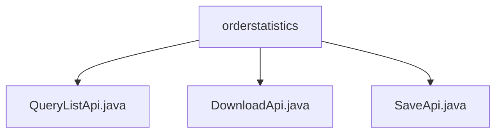

# Basic Information

|      |      |
|------|------|
| Name | orderstatistics |
| Language | .java |
| Code Path | WeFe/serving/serving-service/src/main/java/com/welab/wefe/serving/service/api/orderstatistics |
| Package Name | docs.serving.serving-service.src.main.java.com.welab.wefe.serving.service.api.orderstatistics |
| Brief Description | The QueryListApi is used to query the order statistics list, handle pagination and multi-condition queries, and return statistical information. The DownloadApi downloads order statistics data as a CSV file, validates input parameters, and handles exceptions. The SaveApi adds new order statistics and saves the input data to the service. |

# Description

## Overview  
The core responsibility of this module is to provide query, download, and save functionalities for order statistics data, supporting pagination processing and CSV export. The interface specifications uniformly inherit from the AbstractApi base class, with input parameters including time range, requester/responder information, and service identifiers. The output adopts a paginated structure or file stream. Key data structures include statistical granularity (minute/hour/day/month), request count metrics, and time dimension fields. The only external dependency is the OrderStatisticsService, which handles business logic. For example, the QueryListApi returns paginated statistical results, the DownloadApi generates CSV files, and the SaveApi persists statistical data.  

## Main Business Scenarios  
The module supports three typical interactions: querying statistical lists (similar to paginated table rendering), batch exporting data (similar to report downloads), and real-time data storage. The complete business process covers statistics generation → query display → export archiving, with API types including RESTful queries and file downloads. For instance, users can query minute-level request success rates, export monthly reports, or write real-time statistics via the SaveApi. All operations revolve around time dimensions and service identifiers, adopting a unified service-layer processing model.

### Package Internal Structure View

This flowchart illustrates three Java files under the orderstatistics directory: QueryListApi.java, DownloadApi.java, and SaveApi.java. These files are directly subordinate to the orderstatistics directory with no deeper nested structure. Each file represents a distinct API functionality implementation, respectively for querying lists, downloading, and saving operations. The entire structure is clear and concise, demonstrating a flat relationship among multiple files within a single directory.

# File List

| Name   | Type  | Description |
|-------|------|-------------|
| [QueryListApi.java](QueryListApi.md) | file | API for querying order statistics list, including search criteria such as time, partner, service, etc., returns paginated statistical results such as request count, success/failure count, etc. |
| [DownloadApi.java](DownloadApi.md) | file | The DownloadApi class handles the download of order statistics files. The input parameters include time, partner information, and service details. It outputs a CSV file response, incorporating caching and content configuration. |
| [SaveApi.java](SaveApi.md) | file | Added an order statistics interface that accepts inputs such as request count, success/failure count, time, requester/responder, and service information, then calls the service to save the data. |

