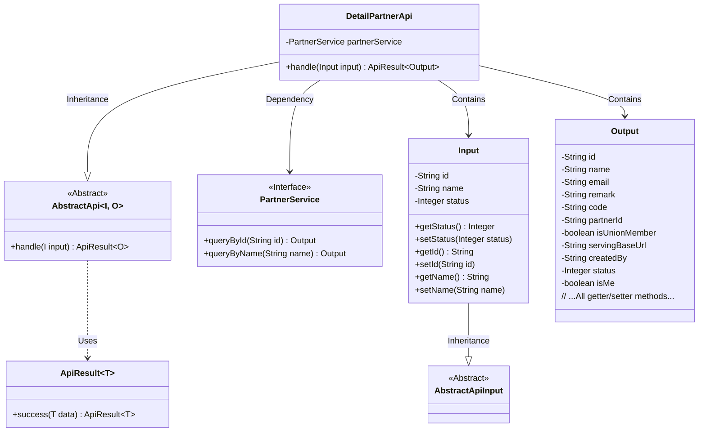

# Basic Information

|      |      |
|------|------|
| Name | DetailPartnerApi |
| Language | .java |
| Code Path | WeFe/serving/serving-service/src/main/java/com/welab/wefe/serving/service/api/partner/DetailPartnerApi.java |
| Package Name | com.welab.wefe.serving.service.api.partner |
| Dependencies | ['org.springframework.beans.factory.annotation.Autowired', 'com.welab.wefe.common.fieldvalidate.annotation.Check', 'com.welab.wefe.common.web.api.base.AbstractApi', 'com.welab.wefe.common.web.api.base.Api', 'com.welab.wefe.common.web.dto.AbstractApiInput', 'com.welab.wefe.common.web.dto.ApiResult', 'com.welab.wefe.serving.service.service.PartnerService'] |
| Brief Description | The DetailPartnerApi retrieves partner details by ID or name. The input includes ID, name, and status, while the output contains detailed partner information such as ID, name, email, etc. |

# Description

The DetailPartnerApi is an API class designed to retrieve partner details, inheriting from AbstractApi. It processes input requests through PartnerService, supporting partner information queries by either ID or name. The input class Input includes fields such as id, name, and status, all annotated with validation constraints. The output class Output contains detailed partner information, including fields like id, name, email, remark, code, partnerId, isUnionMember, servingBaseUrl, createdBy, status, and isMe, along with corresponding getter and setter methods. The API path is "partner/detail," and its name is "get partner."

# Class Summary

| Name   | Type  | Description |
|-------|------|-------------|
| DetailPartnerApi | class | The DetailPartnerApi retrieves partner information by ID or name. The input includes ID, name, and status, while the output contains detailed partner information such as ID, name, email, etc. |

## Class DetailPartnerApi

|      |      |
|------|------|
| Access Modifier | @Api(path = "partner/detail", name = "get partner");public |
| Type | class |
| Name | DetailPartnerApi |
| Description | The DetailPartnerApi retrieves partner information by ID or name. The input includes ID, name, and status, while the output contains detailed partner information such as ID, name, email, etc. |

### UML Class Diagram

Class Diagram Description:
The diagram illustrates the class structure of a partner detail query API, with the core being the DetailPartnerApi class that inherits from AbstractApi and contains two static inner classes Input and Output. DetailPartnerApi queries data through the PartnerService interface, invoking different query methods based on input parameters (ID or name). The Input class inherits from AbstractApiInput and includes validation fields such as client ID, name, and status; the Output class contains detailed partner information fields. The design employs generics, where AbstractApi defines input/output generic templates, and ApiResult is used to wrap response results.

### Internal Method Call Graph

```mermaid
graph TD
    A["Class DetailPartnerApi"]
    B["Annotation: @Api(path='partner/detail', name='get partner')"]
    C["Inheritance: AbstractApi<Input, Output>"]
    D["Dependency Injection: @Autowired PartnerService"]
    E["Overridden Method: handle(Input input)"]
    F["Condition: input.getId() != null"]
    G["Invocation: partnerService.queryById"]
    H["Condition: input.getName() != null"]
    I["Invocation: partnerService.queryByName"]
    J["Return: ApiResult<Output>"]
    K["Nested Class: Input"]
    L["Properties: String id, String name, Integer status"]
    M["Methods: getter/setter"]
    N["Nested Class: Output"]
    O["Properties: String id, name, email..."]
    P["Methods: getter/setter"]

    A --> B
    A --> C
    A --> D
    A --> E
    E --> F
    F --Yes--> G
    F --No--> H
    H --Yes--> I
    G --> J
    I --> J
    A --> K
    K --> L
    K --> M
    A --> N
    N --> O
    N --> P
```

This code implements the DetailPartnerApi class, which inherits from AbstractApi and handles partner detail queries. The flowchart illustrates the main class structure, dependency injection, branch logic of the core handle method (querying partners by ID or name), and the property structure of nested Input/Output classes. The handle method executes actual queries via PartnerService and returns results encapsulated in ApiResult. The Input class contains query parameters and validation annotations, while the Output class encapsulates comprehensive partner detail fields.

### Field List

| Name  | Type  | Description |
|-------|-------|------|
| partnerService | PartnerService | Use @Autowired to automatically inject an instance of PartnerService. |

### Method List

| Name  | Type  | Description |
|-------|-------|------|
| handle | ApiResult<Output> | The method queries partners based on the input ID or name and returns the corresponding result, or null if no match is found. |

