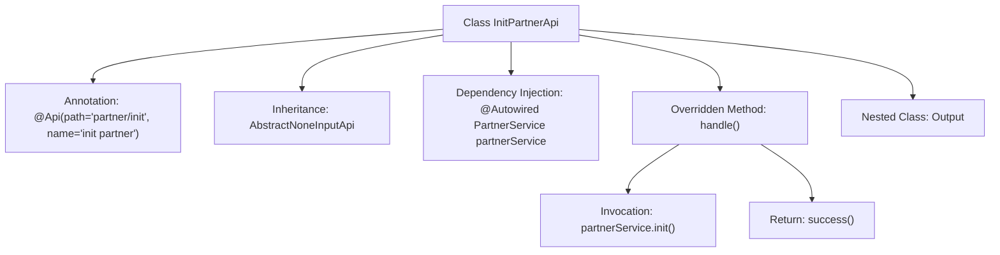

# Basic Information

|      |      |
|------|------|
| Name | InitPartnerApi |
| Language | .java |
| Code Path | WeFe/serving/serving-service/src/main/java/com/welab/wefe/serving/service/api/partner/InitPartnerApi.java |
| Package Name | com.welab.wefe.serving.service.api.partner |
| Dependencies | ['org.springframework.beans.factory.annotation.Autowired', 'com.welab.wefe.common.exception.StatusCodeWithException', 'com.welab.wefe.common.web.api.base.AbstractNoneInputApi', 'com.welab.wefe.common.web.api.base.Api', 'com.welab.wefe.common.web.dto.ApiResult', 'com.welab.wefe.serving.service.service.PartnerService'] |
| Brief Description | This is an API class named "init partner", with the path "partner/init", inheriting from AbstractNoneInputApi. It uses PartnerService to initialize a partner, takes no input parameters, and returns empty output. |

# Description

This is a Java class named InitPartnerApi, used for initializing partners. It extends the AbstractNoneInputApi class with a generic parameter of the inner class Output. The class is annotated with @Api, specifying the path as "partner/init" and the name as "init partner". It injects the PartnerService dependency via @Autowired. The handle method is overridden to call partnerService.init() for initialization and return a successful result. Internally, it defines an empty static Output class as the response data structure. The entire class implements a partner initialization API interface that requires no input parameters.

# Class Summary

| Name   | Type  | Description |
|-------|------|-------------|
| InitPartnerApi | class | Initialize the partner API by calling the init method of PartnerService, with no input parameters and returning an empty output. |


## Class InitPartnerApi

|      |      |
|------|------|
| Access Modifier | @Api(path = "partner/init", name = "init partner");public |
| Type | class |
| Name | InitPartnerApi |
| Description | Initialize the partner API by calling the init method of PartnerService, with no input parameters and returning an empty output. |


### UML Class Diagram

```mermaid
classDiagram
    class InitPartnerApi {
        -PartnerService partnerService
        +handle() ApiResult~Output~
    }
    class AbstractNoneInputApi~T~ {
        <<Abstract>>
        +handle() ApiResult~T~
    }
    class PartnerService {
        <<Interface>>
        +init()
    }
    class Output {
    }
    class ApiResult~T~ {
    }

    InitPartnerApi --|> AbstractNoneInputApi~Output~ : Inheritance
    InitPartnerApi --> PartnerService : Dependency
    InitPartnerApi --> Output : Composition
    AbstractNoneInputApi ~.~ ApiResult : Generic Usage
```

Class Diagram Description: This diagram illustrates that the InitPartnerApi class inherits from the generic class AbstractNoneInputApi<Output> and depends on the implementation of the PartnerService interface. InitPartnerApi overrides the handle() method of its parent class, returning a result of type ApiResult<Output>. PartnerService serves as an interface providing the init() method, while Output acts as a static nested class for encapsulating return data. The overall structure exemplifies a typical API controller design pattern in the Spring framework.


### Internal Method Call Graph



This flowchart illustrates the structure of the InitPartnerApi class, which is a REST interface class annotated with @Api. It inherits from AbstractNoneInputApi with the generic type specified as the inner class Output. The core logic resides in the overridden handle method, where the auto-injected PartnerService performs initialization and returns a success result. The nested Output class serves as an empty structure for type placeholder purposes.

### Field List

| Name  | Type  | Description |
|-------|-------|------|
| partnerService | PartnerService | Using @Autowired to automatically inject an instance of PartnerService. |

### Method List

| Name  | Type  | Description |
|-------|-------|------|
| handle | ApiResult<Output> | Rewrite the handle method, initialize the partnerService, and return a successful result. |


