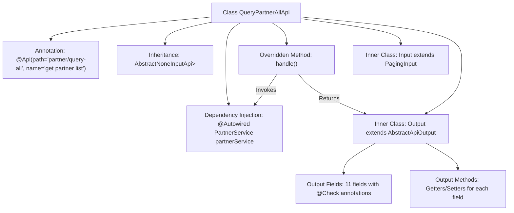

# Basic Information

|      |      |
|------|------|
| Name | QueryPartnerAllApi |
| Language | .java |
| Code Path | WeFe/serving/serving-service/src/main/java/com/welab/wefe/serving/service/api/partner/QueryPartnerAllApi.java |
| Package Name | com.welab.wefe.serving.service.api.partner |
| Dependencies | ['java.util.Date', 'java.util.List', 'org.springframework.beans.factory.annotation.Autowired', 'com.welab.wefe.common.fieldvalidate.annotation.Check', 'com.welab.wefe.common.web.api.base.AbstractNoneInputApi', 'com.welab.wefe.common.web.api.base.Api', 'com.welab.wefe.common.web.dto.AbstractApiOutput', 'com.welab.wefe.common.web.dto.ApiResult', 'com.welab.wefe.serving.service.dto.PagingInput', 'com.welab.wefe.serving.service.service.PartnerService'] |
| Brief Description | API for querying all collaborator information, including fields such as ID, name, email, etc., returning a list result. |

# Description

The code defines an API class named `QueryPartnerAllApi`, which is used to retrieve a list of partners. The API path is `partner/query-all`, requiring no input parameters and returning a list of partners. The output class `Output` contains detailed information about the partners, such as ID, name, email, code, whether they are federation members, service address, remarks, creation time, creator, updater, and status. Each field has corresponding getter and setter methods. The processing logic retrieves the data by calling the `queryAll` method of `partnerService` and returns a successful result.

# Class Summary

| Name   | Type  | Description |
|-------|------|-------------|
| QueryPartnerAllApi | class | API for querying all partner information, including details such as ID, name, email, etc. It retrieves data via PartnerService and returns a result list. |


## Class QueryPartnerAllApi

|      |      |
|------|------|
| Access Modifier | @Api(path = "partner/query-all", name = "get partner list");public |
| Type | class |
| Name | QueryPartnerAllApi |
| Description | API for querying all partner information, including details such as ID, name, email, etc. It retrieves data via PartnerService and returns a result list. |


### UML Class Diagram

```mermaid
classDiagram
    class QueryPartnerAllApi {
        -PartnerService partnerService
        +handle() ApiResult~List~Output~~
    }
    
    class AbstractNoneInputApi~R~ {
        <<Abstract>>
        +handle() R
    }
    
    class PartnerService {
        <<Interface>>
        +queryAll() List~Output~
    }
    
    class Input {
        <<InnerClass>>
        +PagingInput superclass
    }
    
    class Output {
        <<InnerClass>>
        -String id
        -String name
        -String email
        -String code
        -boolean isUnionMember
        -String servingBaseUrl
        -String remark
        -Date createdTime
        -String createdBy
        -String updatedBy
        -Integer status
        +getter/setter methods
    }
    
    class PagingInput {
        <<BaseClass>>
    }
    
    class AbstractApiOutput {
        <<Abstract>>
    }
    
    QueryPartnerAllApi --|> AbstractNoneInputApi~List~Output~~ : Inheritance
    QueryPartnerAllApi --> PartnerService : Dependency
    Input --|> PagingInput : Inheritance
    Output --|> AbstractApiOutput : Inheritance
```

This code describes the implementation of an API for querying a list of partners. The QueryPartnerAllApi inherits from the AbstractNoneInputApi abstract class, retrieves data through the PartnerService interface, and returns a list of Output objects containing partner details. Input and Output serve as inner classes, inheriting from PagingInput and AbstractApiOutput respectively. The Output class includes various partner attributes (such as ID, name, email, etc.) along with their getter/setter methods, and uses the @Check annotation for parameter validation. The overall design demonstrates clear hierarchical relationships and separation of responsibilities, with Input handling pagination parameters and Output encapsulating response data structures.


### Internal Method Call Graph



This flowchart illustrates the complete structure of the QueryPartnerAllApi class, including API annotations, parent class inheritance, service injection, and definitions of two inner classes. The core processing flow involves the handle() method retrieving data via partnerService.queryAll() and wrapping it into a list of Output objects. The Output class contains 11 partner attributes with validation annotations and their accessor methods, while the Input class inherits from a pagination parameter base class. The entire design achieves standardized encapsulation for the partner query API.

### Field List

| Name  | Type  | Description |
|-------|-------|------|
| partnerService | PartnerService | Automatically inject the PartnerService instance using @Autowired. |

### Method List

| Name  | Type  | Description |
|-------|-------|------|
| handle | ApiResult<List<QueryPartnerAllApi.Output>> | This code rewrites the handle method to return a successful ApiResult response containing all partner query results. |


