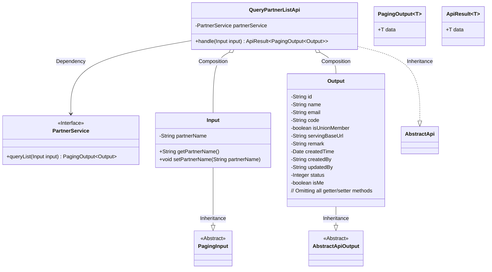

# Basic Information

|      |      |
|------|------|
| Name | QueryPartnerListApi |
| Language | .java |
| Code Path | WeFe/serving/serving-service/src/main/java/com/welab/wefe/serving/service/api/partner/QueryPartnerListApi.java |
| Package Name | com.welab.wefe.serving.service.api.partner |
| Dependencies | ['java.util.Date', 'org.springframework.beans.factory.annotation.Autowired', 'com.welab.wefe.common.fieldvalidate.annotation.Check', 'com.welab.wefe.common.web.api.base.AbstractApi', 'com.welab.wefe.common.web.api.base.Api', 'com.welab.wefe.common.web.dto.AbstractApiOutput', 'com.welab.wefe.common.web.dto.ApiResult', 'com.welab.wefe.serving.service.dto.PagingInput', 'com.welab.wefe.serving.service.dto.PagingOutput', 'com.welab.wefe.serving.service.service.PartnerService'] |
| Brief Description | Define an API interface for querying the partner list, including pagination input parameters and output results. The output contains detailed information such as ID, name, email, etc. |

# Description

The code defines an API class named `QueryPartnerListApi`, which is used to retrieve a list of partners. The API path is `partner/query-list`. The input parameter `Input` inherits from `PagingInput` and includes the collaborator name `partnerName`. The output `Output` inherits from `AbstractApiOutput` and contains fields such as partner ID, name, email, code, whether it is a federation member, service address, remarks, creation time, creator, updater, status, and whether it belongs to the current user. The API processes the request through the `queryList` method of `PartnerService` and returns paginated results. All fields are annotated with validation annotations `Check` to specify attribute names.

# Class Summary

| Name   | Type  | Description |
|-------|------|-------------|
| QueryPartnerListApi | class | The QueryPartnerListApi is an interface for retrieving a list of partners. The input includes pagination and partner name, while the output contains detailed information such as partner ID, name, email, etc., and supports paginated returns. |

## Class QueryPartnerListApi

|      |      |
|------|------|
| Access Modifier | @Api(path = "partner/query-list", name = "get partner list");public |
| Type | class |
| Name | QueryPartnerListApi |
| Description | The QueryPartnerListApi is an interface for retrieving a list of partners. The input includes pagination and partner name, while the output contains detailed information such as partner ID, name, email, etc., and supports paginated returns. |

### UML Class Diagram

This code demonstrates the implementation of a partner list query API, where the core class QueryPartnerListApi inherits from AbstractApi to handle paginated query requests. The class diagram clearly illustrates relationships between classes: Input inherits from PagingInput for receiving pagination parameters, Output inherits from AbstractApiOutput containing comprehensive partner information fields, and the PartnerService interface provides query functionality. The overall design reflects a layered architecture philosophy, separating input/output from business logic while achieving flexible type handling through generics.

### Internal Method Call Graph

```mermaid
graph TD
    A["Class QueryPartnerListApi"]
    B["Annotation: @Api(path='partner/query-list', name='get partner list')"]
    C["Inheritance: AbstractApi<Input, PagingOutput<Output>>"]
    D["Dependency Injection: @Autowired PartnerService"]
    E["Overridden Method: handle(Input input)"]
    F["Inner Class: Input extends PagingInput"]
    G["Inner Class: Output extends AbstractApiOutput"]
    H["Input Properties: String partnerName"]
    I["Input Methods: getter/setter"]
    J["Output Properties: id/name/email/code/isUnionMember etc."]
    K["Output Methods: getter/setter for all fields"]

    A --> B
    A --> C
    A --> D
    A --> E
    A --> F
    A --> G
    F --> D
    F -->|invokes| D["partnerService.queryList(input)"]
    F -->|returns| E["success()"]
    F --> H
    F --> I
    G --> J
    G --> K
```

Flowchart Description: This flowchart illustrates the complete structure of the QueryPartnerListApi class, including class annotations, inheritance relationships, dependency-injected PartnerService, and the processing flow of the overridden handle method. It highlights the structures of inner classes Input and Output, where Input contains pagination parameters and partner name, while Output comprises 12 properties with validation annotations and corresponding getter/setter methods. The handle method implements business logic by invoking partnerService.queryList and ultimately returns the wrapped paginated result.

### Field List

| Name  | Type  | Description |
|-------|-------|------|
| partnerService | PartnerService | Use @Autowired to automatically inject the PartnerService instance. |

### Method List

| Name  | Type  | Description |
|-------|-------|------|
| handle | ApiResult<PagingOutput<Output>> | Java method override, calling partnerService.queryList to process the input and return paginated results. |

