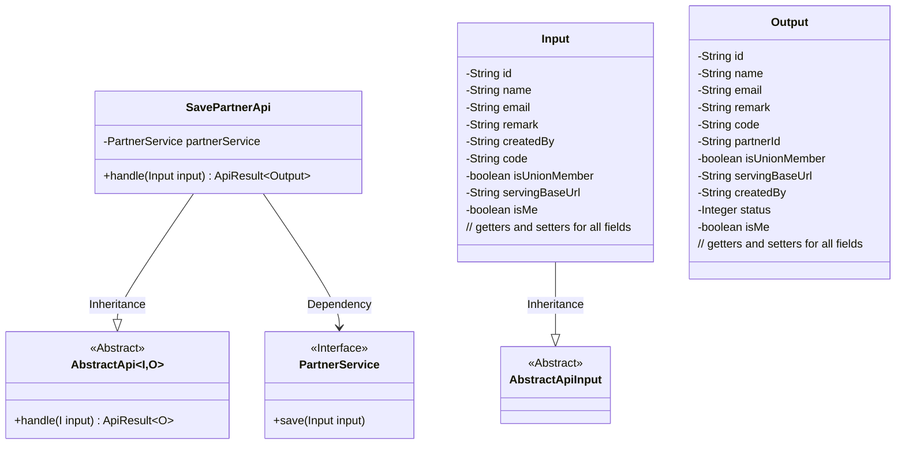

# Basic Information

|      |      |
|------|------|
| Name | SavePartnerApi |
| Language | .java |
| Code Path | WeFe/serving/serving-service/src/main/java/com/welab/wefe/serving/service/api/partner/SavePartnerApi.java |
| Package Name | com.welab.wefe.serving.service.api.partner |
| Dependencies | ['com.welab.wefe.common.fieldvalidate.annotation.Check', 'com.welab.wefe.common.web.api.base.AbstractApi', 'com.welab.wefe.common.web.api.base.Api', 'com.welab.wefe.common.web.dto.AbstractApiInput', 'com.welab.wefe.common.web.dto.ApiResult', 'com.welab.wefe.serving.service.service.PartnerService', 'org.springframework.beans.factory.annotation.Autowired'] |
| Brief Description | API for saving collaborator information, including input and output classes. The input contains fields such as name and email, while the output returns detailed collaborator information. |

# Description

This is an API class named SavePartnerApi, used for saving partner information. It inherits from AbstractApi and includes the input class Input and the output class Output. The Input class defines various attributes of a partner, such as id, name, email, etc., along with validation annotations. The Output class contains attributes similar to those in the Input class, with the additional fields status and partnerId. The API processes the input data through the injected PartnerService and returns a successful result. The API path is partner/save, and its name is save partner.

# Class Summary

| Name   | Type  | Description |
|-------|------|-------------|
| SavePartnerApi | class | The SavePartnerApi class is used to save partner information, including input and output classes. The input class contains fields such as id, name, and email, while the output class includes similar fields along with status, etc. The input data is saved via the partnerService. |

## Class SavePartnerApi

|      |      |
|------|------|
| Access Modifier | @Api(path = "partner/save", name = "save partner");public |
| Type | class |
| Name | SavePartnerApi |
| Description | The SavePartnerApi class is used to save partner information, including input and output classes. The input class contains fields such as id, name, and email, while the output class includes similar fields along with status, etc. The input data is saved via the partnerService. |

### UML Class Diagram

This code implements an API for saving partner information, including input/output data structures and business processing logic. SavePartnerApi inherits from the generic abstract class AbstractApi and uses PartnerService to handle core business operations. The Input class inherits from AbstractApiInput and contains basic partner information, while the Output class contains operation result data. The class diagram illustrates inheritance and dependency relationships, demonstrating a clear hierarchical design.

### Internal Method Call Graph

```mermaid
graph TD
    A["Class SavePartnerApi"]
    B["Annotation: @Api(path='partner/save', name='save partner')"]
    C["Inheritance: AbstractApi<Input, Output>"]
    D["Dependency Injection: @Autowired PartnerService"]
    E["Overridden Method: handle(Input input)"]
    F["Inner Class: Input"]
    G["Inner Class: Output"]
    H["Input Properties: id, name, email, remark, createdBy, code, isUnionMember, servingBaseUrl, isMe"]
    I["Input Methods: getter/setter"]
    J["Output Properties: id, name, email, remark, code, partnerId, isUnionMember, servingBaseUrl, createdBy, status, isMe"]
    K["Output Methods: getter/setter"]

    A --> B
    A --> C
    A --> D
    A --> E
    A --> F
    A --> G
    F --> H
    F --> I
    G --> J
    G --> K
    E --> D
    E --> F
    E --> G
```

This code describes an API class SavePartnerApi for saving partner information, which inherits from AbstractApi and encapsulates input/output parameters. The flowchart illustrates the class structure relationships, including annotation declaration, parent class inheritance, service injection, core processing method handle(), and the definitions of two inner data classes Input and Output. The Input class contains 9 properties with validation annotations and corresponding getter/setter methods, while the Output class contains 11 properties with corresponding getter/setter methods. The handle method saves input data via partnerService and returns successful results.

### Field List

| Name  | Type  | Description |
|-------|-------|------|
| partnerService | PartnerService | Automatically inject the PartnerService instance. |

### Method List

| Name  | Type  | Description |
|-------|-------|------|
| handle | ApiResult<Output> | Process the input and save it, then return the result upon success. |

