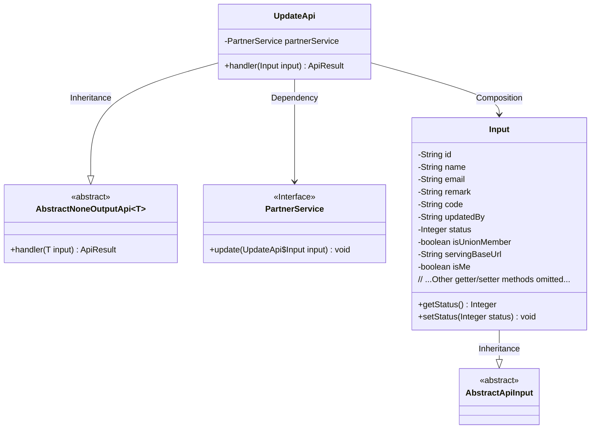

# Basic Information

|      |      |
|------|------|
| Name | UpdateApi |
| Language | .java |
| Code Path | WeFe/serving/serving-service/src/main/java/com/welab/wefe/serving/service/api/partner/UpdateApi.java |
| Package Name | com.welab.wefe.serving.service.api.partner |
| Dependencies | ['org.springframework.beans.factory.annotation.Autowired', 'com.welab.wefe.common.exception.StatusCodeWithException', 'com.welab.wefe.common.fieldvalidate.annotation.Check', 'com.welab.wefe.common.web.api.base.AbstractNoneOutputApi', 'com.welab.wefe.common.web.api.base.Api', 'com.welab.wefe.common.web.dto.AbstractApiInput', 'com.welab.wefe.common.web.dto.ApiResult', 'com.welab.wefe.serving.service.service.PartnerService'] |
| Brief Description | The UpdateApi class is used to update collaborator information, including mandatory fields such as name and status, as well as optional fields like ID, email, remarks, etc. It invokes the PartnerService to perform the update operation. |

# Description

UpdateApi is an API class designed for updating collaborator information, inheriting from AbstractNoneOutputApi, and processes input of type Input. It performs the update operation via PartnerService and returns an empty result upon success. The Input class includes multiple fields: mandatory collaborator name and status, federation member identifier, service address, modifier, as well as optional ID, email, remarks, code, and a self-identification flag. Each field has corresponding getter and setter methods, with some fields validated using the Check annotation.

# Class Summary

| Name   | Type  | Description |
|-------|------|-------------|
| UpdateApi | class | The UpdateApi class is used to update collaborator information, including required fields such as name, status, whether it is a federation member, as well as optional fields like ID, email, remarks, etc. The update operation is performed via the PartnerService. |

## Class UpdateApi

|      |      |
|------|------|
| Access Modifier | @Api(path = "partner/update", name = "update");public |
| Type | class |
| Name | UpdateApi |
| Description | The UpdateApi class is used to update collaborator information, including required fields such as name, status, whether it is a federation member, as well as optional fields like ID, email, remarks, etc. The update operation is performed via the PartnerService. |

### UML Class Diagram

Class Diagram Description:
This code demonstrates an API implementation for updating collaborator information. The core class UpdateApi inherits from the generic AbstractNoneOutputApi class and contains a static inner class Input as the parameter. UpdateApi relies on the PartnerService interface to fulfill business logic. The Input class inherits from AbstractApiInput and includes multiple fields with validation annotations. The diagram clearly reflects inheritance relationships (UpdateApi→AbstractNoneOutputApi, Input→AbstractApiInput), composition relationship (UpdateApi contains Input), and dependency relationship (UpdateApi uses PartnerService). The input parameter class contains 11 fields of different data types, each validated through @Check annotations.

### Internal Method Call Graph

```mermaid
graph TD
    A["Class UpdateApi"]
    B["Annotation: @Api(path='partner/update', name='update')"]
    C["Inheritance: AbstractNoneOutputApi<Input>"]
    D["Dependency Injection: @Autowired PartnerService"]
    E["Overridden Method: handler(Input input)"]
    F["Inner Class: Input"]
    G["Property: String id"]
    H["Property: String name"]
    I["Property: String email"]
    J["Property: String remark"]
    K["Property: String code"]
    L["Property: String updatedBy"]
    M["Property: Integer status"]
    N["Property: boolean isUnionMember"]
    O["Property: String servingBaseUrl"]
    P["Property: boolean isMe"]
    Q["Validation Annotation: @Check"]
    R["Getter/Setter Methods"]

    A --> B
    A --> C
    A --> D
    A --> E
    A --> F
    F --> G
    F --> H
    F --> I
    F --> J
    F --> K
    F --> L
    F --> M
    F --> N
    F --> O
    F --> P
    G --> Q
    H --> Q
    I --> Q
    J --> Q
    K --> Q
    L --> Q
    M --> Q
    N --> Q
    O --> Q
    P --> Q
    F --> R
```

This code describes an API class UpdateApi for updating partner information, which inherits from the abstract class AbstractNoneOutputApi and contains an inner Input class for parameters. The flowchart illustrates the class structure, annotation usage, property definitions, and validation rules, emphasizing the complex validation logic of input parameters and inheritance relationships. The API performs update operations through PartnerService, with input parameters containing 11 fields with validation rules, each having corresponding getter/setter methods.

### Field List

| Name  | Type  | Description |
|-------|-------|------|
| partnerService | PartnerService | Automatically inject the PartnerService instance. |

### Method List

| Name  | Type  | Description |
|-------|-------|------|
| handler | ApiResult<?> | Java method override, calls partnerService to update input data, returns ApiResult upon success. Throws StatusCodeWithException in case of exceptions. |

