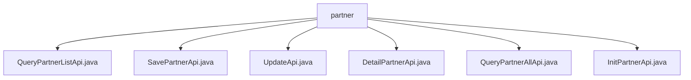

# Basic Information

|      |      |
|------|------|
| Name | partner |
| Language | .java |
| Code Path | WeFe/serving/serving-service/src/main/java/com/welab/wefe/serving/service/api/partner |
| Package Name | docs.serving.serving-service.src.main.java.com.welab.wefe.serving.service.api.partner |
| Brief Description | QueryPartnerListApi queries the partner list, SavePartnerApi saves collaborator information, UpdateApi updates the collaborator, DetailPartnerApi retrieves details, QueryPartnerAllApi fetches all partners, InitPartnerApi initializes partners. |

# Description

## Overview  
The core responsibility of this module is to manage partner information, providing functionalities such as adding, deleting, modifying, querying, initializing, and listing partners. The interface specifications uniformly inherit from the AbstractApi base class and adopt RESTful path design (e.g., `partner/query-list`), with both input and output including validation annotations. Key data structures include the Partner entity fields (e.g., id, name, email, status, etc.) and the pagination parameter PagingInput. The only external dependency is PartnerService, which handles business logic. For example, SavePartnerApi saves partner information, while QueryPartnerListApi supports paginated queries.  

## Key Business Scenarios  
The module supports full lifecycle management of partners: initialization (InitPartnerApi), creation (SavePartnerApi), updating (UpdateApi), detail querying (DetailPartnerApi), and list retrieval (QueryPartnerListApi/QueryPartnerAllApi). The interaction mode resembles CRUD operations, with data centrally processed via PartnerService. Typical applications include member management in federated learning scenarios, such as identifying federation members through the isUnionMember field and configuring service addresses via the servingBaseUrl field. API types cover parameterized queries, parameter-free lists, and no-response operations.

### Package Internal Structure View

This flowchart illustrates the API file structure under the partner directory in the WeFe project. The root node is the partner folder, which contains six Java API files: QueryPartnerListApi, SavePartnerApi, UpdateApi, DetailPartnerApi, QueryPartnerAllApi, and InitPartnerApi. All these files are directly subordinate to the partner directory without any deeper subdirectory hierarchy.

# File List

| Name   | Type  | Description |
|-------|------|-------------|
| [QueryPartnerListApi.java](QueryPartnerListApi.md) | file | Define an API interface for querying the partner list, including pagination input parameters and output results. The output contains detailed information such as ID, name, email, etc. |
| [SavePartnerApi.java](SavePartnerApi.md) | file | API for saving collaborator information, including input and output classes. The input contains fields such as name and email, while the output returns detailed collaborator information. |
| [UpdateApi.java](UpdateApi.md) | file | The UpdateApi class is used to update collaborator information, including mandatory fields such as name and status, as well as optional fields like ID, email, remarks, etc. It invokes the PartnerService to perform the update operation. |
| [DetailPartnerApi.java](DetailPartnerApi.md) | file | The DetailPartnerApi retrieves partner details by ID or name, accepting inputs including ID, name, and status, and returning outputs containing detailed partner information such as ID, name, email, etc. |
| [QueryPartnerAllApi.java](QueryPartnerAllApi.md) | file | API to query all collaborator information, including fields such as ID, name, email, etc., returning a list result. |
| [InitPartnerApi.java](InitPartnerApi.md) | file | This is an API class named "init partner", with the path "partner/init", inheriting from AbstractNoneInputApi. It initializes partners using PartnerService, takes no input parameters, and returns empty output. |

