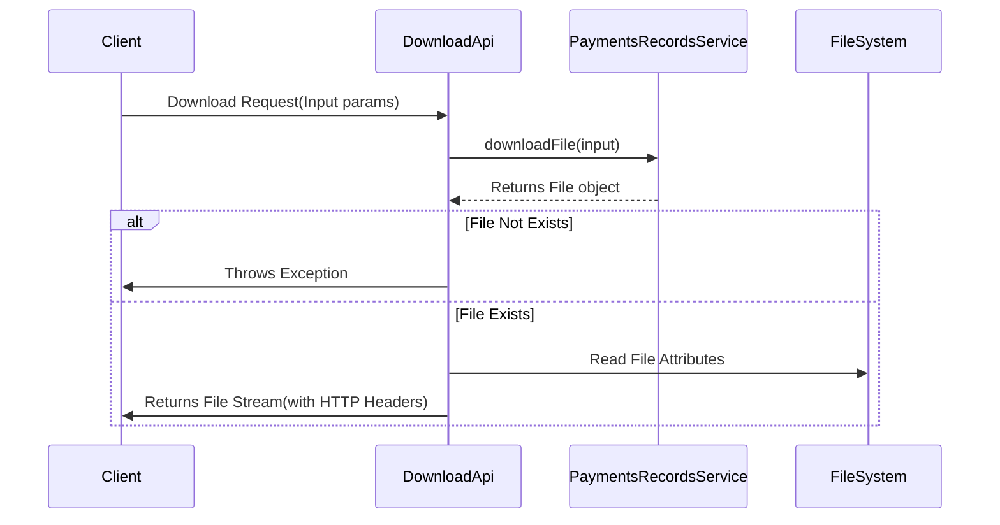

# Basic Information

|      |      |
|------|------|
| Name | DownloadApi |
| Language | .java |
| Code Path | WeFe/serving/serving-service/src/main/java/com/welab/wefe/serving/service/api/paymentsrecords/DownloadApi.java |
| Package Name | com.welab.wefe.serving.service.api.paymentsrecords |
| Dependencies | ['com.welab.wefe.common.StatusCode', 'com.welab.wefe.common.exception.StatusCodeWithException', 'com.welab.wefe.common.fieldvalidate.annotation.Check', 'com.welab.wefe.common.web.api.base.AbstractApi', 'com.welab.wefe.common.web.api.base.Api', 'com.welab.wefe.common.web.dto.AbstractApiInput', 'com.welab.wefe.common.web.dto.ApiResult', 'com.welab.wefe.serving.service.service.PaymentsRecordsService', 'org.springframework.beans.factory.annotation.Autowired', 'org.springframework.core.io.FileSystemResource', 'org.springframework.http.HttpHeaders', 'org.springframework.http.MediaType', 'org.springframework.http.ResponseEntity', 'java.io.File', 'java.io.IOException'] |
| Brief Description | Payment Record Download API class, which queries and returns a CSV file based on input parameters, including filter conditions such as service name, client name, time range, etc. It handles file-not-found exceptions and sets response headers. |

# Description

The `DownloadApi` class is an API designed for downloading payment records, with the endpoint path `"paymentsrecords/download"`. It inherits from `AbstractApi`, processes `Input` parameters, and returns a `ResponseEntity`. Its primary functionalities include invoking `paymentsRecordsService` to download files, verifying file existence, configuring HTTP response headers (Cache-Control, Content-Disposition, Last-Modified, and ETag), and returning the file resource.  

The `Input` class contains multiple validated fields: `serviceName`, `clientName`, `startTime`, `endTime`, `serviceType`, and `payType`, all of which are equipped with getter and setter methods.

# Class Summary

| Name   | Type  | Description |
|-------|------|-------------|
| DownloadApi | class | API class for downloading payment records, which accepts parameters such as service name, client name, time range, etc., calls the service to generate a file, and returns a download response including cache control and file information headers. |


## Class DownloadApi

|      |      |
|------|------|
| Access Modifier | @Api(path = "paymentsrecords/download", name = "download the payments records");public |
| Type | class |
| Name | DownloadApi |
| Description | API class for downloading payment records, which accepts parameters such as service name, client name, time range, etc., calls the service to generate a file, and returns a download response including cache control and file information headers. |


### UML Class Diagram

```mermaid
classDiagram
    class DownloadApi {
        -PaymentsRecordsService paymentsRecordsService
        +handle(Input input) ApiResult~ResponseEntity~?~
        +file(File file) ApiResult~ResponseEntity~?~
    }

    class AbstractApi~T, R~ {
        <<Abstract>>
        +handle(T input) ApiResult~R~
    }

    class PaymentsRecordsService {
        <<Interface>>
        +downloadFile(DownloadApi$Input input) File
    }

    class Input {
        -String serviceName
        -String clientName
        -long startTime
        -long endTime
        -Integer serviceType
        -Integer payType
        +getServiceName() String
        +setServiceName(String serviceName)
        +getClientName() String
        +setClientName(String clientName)
        +getStartTime() long
        +setStartTime(long startTime)
        +getEndTime() long
        +setEndTime(long endTime)
        +getServiceType() Integer
        +setServiceType(Integer serviceType)
        +getPayType() Integer
        +setPayType(Integer payType)
    }

    class AbstractApiInput {
        <<Abstract>>
    }

    DownloadApi --|> AbstractApi~Input, ResponseEntity~?~ : Inheritance
    Input --|> AbstractApiInput : Inheritance
    DownloadApi --> PaymentsRecordsService : Dependency
    DownloadApi --> Input : Usage
```

This code demonstrates the implementation structure of a payment records download API. The DownloadApi inherits from the generic abstract class AbstractApi, processes Input parameters, and returns ResponseEntity responses. Core functionalities include: 1) Downloading files via the PaymentsRecordsService interface; 2) File existence validation; 3) Constructing HTTP responses with cache control and file metadata. The Input class inherits from AbstractApiInput and contains multiple query parameters with validation annotations, following the standard getter/setter pattern. The overall design reflects clear hierarchical structure and separation of responsibilities, adhering to RESTful API best practices.


### Internal Method Call Graph

```mermaid
graph TD
    A["Class DownloadApi"]
    B["Inheritance: AbstractApi<Input, ResponseEntity<?>>"]
    C["Dependency: PaymentsRecordsService"]
    D["Method: handle(Input input)"]
    E["Method: file(File file)"]
    F["Inner Class: Input"]
    G["Attributes: serviceName/clientName/startTime/endTime/serviceType/payType"]
    H["Validation Annotation: @Check"]

    A --> B
    A --> C
    A --> D
    A --> E
    A --> F
    F --> G
    G --> H
    D -->|Invokes| E
    E -->|Checks| F1["File Existence"]
    E -->|Constructs| F2["HTTP Headers"]
    E -->|Wraps| F3["ResponseEntity"]
```





This flowchart illustrates the structure of the DownloadApi class and its core processing logic. The class inherits from AbstractApi and depends on PaymentsRecordsService, primarily containing the handle request processing method and file packaging method. The inner class Input defines six query parameters with validation annotations. The sequence diagram depicts the complete workflow from client request to file download response, including exception handling paths. The entire process implements payment record file download functionality with comprehensive HTTP cache control and file verification mechanisms.

### Field List

| Name  | Type  | Description |
|-------|-------|------|
| paymentsRecordsService | PaymentsRecordsService | Automatically inject payment record service instance. |

### Method List

| Name  | Type  | Description |
|-------|-------|------|
| handle | ApiResult<ResponseEntity<?>> | Java method override, processes input and invokes the service to download files, returns an ApiResult encapsulated response entity, and may throw status code exceptions or IO exceptions. |
| file | ApiResult<ResponseEntity<?>> | This method checks if the file exists and throws an exception if it does not. If the file exists, it sets the HTTP response headers (Cache-Control, Content-Disposition, Last-Modified, ETag) and returns a response entity containing the file resource, which is then encapsulated as an ApiResult object for return. |


