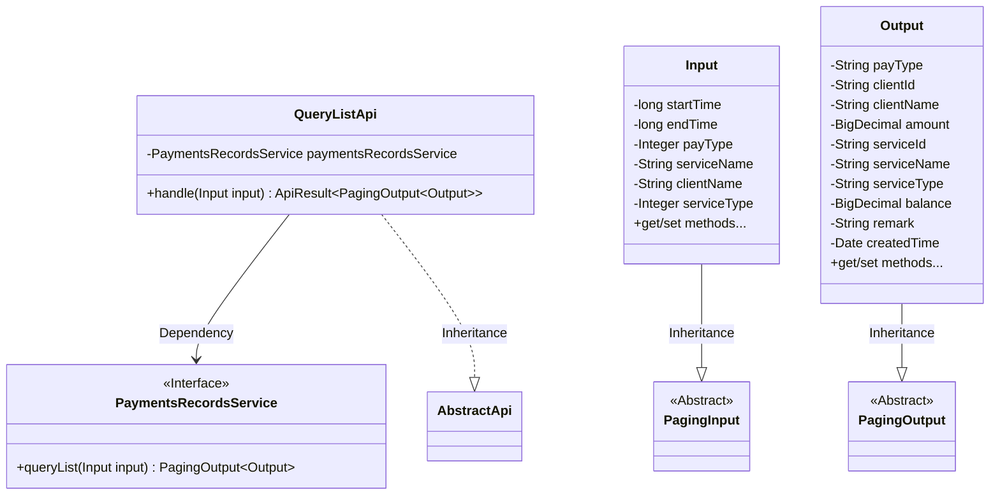

# Basic Information

|      |      |
|------|------|
| Name | QueryListApi |
| Language | .java |
| Code Path | WeFe/serving/serving-service/src/main/java/com/welab/wefe/serving/service/api/paymentsrecords/QueryListApi.java |
| Package Name | com.welab.wefe.serving.service.api.paymentsrecords |
| Dependencies | ['com.welab.wefe.common.exception.StatusCodeWithException', 'com.welab.wefe.common.web.api.base.AbstractApi', 'com.welab.wefe.common.web.api.base.Api', 'com.welab.wefe.common.web.dto.ApiResult', 'com.welab.wefe.serving.service.dto.PagingInput', 'com.welab.wefe.serving.service.dto.PagingOutput', 'com.welab.wefe.serving.service.service.PaymentsRecordsService', 'org.springframework.beans.factory.annotation.Autowired', 'java.io.IOException', 'java.math.BigDecimal', 'java.util.Date'] |
| Brief Description | Payment Record Query API, which accepts parameters including time, type, etc., and outputs a paginated list containing amount, balance, customer, and service information, among others. |

# Description

This is a Java class named QueryListApi, designed to handle API requests for querying payment record lists. The class extends AbstractApi, accepts input parameters of type Input, and returns paginated results of type PagingOutput<Output>. The Input class includes pagination parameters and query conditions such as time range, payment type, service name, etc. The Output class contains detailed payment record information, including payment type, customer details, amount, service information, balance, remarks, and creation time. The class processes business logic through PaymentsRecordsService and returns the query results.

# Class Summary

| Name   | Type  | Description |
|-------|------|-------------|
| QueryListApi | class | Payment Record Query API, supports paginated queries, accepts parameters including time, payment type, service name, etc., and outputs detailed information such as payment type, amount, balance, etc. |

## Class QueryListApi

|      |      |
|------|------|
| Access Modifier | @Api(path = "paymentsrecords/query-list", name = "query list");public |
| Type | class |
| Name | QueryListApi |
| Description | Payment Record Query API, supports paginated queries, accepts parameters including time, payment type, service name, etc., and outputs detailed information such as payment type, amount, balance, etc. |

### UML Class Diagram

This code illustrates the implementation structure of a payment records query API. QueryListApi inherits from AbstractApi to handle paginated query requests, utilizing the PaymentsRecordsService for actual data operations. The Input class extends PagingInput to include query parameters, while the Output class extends PagingOutput to contain response fields. The overall design follows a layered architecture, with Input/Output forming inheritance relationships with pagination base classes, and service invocation achieved through interface dependency for loose coupling.

### Internal Method Call Graph

```mermaid
graph TD
    A["Class QueryListApi"]
    B["Annotation: @Api(path='paymentsrecords/query-list', name='query list')"]
    C["Inheritance: AbstractApi<Input, PagingOutput<Output>>"]
    D["Dependency Injection: @Autowired PaymentsRecordsService"]
    E["Overridden Method: handle(Input input)"]
    F["Inner Class: Input extends PagingInput"]
    G["Inner Class: Output extends PagingOutput"]
    H["Input Attributes: startTime/endTime/payType/serviceName/clientName/serviceType"]
    I["Output Attributes: payType/clientId/clientName/amount/serviceId/serviceName/serviceType/balance/remark/createdTime"]

    A --> B
    A --> C
    A --> D
    A --> E
    A --> F
    A --> G
    F --> H
    G --> I
    E --> D
    E --> F
```

This flowchart illustrates the core structure of the QueryListApi class, including class annotations, inheritance relationships, dependency services, and two inner classes. The Input class contains pagination query parameters, while the Output class encapsulates returned data fields. The handle method processes input parameters by invoking paymentsRecordsService and returns paginated results, demonstrating the data flow of the API interface. The diagram clearly presents the hierarchical relationships between classes and subclasses, as well as attributes and methods.

### Field List

| Name  | Type  | Description |
|-------|-------|------|
| paymentsRecordsService | PaymentsRecordsService | The code snippet uses the @Autowired annotation to automatically inject an instance of the PaymentsRecordsService. |

### Method List

| Name  | Type  | Description |
|-------|-------|------|
| handle | ApiResult<PagingOutput<QueryListApi.Output>> | Process the input and return the payment record query list results, invoking the service method upon success. |

