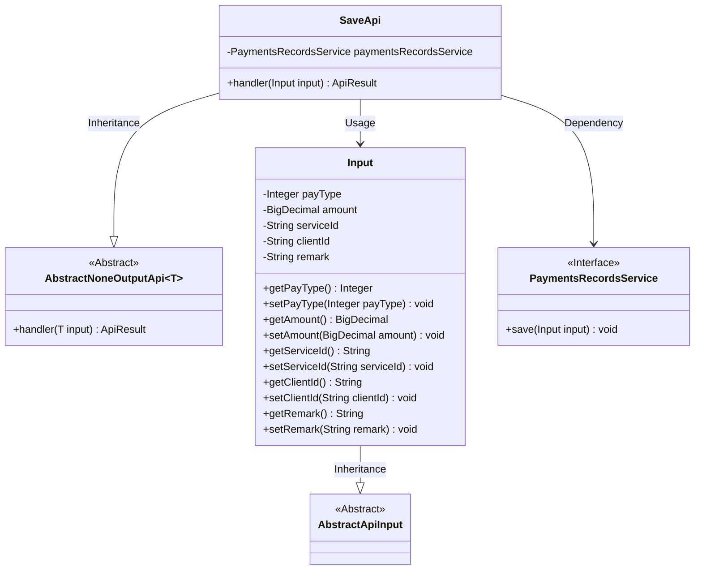

# Basic Information

|      |      |
|------|------|
| Name | SaveApi |
| Language | .java |
| Code Path | WeFe/serving/serving-service/src/main/java/com/welab/wefe/serving/service/api/paymentsrecords/SaveApi.java |
| Package Name | com.welab.wefe.serving.service.api.paymentsrecords |
| Dependencies | ['com.welab.wefe.common.exception.StatusCodeWithException', 'com.welab.wefe.common.web.api.base.AbstractNoneOutputApi', 'com.welab.wefe.common.web.api.base.Api', 'com.welab.wefe.common.web.dto.AbstractApiInput', 'com.welab.wefe.common.web.dto.ApiResult', 'com.welab.wefe.serving.service.service.PaymentsRecordsService', 'org.springframework.beans.factory.annotation.Autowired', 'java.math.BigDecimal'] |
| Brief Description | This is an API class for saving payment records, with the path "paymentsrecords/save". The input parameters include payment type, amount, service ID, customer ID, and remarks. After calling the service layer to save the data, it returns a success result. |

# Description

The code defines an API class named SaveApi, which is used to save payment records. The API path is paymentsrecords/save, and it inherits from AbstractNoneOutputApi, with the input type being the inner class Input. The Input class includes fields for payment type, amount, service ID, customer ID, and remarks, along with corresponding getter and setter methods. SaveApi processes the input through the save method of PaymentsRecordsService and returns an empty result upon success. The entire class structure is clear and focused on the functionality of saving payment records.

# Class Summary

| Name   | Type  | Description |
|-------|------|-------------|
| SaveApi | class | This is a payment record saving API class with the path "paymentsrecords/save". The input parameters include payment type, amount, service ID, customer ID, and remarks. After calling the payment record service to save the data, it returns a successful result. |

## Class SaveApi

|      |      |
|------|------|
| Access Modifier | @Api(path = "paymentsrecords/save", name = "save payments record");public |
| Type | class |
| Name | SaveApi |
| Description | This is a payment record saving API class with the path "paymentsrecords/save". The input parameters include payment type, amount, service ID, customer ID, and remarks. After calling the payment record service to save the data, it returns a successful result. |

### UML Class Diagram

This code illustrates the implementation structure of a payment record saving API. SaveApi inherits from the AbstractNoneOutputApi generic class, processes Input-type parameters, and completes data persistence through the PaymentsRecordsService. The Input class extends AbstractApiInput, containing fields such as payment type, amount, service ID, along with their getter/setter methods. The overall design adopts a layered architecture, implementing service invocation via dependency injection, aligning with object-oriented design principles.

### Internal Method Call Graph

```mermaid
graph TD
    A["Class SaveApi"]
    B["Annotation: @Api(path='paymentsrecords/save', name='save payments record')"]
    C["Inheritance: AbstractNoneOutputApi<Input>"]
    D["Dependency Injection: @Autowired PaymentsRecordsService"]
    E["Overridden Method: handler(Input input)"]
    F["Inner Class: Input"]
    G["Property: Integer payType"]
    H["Property: BigDecimal amount"]
    I["Property: String serviceId"]
    J["Property: String clientId"]
    K["Property: String remark"]
    L["getter/setter methods"]
    M["Invocation: paymentsRecordsService.save(input)"]
    N["Return: success()"]

    A --> B
    A --> C
    A --> D
    A --> E
    A --> F
    F --> G
    F --> H
    F --> I
    F --> J
    F --> K
    F --> L
    E --> M
    E --> N
```

This flowchart illustrates the complete structure of the SaveApi class, including class annotations, inheritance relationships, dependency-injected services, the overridden handler method with its internal processing logic, as well as the properties and methods of the Input inner class. The handler method saves input data by invoking paymentsRecordsService and returns a success result, while the Input class encapsulates transaction information such as payment type, amount, and service ID. The overall design implements the API functionality for saving payment records, featuring a clear structure that adheres to object-oriented design principles.

### Field List

| Name  | Type  | Description |
|-------|-------|------|
| paymentsRecordsService | PaymentsRecordsService | The code snippet uses the @Autowired annotation to automatically inject an instance of the PaymentsRecordsService. |

### Method List

| Name  | Type  | Description |
|-------|-------|------|
| handler | ApiResult | Override the handler method, invoke the paymentsRecordsService to save the input data, and return ApiResult upon success. |

