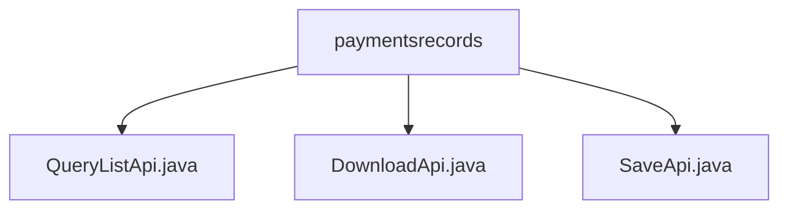

# Basic Information

|      |      |
|------|------|
| Name | paymentsrecords |
| Language | .java |
| Code Path | WeFe/serving/serving-service/src/main/java/com/welab/wefe/serving/service/api/paymentsrecords |
| Package Name | docs.serving.serving-service.src.main.java.com.welab.wefe.serving.service.api.paymentsrecords |
| Brief Description | QueryListApi handles payment record queries, supporting pagination and conditional filtering. DownloadApi provides payment record download functionality, setting HTTP response headers. SaveApi is used for saving payment records, including fields such as payment type and amount. All inherit from AbstractApi and process business logic through PaymentsRecordsService. |

# Description

## Overview  
The core responsibility of this module is to provide full lifecycle management of payment records, including paginated queries, file downloads, and record saving functionalities. The interface specifications uniformly inherit from the AbstractApi base class and adopt the Input/Output pattern. For example, QueryListApi returns paginated data in PagingOutput, DownloadApi returns a file stream, and SaveApi has no return value. Key data structures include Input (containing query conditions such as pagination parameters and time ranges) and Output (containing fields like payment details and customer information). The only external dependency is the PaymentsRecordsService, which handles core business logic. For instance, SaveApi persists payment records through its save method.  

## Key Business Scenarios  
The module supports CRUD operations for payment records: QueryListApi implements paginated queries (similar to admin backend tables), DownloadApi provides file exports (similar to Excel downloads), and SaveApi handles new record creation. All interaction modes follow RESTful conventions, such as the POST request corresponding to the `paymentsrecords/save` path. Typical applications include financial reconciliation (combined queries + downloads) and payment transaction entry. The API types cover query, download, and write operations, such as integrating paginated queries with file downloads to meet audit requirements.

### Package Internal Structure View

This flowchart illustrates three Java files under the paymentsrecords directory: QueryListApi.java, DownloadApi.java, and SaveApi.java. All files are directly subordinate to the paymentsrecords directory with no deeper subdirectory hierarchy. This flat structure indicates a dedicated module for handling payment record-related APIs, encompassing three core functional interfaces: query list, download, and save.

# File List

| Name   | Type  | Description |
|-------|------|-------------|
| [QueryListApi.java](QueryListApi.md) | file | Payment Record Query API, which takes parameters including time, type, etc., and outputs a paginated list containing amount, balance, customer, and service information, among others. |
| [DownloadApi.java](DownloadApi.md) | file | Payment Record Download API class, which queries and returns a CSV file based on input parameters, including filter conditions such as service name, client name, time range, etc., handles file-not-found exceptions, and sets response headers. |
| [SaveApi.java](SaveApi.md) | file | This is an API class for saving payment records, with the path "paymentsrecords/save". The input parameters include payment type, amount, service ID, customer ID, and remarks. After calling the service layer to save the data, it returns a successful result. |

