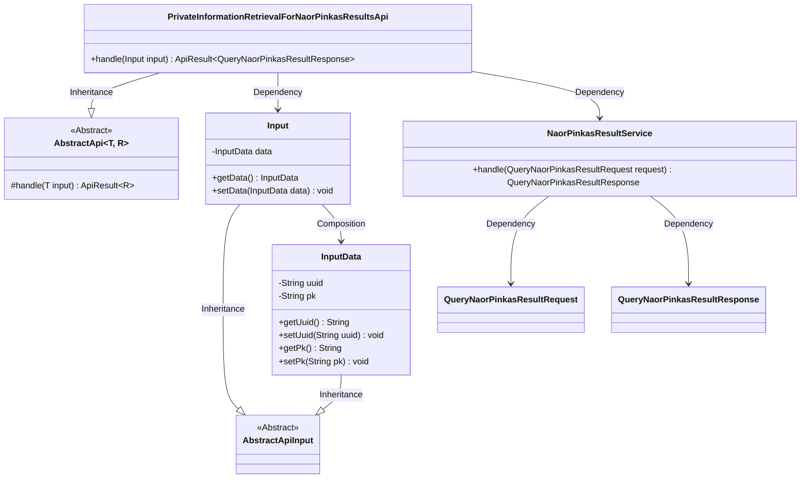

# Basic Information

|      |      |
|------|------|
| Name | PrivateInformationRetrievalForNaorPinkasResultsApi |
| Language | .java |
| Code Path | WeFe/serving/serving-service/src/main/java/com/welab/wefe/serving/service/api/pir/PrivateInformationRetrievalForNaorPinkasResultsApi.java |
| Package Name | com.welab.wefe.serving.service.api.pir |
| Dependencies | ['com.welab.wefe.common.util.JObject', 'com.welab.wefe.common.web.api.base.AbstractApi', 'com.welab.wefe.common.web.api.base.Api', 'com.welab.wefe.common.web.dto.AbstractApiInput', 'com.welab.wefe.common.web.dto.ApiResult', 'com.welab.wefe.common.web.util.ModelMapper', 'com.welab.wefe.mpc.pir.PrivateInformationRetrievalApiName', 'com.welab.wefe.mpc.pir.request.naor.QueryNaorPinkasResultRequest', 'com.welab.wefe.mpc.pir.request.naor.QueryNaorPinkasResultResponse', 'com.welab.wefe.mpc.pir.server.service.naor.NaorPinkasResultService'] |
| Brief Description | NaorPinkas Result Query API class, processes input data and returns query results, including UUID and PK fields. |

# Description

This is an API class named PrivateInformationRetrievalForNaorPinkasResultsApi, designed to handle result queries for the Naor-Pinkas protocol. The class inherits from AbstractApi, accepts input parameters of type Input, and returns QueryNaorPinkasResultResponse. The Input contains an InputData object, which stores the uuid and pk fields. In the processing logic, the request is handled via NaorPinkasResultService, and both the request and response log information are recorded. The API path is defined as PrivateInformationRetrievalApiName.NAORPINKAS_RESULTS and can be accessed without login.

# Class Summary

| Name   | Type  | Description |
|-------|------|-------------|
| PrivateInformationRetrievalForNaorPinkasResultsApi | class | NaorPinkas Result Query API class, processes input data and returns query results, including UUID and PK fields. |

## Class PrivateInformationRetrievalForNaorPinkasResultsApi

|      |      |
|------|------|
| Access Modifier | @Api(path = PrivateInformationRetrievalApiName.NAORPINKAS_RESULTS, name = "results", login = false);public |
| Type | class |
| Name | PrivateInformationRetrievalForNaorPinkasResultsApi |
| Description | NaorPinkas Result Query API class, processes input data and returns query results, including UUID and PK fields. |

### UML Class Diagram

This code demonstrates a private information retrieval results API implementation based on the Naor-Pinkas scheme. The core class `PrivateInformationRetrievalForNaorPinkasResultsApi` inherits from the generic abstract class `AbstractApi`, processing query requests containing UUID and public key through `NaorPinkasResultService`. The input parameters adopt a nested class structure, where `Input` contains `InputData` as the data carrier, both inheriting from the base class `AbstractApiInput`. The system converts input data into service request objects through model mapping, ultimately returning responses containing query results.

### Internal Method Call Graph

```mermaid
graph TD
    A["Class PrivateInformationRetrievalForNaorPinkasResultsApi"]
    B["Inheritance: AbstractApi<Input, QueryNaorPinkasResultResponse>"]
    C["Overridden Method: handle(Input input)"]
    D["Create: NaorPinkasResultService"]
    E["Logging: Request path and parameters"]
    F["Data Mapping: ModelMapper.map"]
    G["Invoke: service.handle(request)"]
    H["Logging: Response result"]
    I["Return: success(response)"]
    J["Nested Class: Input"]
    K["Property: InputData data"]
    L["Nested Class: InputData"]
    M["Property: String uuid"]
    N["Property: String pk"]

    A --> B
    A --> C
    C --> D
    C --> E
    C --> F
    C --> G
    C --> H
    C --> I
    A --> J
    J --> K
    A --> L
    L --> M
    L --> N
```

This code implements a private information retrieval results API based on the Naor-Pinkas scheme, primarily handling query requests and returning encrypted results. The flowchart illustrates the complete process from request handling to response return, including key steps such as service initialization, request parameter mapping, business logic processing, and logging. It also describes the structural relationships of the nested Input and InputData classes. The API achieves standardized processing through abstract class inheritance and employs layered logging to ensure traceability.

### Field List

| Name  | Type  | Description |
|-------|-------|------|

### Method List

| Name  | Type  | Description |
|-------|-------|------|
| handle | ApiResult<QueryNaorPinkasResultResponse> | The method processes NaorPinkas query requests, logs input and output, invokes the service to handle the request, and returns the result. |

