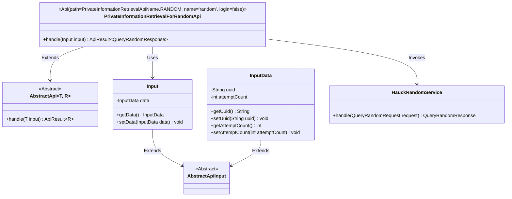

# Basic Information

|      |      |
|------|------|
| Name | PrivateInformationRetrievalForRandomApi |
| Language | .java |
| Code Path | WeFe/serving/serving-service/src/main/java/com/welab/wefe/serving/service/api/pir/PrivateInformationRetrievalForRandomApi.java |
| Package Name | com.welab.wefe.serving.service.api.pir |
| Dependencies | ['java.io.IOException', 'com.welab.wefe.common.exception.StatusCodeWithException', 'com.welab.wefe.common.util.JObject', 'com.welab.wefe.common.web.api.base.AbstractApi', 'com.welab.wefe.common.web.api.base.Api', 'com.welab.wefe.common.web.dto.AbstractApiInput', 'com.welab.wefe.common.web.dto.ApiResult', 'com.welab.wefe.common.web.util.ModelMapper', 'com.welab.wefe.mpc.pir.PrivateInformationRetrievalApiName', 'com.welab.wefe.mpc.pir.request.QueryRandomRequest', 'com.welab.wefe.mpc.pir.request.QueryRandomResponse', 'com.welab.wefe.mpc.pir.server.service.HauckRandomService'] |
| Brief Description | The `PrivateInformationRetrievalForRandomApi` class handles random information retrieval requests without requiring login. The input includes `uuid` and `attemptCount`, which are processed by `HauckRandomService` to return a response, while logging both the request and response. |

# Description

This is an API class named PrivateInformationRetrievalForRandomApi, designed to handle random information retrieval requests. The class inherits from AbstractApi, with the input type being an internally defined Input class and the output type being QueryRandomResponse. The API path is PrivateInformationRetrievalApiName.RANDOM, accessible without login. In the processing logic, an instance of HauckRandomService is created, the input data is mapped into a QueryRandomRequest object for service invocation, and both request and response logs are recorded. The Input class contains a data field of type InputData, while the InputData class defines a uuid string field and an attemptCount integer field, both of which are provided with getter and setter methods.

# Class Summary

| Name   | Type  | Description |
|-------|------|-------------|
| PrivateInformationRetrievalForRandomApi | class | The `PrivateInformationRetrievalForRandomApi` class handles random information retrieval requests, receives input data containing `uuid` and `attemptCount`, invokes the `HauckRandomService` for processing, and returns the response. |

## Class PrivateInformationRetrievalForRandomApi

|      |      |
|------|------|
| Access Modifier | @Api(path = PrivateInformationRetrievalApiName.RANDOM, name = "random", login = false);public |
| Type | class |
| Name | PrivateInformationRetrievalForRandomApi |
| Description | The `PrivateInformationRetrievalForRandomApi` class handles random information retrieval requests, receives input data containing `uuid` and `attemptCount`, invokes the `HauckRandomService` for processing, and returns the response. |

### UML Class Diagram

This class diagram illustrates a random information retrieval implementation based on an abstract API framework. The PrivateInformationRetrievalForRandomApi inherits from the generic abstract class AbstractApi, processes Input-type parameters, and returns QueryRandomResponse results. It includes nested classes Input and InputData to encapsulate request data, with InputData storing UUID and attempt count. The core business logic is handled by HauckRandomService, demonstrating clear hierarchical relationships and responsibility division.

### Internal Method Call Graph

```mermaid
graph TD
    A["Class PrivateInformationRetrievalForRandomApi"]
    B["Parent Class: AbstractApi<Input, QueryRandomResponse>"]
    C["Annotation: @Api"]
    D["Method: handle(Input input)"]
    E["Inner Class: Input"]
    F["Inner Class: InputData"]
    G["HauckRandomService instantiation"]
    H["Log request"]
    I["Map request data"]
    J["Invoke service.handle"]
    K["Log response"]
    L["Return success()"]

    A --> B
    A --> C
    A --> D
    A --> E
    E --> F
    D --> G
    D --> H
    D --> I
    D --> J
    D --> K
    D --> L
```

This code demonstrates a random information retrieval API implementation class based on AbstractApi, encompassing the request processing flow and nested input data structures. The flowchart clearly presents the complete call chain from request handling to response: service instance initialization → request logging → data mapping transformation → business processing → response logging → returning success results. The two static inner classes Input and InputData form a hierarchical request parameter structure, where InputData contains uuid and attemptCount fields. The overall design reflects a typical API processing pattern with clear logging traces and type-safe data conversion.

### Field List

| Name  | Type  | Description |
|-------|-------|------|

### Method List

| Name  | Type  | Description |
|-------|-------|------|
| handle | ApiResult<QueryRandomResponse> | Handle random query requests, log input and output, call services and return results. |

