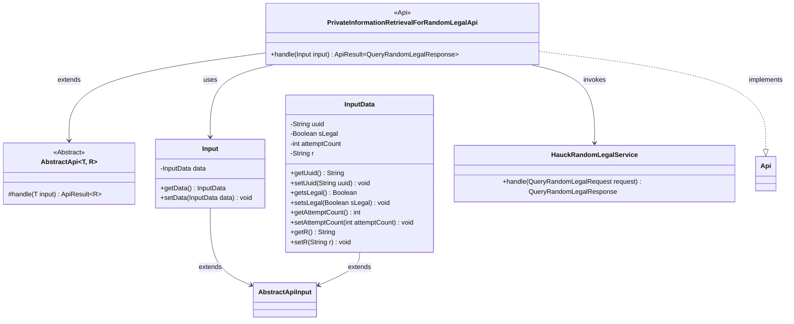

# Basic Information

|      |      |
|------|------|
| Name | PrivateInformationRetrievalForRandomLegalApi |
| Language | .java |
| Code Path | WeFe/serving/serving-service/src/main/java/com/welab/wefe/serving/service/api/pir/PrivateInformationRetrievalForRandomLegalApi.java |
| Package Name | com.welab.wefe.serving.service.api.pir |
| Dependencies | ['java.io.IOException', 'com.welab.wefe.common.exception.StatusCodeWithException', 'com.welab.wefe.common.util.JObject', 'com.welab.wefe.common.web.api.base.AbstractApi', 'com.welab.wefe.common.web.api.base.Api', 'com.welab.wefe.common.web.dto.AbstractApiInput', 'com.welab.wefe.common.web.dto.ApiResult', 'com.welab.wefe.common.web.util.ModelMapper', 'com.welab.wefe.mpc.pir.PrivateInformationRetrievalApiName', 'com.welab.wefe.mpc.pir.request.QueryRandomLegalRequest', 'com.welab.wefe.mpc.pir.request.QueryRandomLegalResponse', 'com.welab.wefe.mpc.pir.server.service.HauckRandomLegalService'] |
| Brief Description | Random Legal Information Query API class, processes input data and invokes services to return responses, including parameters such as UUID, legal flag, and attempt count. |

# Description

The code defines an API class named `PrivateInformationRetrievalForRandomLegalApi`, designed to handle random legal information query requests. The API path is `random_legal`, and no login is required. The class inherits from `AbstractApi`, with the input type being the inner class `Input` and the output being `QueryRandomLegalResponse`. The processing logic includes: creating an instance of `HauckRandomLegalService`, logging the request, mapping input data to `QueryRandomLegalRequest`, invoking the service to process the request, and logging the response. The `Input` class contains an inner class `InputData`, which includes the fields `uuid`, `sLegal`, `attemptCount`, and `r`, all of which have getter and setter methods provided.

# Class Summary

| Name   | Type  | Description |
|-------|------|-------------|
| PrivateInformationRetrievalForRandomLegalApi | class | This is an API class for handling random legal information queries, which inherits from AbstractApi. It includes input data structures and processing logic, utilizing HauckRandomLegalService to process requests and return responses. |

## Class PrivateInformationRetrievalForRandomLegalApi

|      |      |
|------|------|
| Access Modifier | @Api(path = PrivateInformationRetrievalApiName.RANDOM_LEGAL, name = "random_legal", login = false);public |
| Type | class |
| Name | PrivateInformationRetrievalForRandomLegalApi |
| Description | This is an API class for handling random legal information queries, which inherits from AbstractApi. It includes input data structures and processing logic, utilizing HauckRandomLegalService to process requests and return responses. |

### UML Class Diagram

This code implements a random legal information retrieval API. The core class `PrivateInformationRetrievalForRandomLegalApi` inherits from the generic abstract class `AbstractApi` and processes requests through `HauckRandomLegalService`. It includes nested classes `Input` and `InputData`, which inherit from `AbstractApiInput` and are used to encapsulate request parameters. The class diagram illustrates inheritance relationships, dependency invocations, and interface implementations, reflecting layered design and parameter encapsulation mechanisms.

### Internal Method Call Graph

```mermaid
graph TD
    A["Class PrivateInformationRetrievalForRandomLegalApi"]
    B["Inheritance: AbstractApi<Input, QueryRandomLegalResponse>"]
    C["Annotation: @Api"]
    D["Method: handle(Input input)"]
    E["Inner Class: Input"]
    F["Inner Class: InputData"]
    G["Create HauckRandomLegalService"]
    H["Log request information"]
    I["Map request data: ModelMapper.map"]
    J["Invoke service.handle"]
    K["Log response information"]
    L["Return success(response)"]

    A --> B
    A --> C
    A --> D
    A --> E
    E --> F
    D --> G
    D --> H
    D --> I
    D --> J
    D --> K
    D --> L
```

This code demonstrates an API class for processing random legal information queries, inheriting from the abstract base class AbstractApi. The main workflow includes: service initialization, request logging, data mapping conversion, service invocation, response logging, and result return. It contains two nested static classes Input and InputData for encapsulating request parameters, where InputData includes fields such as uuid and sLegal. The entire process reflects a typical API request handling pattern, incorporating complete request/response logging and exception handling mechanisms.

### Field List

| Name  | Type  | Description |
|-------|-------|------|

### Method List

| Name  | Type  | Description |
|-------|-------|------|
| handle | ApiResult<QueryRandomLegalResponse> | This method processes random legal information query requests, creates service instances, logs request and response records, and ultimately returns successful results. |

