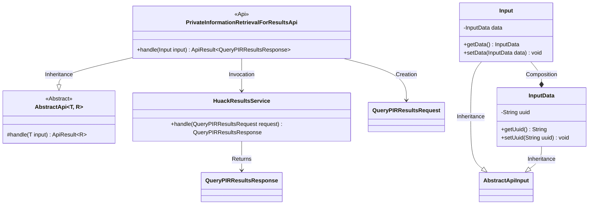

# Basic Information

|      |      |
|------|------|
| Name | PrivateInformationRetrievalForResultsApi |
| Language | .java |
| Code Path | WeFe/serving/serving-service/src/main/java/com/welab/wefe/serving/service/api/pir/PrivateInformationRetrievalForResultsApi.java |
| Package Name | com.welab.wefe.serving.service.api.pir |
| Dependencies | ['java.io.IOException', 'com.welab.wefe.common.exception.StatusCodeWithException', 'com.welab.wefe.common.util.JObject', 'com.welab.wefe.common.web.api.base.AbstractApi', 'com.welab.wefe.common.web.api.base.Api', 'com.welab.wefe.common.web.dto.AbstractApiInput', 'com.welab.wefe.common.web.dto.ApiResult', 'com.welab.wefe.common.web.util.ModelMapper', 'com.welab.wefe.mpc.pir.PrivateInformationRetrievalApiName', 'com.welab.wefe.mpc.pir.request.QueryPIRResultsRequest', 'com.welab.wefe.mpc.pir.request.QueryPIRResultsResponse', 'com.welab.wefe.mpc.pir.server.service.HuackResultsService'] |
| Brief Description | The `PrivateInformationRetrievalForResultsApi` class handles private information retrieval result requests. It receives input data containing a UUID, invokes the `HuackResultsService` for processing, and returns the response result. |

# Description

The code defines an API class named `PrivateInformationRetrievalForResultsApi`, designed to handle private information retrieval result queries. This class inherits from `AbstractApi`, accepts an `Input` type parameter, and returns a `QueryPIRResultsResponse`. Its primary function is to process query requests through `HuackResultsService` while logging both request and response details. The `Input` class contains an `InputData` object, which stores the `uuid` field required for the query. This API is accessible via the `RESULTS` path and does not require login.

# Class Summary

| Name   | Type  | Description |
|-------|------|-------------|
| PrivateInformationRetrievalForResultsApi | class | The `PrivateInformationRetrievalForResultsApi` class handles private information retrieval result requests. It receives input data containing a UUID, invokes the `HuackResultsService` for processing, and returns the response result. |

## Class PrivateInformationRetrievalForResultsApi

|      |      |
|------|------|
| Access Modifier | @Api(path = PrivateInformationRetrievalApiName.RESULTS, name = "results", login = false);public |
| Type | class |
| Name | PrivateInformationRetrievalForResultsApi |
| Description | The `PrivateInformationRetrievalForResultsApi` class handles private information retrieval result requests. It receives input data containing a UUID, invokes the `HuackResultsService` for processing, and returns the response result. |

### UML Class Diagram

This code demonstrates the implementation structure of a private information retrieval results API. The core class PrivateInformationRetrievalForResultsApi inherits from the generic abstract class AbstractApi, processes input data containing UUID parameters, and retrieves query results through the HuackResultsService. The class diagram clearly presents inheritance relationships (abstract API base class), composition relationships (Input contains InputData), and service invocation dependencies, reflecting a typical API processing flow: parameter reception → service invocation → result return in a complete chain.

### Internal Method Call Graph

```mermaid
graph TD
    A["Class PrivateInformationRetrievalForResultsApi"]
    B["Inheritance: AbstractApi<Input, QueryPIRResultsResponse>"]
    C["Overridden Method: handle(Input input)"]
    D["Create HuackResultsService instance"]
    E["Log request information"]
    F["Map input data to QueryPIRResultsRequest"]
    G["Invoke service.handle for processing"]
    H["Log response information"]
    I["Return success response"]
    J["Nested Class Input"]
    K["Property: InputData data"]
    L["Nested Class InputData"]
    M["Property: String uuid"]

    A --> B
    A --> C
    C --> D
    C --> E
    C --> F
    C --> G
    C --> H
    C --> I
    A --> J
    J --> K
    J --> L
    L --> M
```

This code demonstrates an API class for handling private information retrieval results, which implements core request processing logic by inheriting from an abstract base class. The flowchart clearly presents the complete workflow from request handling to response return: including key steps such as service instance creation, request/response logging, data mapping conversion, and business processing, while also displaying the hierarchical structure of nested input classes. The design adheres to layered processing principles, standardizes input/output types through the abstract base class, and provides detailed logging capabilities.

### Field List

| Name  | Type  | Description |
|-------|-------|------|

### Method List

| Name  | Type  | Description |
|-------|-------|------|
| handle | ApiResult<QueryPIRResultsResponse> | Rewrite the method to handle query requests, log input and output, invoke the service, and return the result. |

