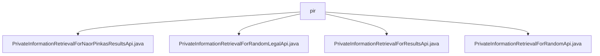

# Basic Information

|      |      |
|------|------|
| Name | pir |
| Language | .java |
| Code Path | WeFe/serving/serving-service/src/main/java/com/welab/wefe/serving/service/api/pir |
| Package Name | docs.serving.serving-service.src.main.java.com.welab.wefe.serving.service.api.pir |
| Brief Description | The information describes four API classes, all inheriting from AbstractApi, designed to handle different private information retrieval requests. NaorPinkasResultsApi processes Naor-Pinkas protocol result queries, RandomLegalApi handles random legal information queries, ResultsApi manages retrieval result queries, and RandomApi deals with random information retrieval. All APIs operate without requiring login and include input-output definitions along with logging functionality. |

# Description

## Overview  
The core responsibility of this module is to provide Private Information Retrieval (PIR) functionality, including sub-services such as Naor-Pinkas protocol result queries and random legal information retrieval, operating in a manner similar to a distributed query proxy pattern. The interface specifications uniformly inherit from AbstractApi, with inputs being Input classes containing InputData and outputs being specific Response objects. All APIs are accessible without authentication.  

Key data structures include InputData (containing fields such as uuid and pk) and various Request/Response objects. External dependencies primarily consist of internal service components like NaorPinkasResultService and HauckRandomLegalService. For example, the Naor-Pinkas protocol processing uses uuid and pk fields, while random legal retrieval requires sLegal and attemptCount parameters.  

## Primary Business Scenarios  
The module supports four typical query scenarios: Naor-Pinkas result retrieval (e.g., protocol verification), random data retrieval (e.g., test data generation), legal information queries (e.g., compliance checks), and generic PIR result queries. The interaction model in all cases involves the client submitting a request containing a uuid, which the server processes and returns a structured result.  

API types are categorized into result queries (e.g., NAORPINKAS_RESULTS) and random data queries (e.g., RANDOM_LEGAL). For instance, random APIs use attemptCount to control retry attempts, while legal retrieval APIs require the sLegal parameter to specify legal provisions. All services adopt a "request-service-response" pipeline model and include built-in logging and tracing capabilities.

### Package Internal Structure View

This flowchart illustrates the hierarchical relationships of four core API files in the PIR (Private Information Retrieval) service. All Java files are directly located under the pir directory, including four functional interfaces: Naor-Pinkas results retrieval, random legal data retrieval, general results retrieval, and random data retrieval, reflecting the flat structure design of this module. Each file represents an independent implementation approach for private information retrieval.

# File List

| Name   | Type  | Description |
|-------|------|-------------|
| [PrivateInformationRetrievalForNaorPinkasResultsApi.java](PrivateInformationRetrievalForNaorPinkasResultsApi.md) | file | NaorPinkas result query API class, processes input data and returns query results, including UUID and PK fields. |
| [PrivateInformationRetrievalForRandomLegalApi.java](PrivateInformationRetrievalForRandomLegalApi.md) | file | Random Legal Information Query API class, processes input data and invokes services to return responses, including parameters such as UUID, legality flag, and attempt count. |
| [PrivateInformationRetrievalForResultsApi.java](PrivateInformationRetrievalForResultsApi.md) | file | The `PrivateInformationRetrievalForResultsApi` class handles private information retrieval result requests. It receives input data containing UUID, invokes the `HuackResultsService` for processing, and returns the response results. |
| [PrivateInformationRetrievalForRandomApi.java](PrivateInformationRetrievalForRandomApi.md) | file | The `PrivateInformationRetrievalForRandomApi` class handles random information query requests without requiring login. The input includes `uuid` and `attemptCount`, which are processed by `HauckRandomService` to return a response, while logging both the request and response. |

