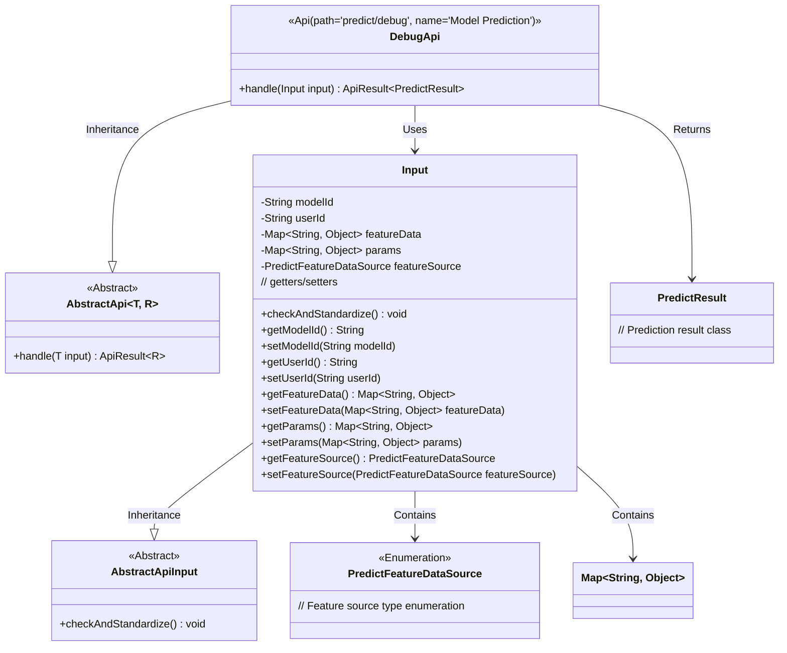
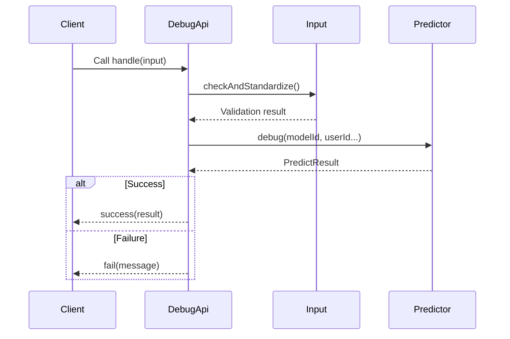

# Basic Information

|      |      |
|------|------|
| Name | DebugApi |
| Language | .java |
| Code Path | WeFe/serving/serving-service/src/main/java/com/welab/wefe/serving/service/api/predict/DebugApi.java |
| Package Name | com.welab.wefe.serving.service.api.predict |
| Dependencies | ['com.alibaba.fastjson.JSONObject', 'com.welab.wefe.common.StatusCode', 'com.welab.wefe.common.exception.StatusCodeWithException', 'com.welab.wefe.common.fieldvalidate.annotation.Check', 'com.welab.wefe.common.web.api.base.AbstractApi', 'com.welab.wefe.common.web.api.base.Api', 'com.welab.wefe.common.web.dto.AbstractApiInput', 'com.welab.wefe.common.web.dto.ApiResult', 'com.welab.wefe.common.wefe.enums.PredictFeatureDataSource', 'com.welab.wefe.serving.sdk.dto.PredictResult', 'com.welab.wefe.serving.service.predicter.Predictor', 'org.apache.commons.collections4.MapUtils', 'org.apache.commons.lang3.StringUtils', 'java.util.Map'] |
| Brief Description | The DebugApi class provides model prediction functionality, processes input parameters, and returns prediction results, including parameter validation and exception handling. |

# Description

The DebugApi class is an API interface designed for model prediction debugging, inheriting from AbstractApi. It processes input of type Input and outputs PredictResult. The API path is predict/debug, named "Model Prediction." Its primary function involves performing predictions via the Predictor.debug method, accepting inputs such as model ID, user ID, feature data, feature source, and parameters.  

The Input class defines essential input fields, including model ID, user ID, feature data, parameters, and feature source type, with parameter validation to ensure that when the feature source is SQL, the parameters are non-empty and at least either sample ID or sample features are provided. During processing, exceptions are caught and corresponding error messages are returned.

# Class Summary

| Name   | Type  | Description |
|-------|------|-------------|
| DebugApi | class | The DebugApi class provides model prediction functionality, processing input parameters and returning prediction results. The inputs include model ID, user ID, feature data, etc. After validating parameter validity, it invokes Predictor.debug to execute the prediction, returning results upon success or error messages upon failure. |

## Class DebugApi

|      |      |
|------|------|
| Access Modifier | @Api(;        path = "predict/debug",;        name = "模型预测";);public |
| Type | class |
| Name | DebugApi |
| Description | The DebugApi class provides model prediction functionality, processing input parameters and returning prediction results. The inputs include model ID, user ID, feature data, etc. After validating parameter validity, it invokes Predictor.debug to execute the prediction, returning results upon success or error messages upon failure. |

### UML Class Diagram

Class Diagram Description:
The diagram illustrates the structural relationships of DebugApi and its associated classes. DebugApi inherits from the generic class AbstractApi<Input, PredictResult>, implementing model prediction functionality. Input, as an inner class inheriting from AbstractApiInput, contains fields such as model ID, user ID, feature data, and implements parameter validation logic. PredictResult represents the prediction result, while PredictFeatureDataSource is an enumeration type for feature sources. The class diagram clearly presents inheritance, composition, and usage relationships between components, reflecting the complete workflow of parameter validation and prediction processing.

### Internal Method Call Graph

```mermaid
graph TD
    A["Class DebugApi"]
    B["Inheritance: AbstractApi<Input, PredictResult>"]
    C["Method: handle(Input input)"]
    D["Invocation: Predictor.debug()"]
    E["Return: success(result)"]
    F["Exception Handling: fail(e.getMessage())"]
    G["Nested Class Input"]
    H["Inheritance: AbstractApiInput"]
    I["Properties: modelId, userId, featureData, params, featureSource"]
    J["Method: checkAndStandardize()"]
    K["Validation Logic: Non-null parameter checks"]
    L["Getter/Setter methods"]

    A --> B
    A --> C
    C --> D
    D --> E
    C --> F
    A --> G
    G --> H
    G --> I
    G --> J
    J --> K
    G --> L
```

This code implements a model prediction debugging API, primarily consisting of the DebugApi class and its nested Input class. The flowchart illustrates the class structure and key method invocation relationships, while the sequence diagram depicts the complete API call flow. The Input class handles parameter validation, DebugApi processes core prediction logic, obtains results via Predictor, and returns them to the client. The code includes comprehensive exception handling and parameter validation mechanisms to ensure prediction process reliability.

### Field List

| Name  | Type  | Description |
|-------|-------|------|

### Method List

| Name  | Type  | Description |
|-------|-------|------|
| handle | ApiResult<PredictResult> | Process the input and invoke the predictor, returning the result upon success or an error message upon failure. |

