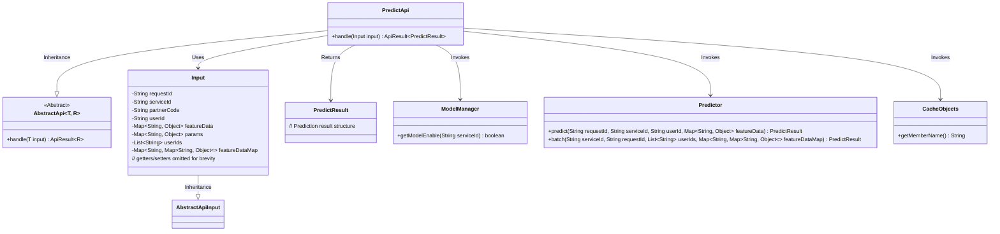

# Basic Information

|      |      |
|------|------|
| Name | PredictApi |
| Language | .java |
| Code Path | WeFe/serving/serving-service/src/main/java/com/welab/wefe/serving/service/api/predict/PredictApi.java |
| Package Name | com.welab.wefe.serving.service.api.predict |
| Dependencies | ['com.welab.wefe.common.fieldvalidate.annotation.Check', 'com.welab.wefe.common.web.api.base.AbstractApi', 'com.welab.wefe.common.web.api.base.Api', 'com.welab.wefe.common.web.api.base.Caller', 'com.welab.wefe.common.web.dto.AbstractApiInput', 'com.welab.wefe.common.web.dto.ApiResult', 'com.welab.wefe.serving.sdk.dto.PredictResult', 'com.welab.wefe.serving.service.manager.ModelManager', 'com.welab.wefe.serving.service.predicter.Predictor', 'com.welab.wefe.serving.service.service.CacheObjects', 'org.apache.commons.collections4.CollectionUtils', 'java.util.List', 'java.util.Map'] |
| Brief Description | The PredictApi provides model prediction functionality, supporting both single-user and batch predictions. It requires parameters such as request ID and model identifier, and returns prediction results after verifying the model's online status. |

# Description

PredictApi is a model prediction interface that allows clients to access it through signatures. It inherits from AbstractApi and processes the input Input and output PredictResult. Its main functionalities include checking whether the model is online, supporting batch prediction and single-user prediction. The Input class contains required fields requestId, serviceId, and partnerCode, as well as optional fields userId, userIds, featureData, featureDataMap, and params. Batch prediction uses userIds and featureDataMap, while single-user prediction uses userId and featureData. All fields have getter and setter methods.

# Class Summary

| Name   | Type  | Description |
|-------|------|-------------|
| PredictApi | class | The PredictApi provides model prediction functionality, supporting both single-user and batch predictions. It requires parameters such as request ID and model identifier, and returns prediction results after verifying the model's online status. |

## Class PredictApi

|      |      |
|------|------|
| Access Modifier | @Api(;        path = "predict",;        name = "模型预测",;        allowAccessWithSign = true,;        domain = Caller.Customer;);public |
| Type | class |
| Name | PredictApi |
| Description | The PredictApi provides model prediction functionality, supporting both single-user and batch predictions. It requires parameters such as request ID and model identifier, and returns prediction results after verifying the model's online status. |

### UML Class Diagram

This code demonstrates the implementation structure of a model prediction API. PredictApi inherits from the generic AbstractApi class, handling two prediction modes: batch prediction (triggered via userIds) and single-user prediction (triggered via userId). Core classes include the input parameter encapsulation class Input, prediction result class PredictResult, and dependent components such as ModelManager (model status check), Predictor (prediction execution), and CacheObjects (cache access). The system determines the execution path by checking model status and input parameters, ultimately returning a unified prediction result encapsulation.

### Internal Method Call Graph

```mermaid
graph TD
    A["PredictApi Class"]
    B["Inheritance: AbstractApi<Input, PredictResult>"]
    C["Annotation: @Api Configuration"]
    D["Method: handle(Input input)"]
    E["Check: ModelManager.getModelEnable"]
    F["Batch Prediction Branch: Predictor.batch"]
    G["Single Prediction Branch: Predictor.predict"]
    H["Return Result: success/fail"]
    I["Nested Class: Input"]
    J["Input Properties: requestId, etc. (9 fields)"]
    K["Input Methods: getter/setter"]

    A --> B
    A --> C
    A --> D
    D --> E
    E -->|false| H
    E -->|true| F
    E -->|true| G
    F --> H
    G --> H
    A --> I
    I --> J
    I --> K
```

This flowchart illustrates the core structure of PredictApi: 1) Class inheritance relationship and API annotation configuration; 2) Two prediction paths (batch/single) in the handle method and pre-check logic; 3) Properties and methods of the nested Input class. The processing flow first verifies model availability, then determines the prediction approach based on whether userIds exist, and finally uniformly encapsulates the return result. Input parameters are structurally encapsulated and managed via the Input class.

### Field List

| Name  | Type  | Description |
|-------|-------|------|

### Method List

| Name  | Type  | Description |
|-------|-------|------|
| handle | ApiResult<PredictResult> | This method processes prediction requests by first checking whether the model is enabled. It supports both batch prediction (when the input contains multiple user IDs) and single-user prediction, returning the predicted results. |

