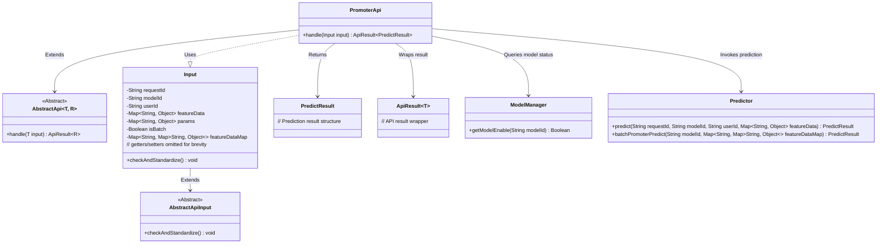

# Basic Information

|      |      |
|------|------|
| Name | PromoterApi |
| Language | .java |
| Code Path | WeFe/serving/serving-service/src/main/java/com/welab/wefe/serving/service/api/predict/PromoterApi.java |
| Package Name | com.welab.wefe.serving.service.api.predict |
| Dependencies | ['com.welab.wefe.common.StatusCode', 'com.welab.wefe.common.exception.StatusCodeWithException', 'com.welab.wefe.common.fieldvalidate.annotation.Check', 'com.welab.wefe.common.util.StringUtil', 'com.welab.wefe.common.web.api.base.AbstractApi', 'com.welab.wefe.common.web.api.base.Api', 'com.welab.wefe.common.web.api.base.Caller', 'com.welab.wefe.common.web.dto.AbstractApiInput', 'com.welab.wefe.common.web.dto.ApiResult', 'com.welab.wefe.serving.sdk.dto.PredictResult', 'com.welab.wefe.serving.service.manager.ModelManager', 'com.welab.wefe.serving.service.predicter.Predictor', 'com.welab.wefe.serving.service.service.CacheObjects', 'org.apache.commons.collections4.MapUtils', 'java.util.Map'] |
| Brief Description | The PromoterApi provides model prediction functionality, supporting both single and batch predictions. Input parameters include request ID, model ID, user ID, and feature data. If the model is not online or the parameters are invalid, an error is returned; upon success, the prediction results are returned. |

# Description

This is a model prediction API class named PromoterApi, which inherits from AbstractApi, processes Input, and returns PredictResult. The API path is predict/promoter, allowing signed access with the calling domain set to Member. Its main functionalities include checking model availability, performing single prediction (current implementation), and batch prediction (commented out). The Input class contains fields such as request ID, model ID, user ID, and feature data, along with parameter validation logic to ensure non-empty user ID for single prediction and non-empty feature data mapping for batch prediction. All fields have getter and setter methods. Failure messages are returned in exceptional cases.

# Class Summary

| Name   | Type  | Description |
|-------|------|-------------|
| PromoterApi | class | The PromoterApi provides model prediction functionality, supporting both single and batch predictions. Input parameters include request ID, model ID, user ID, and feature data. If the model is not online or the parameters are invalid, an error is returned; upon success, the prediction results are returned. |

## Class PromoterApi

|      |      |
|------|------|
| Access Modifier | @Api(;        path = "predict/promoter",;        name = "模型预测",;        allowAccessWithSign = true,;        domain = Caller.Member;);public |
| Type | class |
| Name | PromoterApi |
| Description | The PromoterApi provides model prediction functionality, supporting both single and batch predictions. Input parameters include request ID, model ID, user ID, and feature data. If the model is not online or the parameters are invalid, an error is returned; upon success, the prediction results are returned. |

### UML Class Diagram

Class Diagram Description:
The diagram illustrates the core structure of the PromoterApi prediction system. PromoterApi inherits from the generic AbstractApi class, processes Input parameters, and returns PredictResult. The Input class extends AbstractApiInput, containing request parameters and validation logic. The system relies on ModelManager to check model status and uses Predictor for single/batch predictions. ApiResult serves as a unified response wrapper, demonstrating clear hierarchical relationships and separation of responsibilities.

### Internal Method Call Graph

```mermaid
graph TD
    A["PromoterApi Class"]
    B["Inheritance: AbstractApi<Input, PredictResult>"]
    C["Annotation: @Api Configuration"]
    D["Method: handle(Input input)"]
    E["Check Model Status: ModelManager.getModelEnable"]
    F["Single Prediction: Predictor.predict"]
    G["Return Result: success/fail"]
    H["Input Inner Class"]
    I["Fields: requestId, modelId etc."]
    J["Method: checkAndStandardize"]
    K["getter/setter Methods"]

    A --> B
    A --> C
    A --> D
    D --> E
    E -->|Model Disabled| G
    E -->|Model Enabled| F
    F --> G
    A --> H
    H --> I
    H --> J
    H --> K
```

This code implements a model prediction API, primarily consisting of the PromoterApi class and Input inner class. PromoterApi first checks the model status when processing prediction requests, then invokes the predictor based on input type (currently only single input supported), and finally returns results. The Input class encapsulates request parameters with validation logic, containing multiple annotated fields and a standardization method. The flowchart clearly illustrates the class structure, main method call relationships, and exception handling paths.

### Field List

| Name  | Type  | Description |
|-------|-------|------|

### Method List

| Name  | Type  | Description |
|-------|-------|------|
| handle | ApiResult<PredictResult> | Process the input and return the prediction result. Check if the model is available, execute single prediction, return the result upon success, or return an error message upon failure. |

