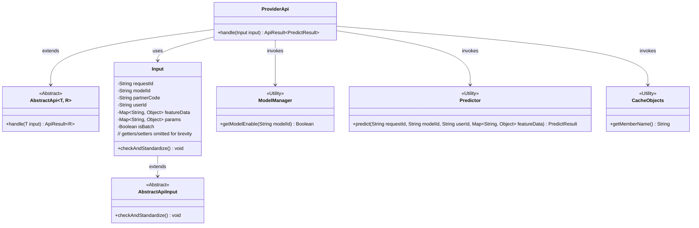
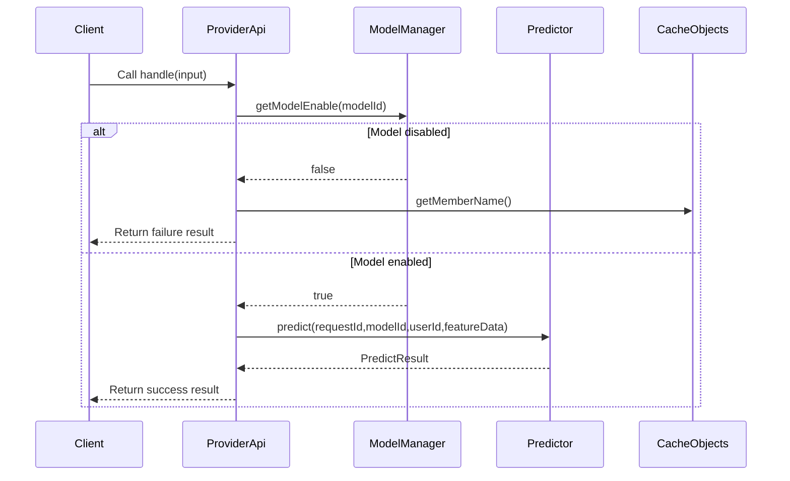

# Basic Information

|      |      |
|------|------|
| Name | ProviderApi |
| Language | .java |
| Code Path | WeFe/serving/serving-service/src/main/java/com/welab/wefe/serving/service/api/predict/ProviderApi.java |
| Package Name | com.welab.wefe.serving.service.api.predict |
| Dependencies | ['com.welab.wefe.common.StatusCode', 'com.welab.wefe.common.exception.StatusCodeWithException', 'com.welab.wefe.common.fieldvalidate.annotation.Check', 'com.welab.wefe.common.util.StringUtil', 'com.welab.wefe.common.web.api.base.AbstractApi', 'com.welab.wefe.common.web.api.base.Api', 'com.welab.wefe.common.web.api.base.Caller', 'com.welab.wefe.common.web.dto.AbstractApiInput', 'com.welab.wefe.common.web.dto.ApiResult', 'com.welab.wefe.serving.sdk.dto.PredictResult', 'com.welab.wefe.serving.service.manager.ModelManager', 'com.welab.wefe.serving.service.predicter.Predictor', 'com.welab.wefe.serving.service.service.CacheObjects', 'java.util.Map'] |
| Brief Description | The ProviderApi provides prediction functionality and supports single-item prediction, requiring verification of whether the model is online. The input includes request ID, model ID, user ID, etc. After validating the required fields, it invokes Predictor.predict to return the result. Error messages are returned in case of exceptions. |

# Description

The code defines an API class named ProviderApi for model prediction functionality. The API path is predict/provider, allowing signed access with the calling domain set to Member. The class inherits from AbstractApi and processes input Input and output PredictResult. Key logic includes checking whether the model is online and executing single-item prediction (batch prediction functionality is currently commented out). The input class Input contains required fields requestId, modelId, and partnerCode, optional fields userId, featureData, params, and isBatch, and implements parameter validation logic. Exception handling returns collaborator error messages.

# Class Summary

| Name   | Type  | Description |
|-------|------|-------------|
| ProviderApi | class | This is an API class for a prediction model, with the path "predict/provider", requiring signed access. It handles single prediction requests, verifies if the model is online, and returns prediction results or error messages. Input parameters include request ID, model ID, user ID, etc., and it supports single prediction. |

## Class ProviderApi

|      |      |
|------|------|
| Access Modifier | @Api(;        path = "predict/provider",;        name = "Model to predict",;        allowAccessWithSign = true,;        domain = Caller.Member;);public |
| Type | class |
| Name | ProviderApi |
| Description | This is an API class for a prediction model, with the path "predict/provider", requiring signed access. It handles single prediction requests, verifies if the model is online, and returns prediction results or error messages. Input parameters include request ID, model ID, user ID, etc., and it supports single prediction. |

### UML Class Diagram

Class Diagram Description: This diagram illustrates the class structure of a prediction service provider API. The ProviderApi inherits from the generic abstract class AbstractApi, relying on ModelManager to check model status, invoking Predictor for execution, and utilizing CacheObjects to retrieve partner information during prediction requests. The Input class, as an inner class extending AbstractApiInput, encapsulates request parameters and validation logic. The overall architecture demonstrates clear separation of responsibilities and layered design.

### Internal Method Call Graph

```mermaid
graph TD
    A["ProviderApi class"]
    B["Inheritance: AbstractApi<Input, PredictResult>"]
    C["Annotation: @ApiConfig"]
    D["Method: handle(Input input)"]
    E["Input class: Input extends AbstractApiInput"]
    F["Validation method: checkAndStandardize()"]
    G["Getter/Setter method group"]

    A --> B
    A --> C
    A --> D
    A --> E
    E --> F
    E --> G

    D --> H["Check model status ModelManager.getModelEnable"]
    H -->|Model disabled| I["Return failure result"]
    H -->|Model enabled| J["Execute single prediction Predictor.predict"]
    J --> K["Return success result"]
    D -->|Exception caught| L["Return error message"]

    F --> M["Validate userId not null in non-batch mode"]
    M -->|Validation failed| N["Throw StatusCodeWithException"]
```

This code implements a prediction service API, primarily consisting of the ProviderApi class and its internal Input class. The flowchart illustrates class relationships, with core processing flows including: model status check, single prediction execution, and exception handling mechanisms. The sequence diagram details client invocation interactions, covering two critical phases: model availability verification and prediction execution. The Input class implements parameter validation through annotations, specifically handling batch/single prediction scenario checks. The overall design embodies defensive programming principles.

### Field List

| Name  | Type  | Description |
|-------|-------|------|

### Method List

| Name  | Type  | Description |
|-------|-------|------|
| handle | ApiResult<PredictResult> | Process the input and return the prediction results. Check if the model is available; return an error if unavailable. Perform a single prediction, returning the result upon success or an error message upon failure. |

