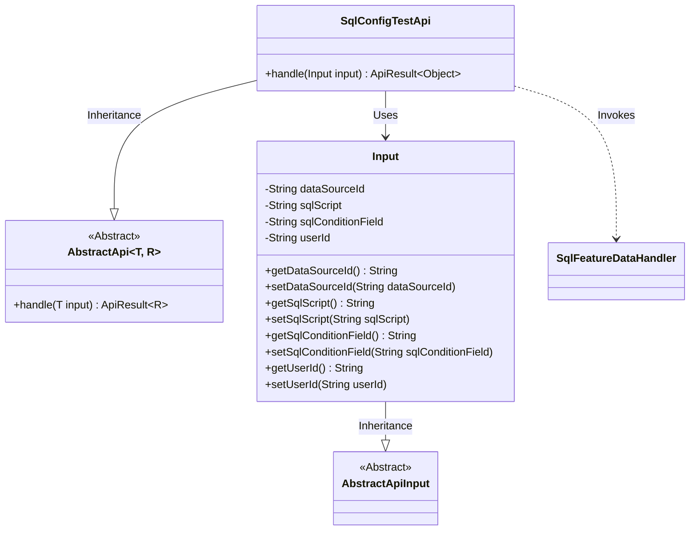

# Basic Information

|      |      |
|------|------|
| Name | SqlConfigTestApi |
| Language | .java |
| Code Path | WeFe/serving/serving-service/src/main/java/com/welab/wefe/serving/service/api/predict/SqlConfigTestApi.java |
| Package Name | com.welab.wefe.serving.service.api.predict |
| Dependencies | ['com.welab.wefe.common.fieldvalidate.annotation.Check', 'com.welab.wefe.common.web.api.base.AbstractApi', 'com.welab.wefe.common.web.api.base.Api', 'com.welab.wefe.common.web.dto.AbstractApiInput', 'com.welab.wefe.common.web.dto.ApiResult', 'com.welab.wefe.serving.service.feature.SqlFeatureDataHandler'] |
| Brief Description | The SqlConfigTestApi interface is used to test SQL scripts. It accepts parameters including the data source ID, SQL script, query condition fields, and user ID, invokes the SqlFeatureDataHandler.debug method for processing, and returns the result. |

# Description

The code defines an API class named SqlConfigTestApi, designed for testing SQL scripts. The API path is predict/sql_config_test, which inherits from the AbstractApi class, processes input of type Input, and outputs type Object. The input parameters include data source ID, SQL script, query condition field, and user ID, all of which are mandatory. The core logic of the API involves processing the input parameters and returning results via the SqlFeatureDataHandler.debug method. The input class Input contains getter and setter methods for its four fields.

# Class Summary

| Name   | Type  | Description |
|-------|------|-------------|
| SqlConfigTestApi | class | SqlConfigTestApi is used to test SQL scripts, accepting parameters including the data source ID, SQL script, query condition fields, and user ID, then returning the debugging results. |

## Class SqlConfigTestApi

|      |      |
|------|------|
| Access Modifier | @Api(;        path = "predict/sql_config_test",;        name = "sql脚本测试i";);public |
| Type | class |
| Name | SqlConfigTestApi |
| Description | SqlConfigTestApi is used to test SQL scripts, accepting parameters including the data source ID, SQL script, query condition fields, and user ID, then returning the debugging results. |

### UML Class Diagram

This code demonstrates the implementation structure of a SQL configuration test API. SqlConfigTestApi inherits from the generic abstract class AbstractApi, specifying Input as the parameter type and Object as the return type. The inner class Input inherits from AbstractApiInput and contains four mandatory fields with their getter/setter methods. The API invokes the debug method of SqlFeatureDataHandler through the handle method for SQL debugging. The class diagram clearly illustrates the inheritance relationships and dependencies between classes, reflecting the design pattern where the API processes input parameters and returns debugging results.

### Internal Method Call Graph

```mermaid
graph TD
    A["Class SqlConfigTestApi"]
    B["Annotation: @Api(path='predict/sql_config_test', name='SQL script test i')"]
    C["Inheritance: AbstractApi<Input, Object>"]
    D["Method: handle(Input input)"]
    E["Invocation: SqlFeatureDataHandler.debug()"]
    F["Return: ApiResult<Object>"]
    G["Inner Class Input"]
    H["Property: String dataSourceId"]
    I["Property: String sqlScript"]
    J["Property: String sqlConditionField"]
    K["Property: String userId"]
    L["Getter/Setter methods"]

    A --> B
    A --> C
    A --> D
    D --> E
    E --> F
    A --> G
    G --> H
    G --> I
    G --> J
    G --> K
    G --> L
```

This code defines an SQL configuration test API class SqlConfigTestApi, which inherits from AbstractApi and processes input parameters of type Input. The main workflow involves invoking SqlFeatureDataHandler.debug() through the handle method to execute SQL debugging, returning encapsulated results. The Input inner class includes essential parameters such as data source ID, SQL script, query condition field, and user ID, with validation performed via annotations. The entire structure clearly illustrates the API request processing flow and data transfer path.

### Field List

| Name  | Type  | Description |
|-------|-------|------|

### Method List

| Name  | Type  | Description |
|-------|-------|------|
| handle | ApiResult<Object> | Rewrite the method to handle input, call SqlFeatureDataHandler.debug, and return a successful result, with parameters including the data source ID, SQL script, condition field, and user ID. |

