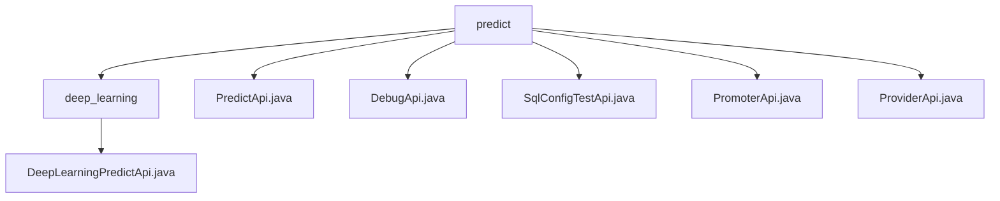

# Basic Information

|      |      |
|------|------|
| Name | predict |
| Language | .java |
| Code Path | WeFe/serving/serving-service/src/main/java/com/welab/wefe/serving/service/api/predict |
| Package Name | docs.serving.serving-service.src.main.java.com.welab.wefe.serving.service.api.predict |
| Brief Description | Deep Learning Prediction API class, path `predict/deep_learning`, no login required, decompresses the model and invokes PaddleServing for prediction. Input includes model ID and image path, output includes image and JSON results. `PredictApi` supports signed access, checks model status, handles batch or single-user predictions, and requires fields such as `requestId` in the input. `DebugApi` is used for debugging, path `predict/debug`, input requires model ID, etc., and performs prediction after parameter validation. `SqlConfigTestApi` tests SQL scripts, path `predict/sql_config_test`, input requires mandatory fields such as data source ID. `PromoterApi` and `ProviderApi` are located at paths `predict/promoter` and `predict/provider` respectively, support signed access, check model status, handle single prediction, and require fields such as `requestId` in the input. |

# Description

## Overview  
The core responsibility of this module is to provide a unified deep learning model prediction service, supporting functionalities such as single/batch prediction, debugging, and SQL configuration testing. The interface specifications adhere to the constraints of the AbstractApi base class, with both input and output using structured types (e.g., Input/PredictResult). Access permissions are controlled via paths (e.g., predict/deep_learning) and signatures. Key data structures include the Input class, which contains fields such as model ID and user features, and the Output class, which supports mixed image/JSON formats. External dependencies involve the PaddleServing service, file decompression tools, and SQL query engines. For example, DebugApi validates the effectiveness of feature data through the Predictor.debug method.  

## Key Business Scenarios  
The module primarily serves the end-to-end model prediction workflow, including three modes: conventional prediction (similar to RESTful interfaces), debugging validation, and SQL configuration testing. All interaction modes adopt a request-response mechanism, supporting batch feature data processing (e.g., userIds mapping) and single real-time prediction. Typical applications include PromoterApi checking model availability before executing predictions, or SqlConfigTestApi testing the compatibility of SQL scripts with feature data. API types encompass basic prediction (PredictApi), domain-specific customization (ProviderApi), and utility classes (DebugApi), such as enabling batch inference via featureDataMap.

### Package Internal Structure View

This flowchart illustrates the API file structure of the predict module in the WeFe project. The predict directory serves as the root, containing 5 direct child files (PredictApi, DebugApi, etc.) and 1 subdirectory deep_learning. The deep_learning directory includes the implementation file DeepLearningPredictApi.java, forming a clear hierarchical relationship that fully presents the file organization structure of the prediction service APIs.

# File List

| Name   | Type  | Description |
|-------|------|-------------|
| [PredictApi.java](PredictApi.md) | file | The PredictApi provides model prediction functionality, supporting both single-user and batch predictions. It requires parameters such as request ID and model identifier, and returns prediction results after verifying the model's online status. |
| [DebugApi.java](DebugApi.md) | file | The DebugApi class provides model prediction functionality, processes input parameters, and returns prediction results, including parameter validation and exception handling. |
| [SqlConfigTestApi.java](SqlConfigTestApi.md) | file | The SqlConfigTestApi interface is used to test SQL scripts. It accepts parameters such as the data source ID, SQL script, query condition fields, and user ID, invokes the SqlFeatureDataHandler.debug method for processing, and returns the result. |
| [PromoterApi.java](PromoterApi.md) | file | The PromoterApi provides model prediction functionality, supporting both single and batch predictions. Input parameters include request ID, model ID, user ID, and feature data. If the model is not online or the parameters are invalid, an error is returned; upon success, the prediction results are returned. |
| [ProviderApi.java](ProviderApi.md) | file | The ProviderApi provides prediction functionality and supports single-item prediction, requiring verification of whether the model is online. The input includes request ID, model ID, user ID, etc. After validating the required fields, it invokes Predictor.predict to return the result. Error messages are returned in case of exceptions. |
| [deep_learning](deep_learning/_module.md) | package | Deep learning prediction API class, no login required, accepts model ID and image path, decompresses model files, then invokes PaddleServing service to process the image and returns results. |

