# Basic Information

|      |      |
|------|------|
| Name | DeepLearningPredictApi |
| Language | .java |
| Code Path | WeFe/serving/serving-service/src/main/java/com/welab/wefe/serving/service/api/predict/deep_learning/DeepLearningPredictApi.java |
| Package Name | com.welab.wefe.serving.service.api.predict.deep_learning |
| Dependencies | ['com.welab.wefe.common.fieldvalidate.annotation.Check', 'com.welab.wefe.common.file.decompression.SuperDecompressor', 'com.welab.wefe.common.util.JObject', 'com.welab.wefe.common.web.api.base.AbstractApi', 'com.welab.wefe.common.web.api.base.Api', 'com.welab.wefe.common.web.dto.AbstractApiInput', 'com.welab.wefe.common.web.dto.ApiResult', 'com.welab.wefe.serving.service.utils.DeepLearningUtil', 'com.welab.wefe.serving.service.utils.ServingFileUtil', 'java.io.File', 'java.nio.file.Path'] |
| Brief Description | Deep learning prediction API class, no login required, receives model ID and image path, unpacks the model file, invokes the PaddleServing service to process the image, and returns the result. |

# Description

This is an API class named "Deep Learning Prediction", with the path "predict/deep_learning", accessible without login. The class inherits from AbstractApi, accepts parameters of type Input, and returns a string result. Its main functions include: decompressing model files to a specified directory, invoking the PaddleServing service for prediction, and returning the prediction result as a string. The Input class contains a required model ID parameter and an optional image path parameter. The Output class includes prediction results in both image and JSON formats. The entire process involves operations such as file decompression, path handling, and deep learning service invocation.

# Class Summary

| Name   | Type  | Description |
|-------|------|-------------|
| DeepLearningPredictApi | class | Deep learning prediction API class, no login required, accepts model ID and image path, unpacks model files and invokes PaddleServing service for prediction, returns result string. |


## Class DeepLearningPredictApi

|      |      |
|------|------|
| Access Modifier | @Api(;        path = "predict/deep_learning",;        name = "深度学习预测",;        login = false;);public |
| Type | class |
| Name | DeepLearningPredictApi |
| Description | Deep learning prediction API class, no login required, accepts model ID and image path, unpacks model files and invokes PaddleServing service for prediction, returns result string. |


### UML Class Diagram

```mermaid
classDiagram
    class AbstractApi~T, R~ {
        <<Abstract>>
        +handle(T input) ApiResult~R~
    }

    class DeepLearningPredictApi {
        +handle(Input input) ApiResult~String~
        -getWordDir(String modelId) String
        -unZipModelFile(String modelId, Path distDirPath) void
    }

    class AbstractApiInput {
        <<Abstract>>
    }

    class Input {
        -String modelId
        -String imagePath
        +getModelId() String
        +setModelId(String modelId) void
        +getImagePath() String
        +setImagePath(String imagePath) void
    }

    class Output {
        +String images
        +JObject resultJson
        +Output(String images, JObject resultJson)
    }

    class ServingFileUtil$DeepLearningModelFile {
        <<Static>>
        +getZipFileUnzipDir(String modelId) Path
        +getZipFile(String modelId) File
        +getPredictOutputPath(String modelId) Path
    }

    class SuperDecompressor {
        <<Static>>
        +decompression(File zipFile, String outputPath, boolean overwrite) void
    }

    class DeepLearningUtil {
        <<Static>>
        +callPaddleServing(String imagePath, String labelFile, String outputPath, String modelDir) String
    }

    DeepLearningPredictApi --|> AbstractApi~Input, String~
    Input --|> AbstractApiInput
    DeepLearningPredictApi --> ServingFileUtil$DeepLearningModelFile : uses
    DeepLearningPredictApi --> SuperDecompressor : uses
    DeepLearningPredictApi --> DeepLearningUtil : uses
```

This code demonstrates the implementation structure of a deep learning prediction API. The DeepLearningPredictApi inherits from the generic abstract class AbstractApi, processes Input parameters, and returns string results. Key functionalities include: retrieving model file paths via ServingFileUtil, decompressing model files using SuperDecompressor, and invoking Paddle Serving services through DeepLearningUtil for predictions. The Input class contains model ID and image path parameters, while the Output class encapsulates prediction results. The entire workflow involves collaboration among multiple components such as file operations, model decompression, and service calls, exemplifying a typical implementation pattern for deep learning service APIs.


### Internal Method Call Graph

```mermaid
graph TD
    A["Class DeepLearningPredictApi"]
    B["Inheritance: AbstractApi<Input, String>"]
    C["Method: handle(Input input)"]
    D["Method: getWordDir(String modelId)"]
    E["Method: unZipModelFile(String modelId, Path distDirPath)"]
    F["Inner Class: Input"]
    G["Inner Class: Output"]
    H["Annotation: @Api"]

    A --> B
    A --> C
    A --> D
    A --> E
    A --> F
    A --> G
    A -.-> H

    C --> D1["Step 1: Call getWordDir to unzip model"]
    C --> D2["Step 2: Get prediction output path"]
    C --> D3["Step 3: Invoke PaddleServing service"]
    C --> D4["Step 4: Return result string"]

    D --> E1["Check and unzip model file"]
    E --> E2["Unzip if directory does not exist"]

    F --> F1["Field: modelId"]
    F --> F2["Field: imagePath"]
    F --> F3["Getter/Setter methods"]

    G --> G1["Field: images"]
    G --> G2["Field: resultJson"]
```



This code implements a deep learning prediction API, with core functionalities including processing input data, decompressing model files, invoking PaddleServing for prediction, and returning results. The structure is clearly organized, containing definitions for input/output classes and core business logic handling methods. API metadata is configured via annotations, while concrete business processes are implemented by inheriting from an abstract API class. The flowchart illustrates the main class structure and method invocation relationships, highlighting the complete workflow from input processing to result delivery.

### Field List

| Name  | Type  | Description |
|-------|-------|------|

### Method List

| Name  | Type  | Description |
|-------|-------|------|
| unZipModelFile | void | Extract the model files to the specified directory. If the directory does not exist, extract them from the compressed file. |
| getWordDir | String | This method retrieves the decompression directory path using the model ID, and returns the directory path string after decompressing the model files. |
| handle | ApiResult<String> | The method processes the input data, extracts the zip file to a specified directory, invokes the deep learning service to handle the images, and returns the prediction results. |


