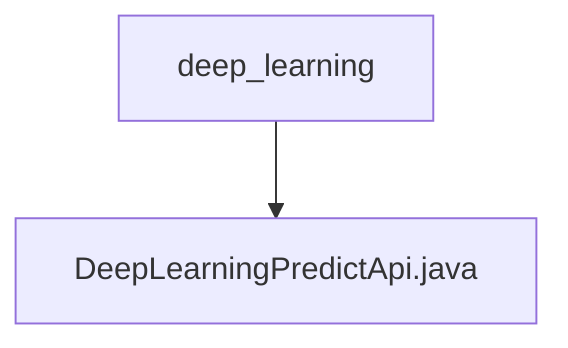

# Basic Information

|      |      |
|------|------|
| Name | deep_learning |
| Language | .java |
| Code Path | WeFe/serving/serving-service/src/main/java/com/welab/wefe/serving/service/api/predict/deep_learning |
| Package Name | docs.serving.serving-service.src.main.java.com.welab.wefe.serving.service.api.predict.deep_learning |
| Brief Description | Deep learning prediction API class, no login required, accepts model ID and image path, decompresses model files, then invokes PaddleServing service to process the image and returns results. |

# Description

This is an API class named "Deep Learning Prediction" with the path "predict/deep_learning", accessible without login. The class inherits from AbstractApi, accepts parameters of type Input, and returns a string result. Its main functionalities include: decompressing model files to a specified directory, invoking the PaddleServing service for prediction, and returning the prediction result as a string. The Input class contains a mandatory model ID and an optional image path parameter. The Output class includes prediction results in both image and JSON formats. The entire process involves operations such as file decompression, path handling, and deep learning service invocation.

### Package Internal Structure View

This flowchart illustrates the hierarchical path of the deep learning prediction API. The top-level directory is "deep_learning", which contains a specific implementation file "DeepLearningPredictApi.java". This represents a typical Java project structure where API implementation classes reside under specific functional module directories, reflecting the concept of modular development.

# File List

| Name   | Type  | Description |
|-------|------|-------------|
| [DeepLearningPredictApi.java](DeepLearningPredictApi.md) | file | Deep learning prediction API class, no login required, receives model ID and image path, unpacks model files, then invokes PaddleServing service to process the image and returns results. |

