# Basic Information

|      |      |
|------|------|
| Name | QueryListApi |
| Language | .java |
| Code Path | WeFe/serving/serving-service/src/main/java/com/welab/wefe/serving/service/api/requeststatistics/QueryListApi.java |
| Package Name | com.welab.wefe.serving.service.api.requeststatistics |
| Dependencies | ['com.welab.wefe.common.exception.StatusCodeWithException', 'com.welab.wefe.common.web.api.base.AbstractApi', 'com.welab.wefe.common.web.api.base.Api', 'com.welab.wefe.common.web.dto.ApiResult', 'com.welab.wefe.serving.service.database.entity.RequestStatisticsMysqlModel', 'com.welab.wefe.serving.service.dto.PagingInput', 'com.welab.wefe.serving.service.dto.PagingOutput', 'com.welab.wefe.serving.service.service.RequestStatisticsService', 'org.springframework.beans.factory.annotation.Autowired', 'java.io.IOException', 'java.util.Date'] |
| Brief Description | API class for querying request statistics list, which accepts pagination parameters, time range, service name, and client name, and returns paginated request statistics results. |

# Description

The code defines an API class named QueryListApi, which is used to query request statistics lists. The API path is requeststatistics/query-list, inheriting from AbstractApi, with the input type as the inner class Input and the output as a paginated RequestStatisticsMysqlModel. The Input class includes pagination parameters and four query conditions: start time, end time, service name, and client name, all of which provide getter and setter methods. The processing logic calls the queryList method of requestStatisticsService and returns the result.

# Class Summary

| Name   | Type  | Description |
|-------|------|-------------|
| QueryListApi | class | The QueryListApi is used for paginated querying of request statistics lists. It takes inputs including start and end times, service names, and client names, and invokes the RequestStatisticsService to return paginated results. |


## Class QueryListApi

|      |      |
|------|------|
| Access Modifier | @Api(path = "requeststatistics/query-list", name = "query request statistics list");public |
| Type | class |
| Name | QueryListApi |
| Description | The QueryListApi is used for paginated querying of request statistics lists. It takes inputs including start and end times, service names, and client names, and invokes the RequestStatisticsService to return paginated results. |


### UML Class Diagram

```mermaid
classDiagram
    class QueryListApi {
        -RequestStatisticsService requestStatisticsService
        +handle(Input input) ApiResult~PagingOutput~RequestStatisticsMysqlModel~~
    }
    
    class AbstractApi~T, R~ {
        <<Abstract>>
        +handle(T input) ApiResult~R~
    }
    
    class PagingInput {
        <<Abstract>>
    }
    
    class Input {
        -Date startTime
        -Date endTime
        -String serviceId
        -String clientId
        +getStartTime() Date
        +setStartTime(Date startTime)
        +getEndTime() Date
        +setEndTime(Date endTime)
        +getServiceId() String
        +setServiceId(String serviceId)
        +getClientId() String
        +setClientId(String clientId)
    }
    
    class PagingOutput~T~ {
        <<Generic>>
    }
    
    class RequestStatisticsMysqlModel {
    }
    
    class RequestStatisticsService {
        +queryList(Input input) PagingOutput~RequestStatisticsMysqlModel~
    }
    
    QueryListApi --|> AbstractApi~Input, PagingOutput~RequestStatisticsMysqlModel~~ : Inheritance
    Input --|> PagingInput : Inheritance
    QueryListApi --> RequestStatisticsService : Dependency
    RequestStatisticsService ..> PagingOutput~RequestStatisticsMysqlModel~ : Creates
    RequestStatisticsService ..> Input : Uses
```

This code describes a query request statistics list API class QueryListApi, which inherits from the generic abstract class AbstractApi, processes Input parameters, and returns paginated RequestStatisticsMysqlModel results. The Input class inherits from PagingInput and includes query conditions such as time range, service ID, and client ID. QueryListApi implements core business logic by relying on the queryList method of RequestStatisticsService, demonstrating a typical layered architecture design pattern.


### Internal Method Call Graph

```mermaid
graph TD
    A["Class QueryListApi"]
    B["Inheritance: AbstractApi<Input, PagingOutput<RequestStatisticsMysqlModel>>"]
    C["Dependency: RequestStatisticsService"]
    D["Overridden Method: handle(Input input)"]
    E["Inner Class: Input"]
    F["Property: Date startTime"]
    G["Property: Date endTime"]
    H["Property: String serviceId"]
    I["Property: String clientId"]
    J["Getter/Setter Methods"]

    A --> B
    A --> C
    A --> D
    A --> E
    E --> F
    E --> G
    E --> H
    E --> I
    E --> J
    D -->|Invokes| C
    D -->|Returns| B
```



This code defines an API class named QueryListApi, which inherits from AbstractApi and handles the logic for paginated query requests of statistical data. The class includes an inner class Input to encapsulate query parameters (start/end time, service ID, and client ID). It implements business logic by overriding the handle method to call the queryList method of RequestStatisticsService. The flowchart clearly illustrates class inheritance, dependency injection, method overriding, and inner class structure.

### Field List

| Name  | Type  | Description |
|-------|-------|------|
| requestStatisticsService | RequestStatisticsService | Automatically inject the RequestStatisticsService service instance. |

### Method List

| Name  | Type  | Description |
|-------|-------|------|
| handle | ApiResult<PagingOutput<RequestStatisticsMysqlModel>> | Rewrite the handle method to call the service for querying the list and return paginated results. |


