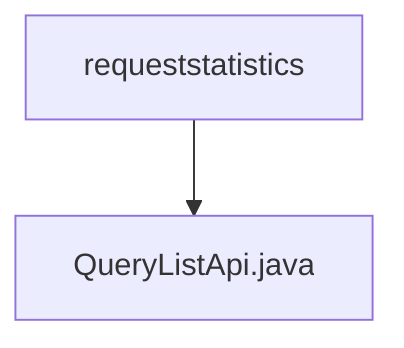

# Basic Information

|      |      |
|------|------|
| Name | requeststatistics |
| Language | .java |
| Code Path | WeFe/serving/serving-service/src/main/java/com/welab/wefe/serving/service/api/requeststatistics |
| Package Name | docs.serving.serving-service.src.main.java.com.welab.wefe.serving.service.api.requeststatistics |
| Brief Description | API class for querying request statistics list, which accepts pagination parameters, time range, service name, and client name, and returns paginated request statistics results. |

# Description

The code defines an API class named QueryListApi, which is used to query request statistics lists. The API path is requeststatistics/query-list, inheriting from AbstractApi, with the input type as an inner class Input and the output as paginated RequestStatisticsMysqlModel. The Input class includes pagination parameters and four query conditions: start time, end time, service name, and client name, all equipped with getter and setter methods. The processing logic invokes the queryList method of requestStatisticsService and returns the result.

### Package Internal Structure View

This flowchart illustrates the hierarchical relationship between the requeststatistics directory and the QueryListApi.java file in the WeFe project. As the parent node, requeststatistics contains a child node QueryListApi.java, indicating that this is an API interface file stored under the request statistics feature module directory. The entire structure clearly reflects the storage location relationship of the code files within the project.

# File List

| Name   | Type  | Description |
|-------|------|-------------|
| [QueryListApi.java](QueryListApi.md) | file | API class for querying request statistics list, which accepts pagination parameters, time range, service name, and client name, and returns paginated request statistics results. |

