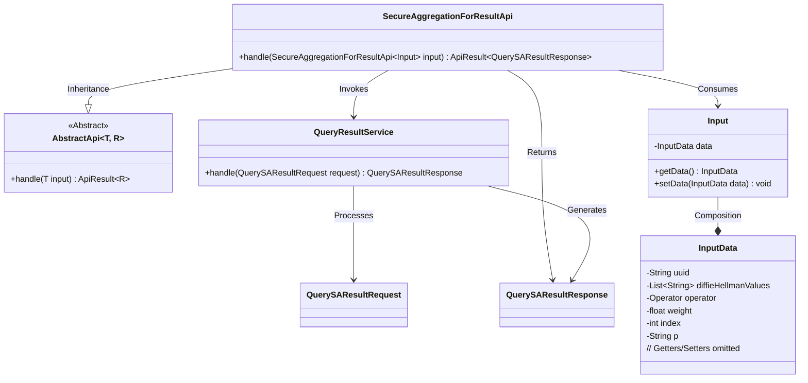

# Basic Information

|      |      |
|------|------|
| Name | SecureAggregationForResultApi |
| Language | .java |
| Code Path | WeFe/serving/serving-service/src/main/java/com/welab/wefe/serving/service/api/sa/SecureAggregationForResultApi.java |
| Package Name | com.welab.wefe.serving.service.api.sa |
| Dependencies | ['java.io.IOException', 'java.util.List', 'com.welab.wefe.common.exception.StatusCodeWithException', 'com.welab.wefe.common.util.JObject', 'com.welab.wefe.common.web.api.base.AbstractApi', 'com.welab.wefe.common.web.api.base.Api', 'com.welab.wefe.common.web.dto.AbstractApiInput', 'com.welab.wefe.common.web.dto.ApiResult', 'com.welab.wefe.common.web.util.ModelMapper', 'com.welab.wefe.mpc.commom.Operator', 'com.welab.wefe.mpc.sa.SecureAggregationApiName', 'com.welab.wefe.mpc.sa.request.QuerySAResultRequest', 'com.welab.wefe.mpc.sa.request.QuerySAResultResponse', 'com.welab.wefe.mpc.sa.server.service.QueryResultService'] |
| Brief Description | The SecureAggregationForResultApi handles secure aggregation result queries, receiving inputs containing parameters such as uuid, DH public key, operator, weights, etc. It invokes the QueryResultService to process the request and returns the response. |

# Description

SecureAggregationForResultApi is an API class that handles secure aggregation results, inheriting from AbstractApi. It takes Input class as input and outputs QuerySAResultResponse. The API path is SA_RESULT, and no login is required. The handle method processes input requests, invokes the QueryResultService, and logs request and response details. The Input class contains InputData, which includes fields such as the request identifier uuid, a list of participant DH public keys diffieHellmanValues, the operator operator, weight weight, participant index index, and DH mode p. It provides getter and setter methods for each field.

# Class Summary

| Name   | Type  | Description |
|-------|------|-------------|
| SecureAggregationForResultApi | class | The SecureAggregationForResultApi handles secure aggregation result queries, receiving inputs containing parameters such as UUID, DH public key lists, operators, weights, etc. It invokes the QueryResultService to process the request and returns the response. |

## Class SecureAggregationForResultApi

|      |      |
|------|------|
| Access Modifier | @Api(path = SecureAggregationApiName.SA_RESULT, name = "sa_result", login = false);public |
| Type | class |
| Name | SecureAggregationForResultApi |
| Description | The SecureAggregationForResultApi handles secure aggregation result queries, receiving inputs containing parameters such as UUID, DH public key lists, operators, weights, etc. It invokes the QueryResultService to process the request and returns the response. |

### UML Class Diagram

This code implements a secure aggregation result query API. The core class SecureAggregationForResultApi inherits from the generic abstract class AbstractApi, processing input data containing cryptographic parameters (DH public keys, operators, etc.) and generating query responses via QueryResultService. The class structure consists of three nested layers: the main API class, input parameter class (Input) with its data class (InputData), and service classes that complete the secure computation request processing flow. It involves multiple data type conversions and logging functionalities.

### Internal Method Call Graph

```mermaid
graph TD
    A["Class SecureAggregationForResultApi"]
    B["Inheritance: AbstractApi<Input, QuerySAResultResponse>"]
    C["Annotation: @Api"]
    D["Method: handle(Input input)"]
    E["Create: QueryResultService"]
    F["Log request information"]
    G["Data mapping: ModelMapper.map"]
    H["Invoke: service.handle"]
    I["Log response information"]
    J["Return: success(response)"]
    K["Inner class Input"]
    L["Property: InputData data"]
    M["getter/setter methods"]
    N["Inner class InputData"]
    O["Properties: String uuid, List<String> diffieHellmanValues, etc."]
    P["getter/setter methods"]

    A --> B
    A --> C
    A --> D
    D --> E
    D --> F
    D --> G
    D --> H
    D --> I
    D --> J
    A --> K
    K --> L
    K --> M
    A --> N
    N --> O
    N --> P
```

This code demonstrates the implementation of a secure aggregation result API, primarily consisting of request processing flow and data structure definitions. The flowchart clearly presents the class inheritance relationship, the execution steps of the core method handle() (including service invocation, data transformation, and logging), as well as the structures of two inner classes Input and InputData. The InputData class encapsulates request parameters such as UUID, DH public key list, operators, and other fields, providing access interfaces through getter/setter methods. The overall design reflects a standard pattern for API request processing, covering the complete workflow from request reception, business processing, to response return.

### Field List

| Name  | Type  | Description |
|-------|-------|------|

### Method List

| Name  | Type  | Description |
|-------|-------|------|
| handle | ApiResult<QuerySAResultResponse> | Process the secure aggregation result request, log input and output, invoke the service, and return the response. |

