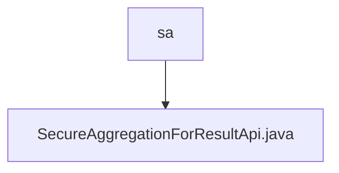

# Basic Information

|      |      |
|------|------|
| Name | sa |
| Language | .java |
| Code Path | WeFe/serving/serving-service/src/main/java/com/welab/wefe/serving/service/api/sa |
| Package Name | docs.serving.serving-service.src.main.java.com.welab.wefe.serving.service.api.sa |
| Brief Description | The SecureAggregationForResultApi handles secure aggregation result queries, accepting inputs containing parameters such as uuid, DH public key, operator, weights, etc. It invokes the QueryResultService to process the request and returns a response. |

# Description

SecureAggregationForResultApi is an API class for handling secure aggregation results, inheriting from AbstractApi. It takes the Input class as input and outputs QuerySAResultResponse. The API path is SA_RESULT, and no login is required. The handle method processes input requests, invokes the QueryResultService service, and logs request and response details. The Input class contains InputData, which includes fields such as the request identifier uuid, a list of participant DH public keys diffieHellmanValues, the operator operator, weight weight, participant index index, and DH mode p. Getter and setter methods are provided for each field.

### Package Internal Structure View

This flowchart illustrates the API file structure of the secure aggregation module in the WeFe project. The top-level directory "sa" contains a Java class file named SecureAggregationForResultApi.java, which implements the secure aggregation functionality and serves as the core business logic implementation file for this module. The entire structure is concise and clear, reflecting the single responsibility design principle.

# File List

| Name   | Type  | Description |
|-------|------|-------------|
| [SecureAggregationForResultApi.java](SecureAggregationForResultApi.md) | file | The SecureAggregationForResultApi handles secure aggregation result queries, receiving inputs containing parameters such as uuid, DH public key, operator, weights, etc., invokes the QueryResultService to process the request, and returns the response. |

