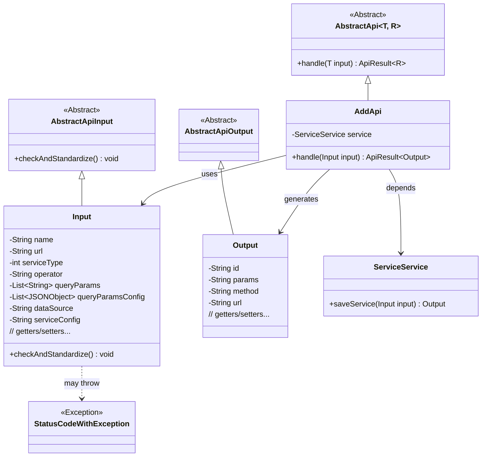
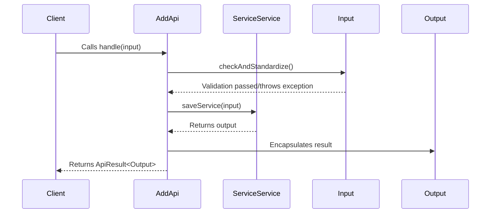

# Basic Information

|      |      |
|------|------|
| Name | AddApi |
| Language | .java |
| Code Path | WeFe/serving/serving-service/src/main/java/com/welab/wefe/serving/service/api/service/AddApi.java |
| Package Name | com.welab.wefe.serving.service.api.service |
| Dependencies | ['java.io.IOException', 'java.util.List', 'org.apache.commons.lang3.StringUtils', 'org.springframework.beans.factory.annotation.Autowired', 'com.alibaba.fastjson.JSONArray', 'com.alibaba.fastjson.JSONObject', 'com.welab.wefe.common.StatusCode', 'com.welab.wefe.common.exception.StatusCodeWithException', 'com.welab.wefe.common.fieldvalidate.annotation.Check', 'com.welab.wefe.common.util.JObject', 'com.welab.wefe.common.web.api.base.AbstractApi', 'com.welab.wefe.common.web.api.base.Api', 'com.welab.wefe.common.web.dto.AbstractApiInput', 'com.welab.wefe.common.web.dto.AbstractApiOutput', 'com.welab.wefe.common.web.dto.ApiResult', 'com.welab.wefe.serving.service.enums.ServiceTypeEnum', 'com.welab.wefe.serving.service.service.ServiceService'] |
| Brief Description | The `AddApi` class is used to add services and includes input and output classes. The input class validates parameters such as service name, address, and type, while the output class returns the ID, parameters, methods, and URL. The processing logic invokes the service to save the service and returns the result. |

# Description

The code defines an API class named `AddApi`, which is used to add services. The API path is `"service/add"`, inheriting from the `AbstractApi` class and handling `Input` and `Output` type data. The `Input` class includes required fields such as service name, address, and type, as well as optional fields like operations and query parameter configurations, with strict parameter validation applied. The `Output` class returns the service ID, parameters, method type, and URL. The core logic involves saving the input data via `ServiceService` and returning the output result. Validations include checks for service type, non-null validation of data source and service configurations, as well as legality checks for URL format.

# Class Summary

| Name   | Type  | Description |
|-------|------|-------------|
| AddApi | class | The AddApi class handles service addition requests, with inputs including mandatory fields such as service name, address, and type, and outputs returning service ID, parameters, methods, and URL. Input validation covers service type, data source, configuration, and address format. |

## Class AddApi

|      |      |
|------|------|
| Access Modifier | @Api(path = "service/add", name = "add service");public |
| Type | class |
| Name | AddApi |
| Description | The AddApi class handles service addition requests, with inputs including mandatory fields such as service name, address, and type, and outputs returning service ID, parameters, methods, and URL. Input validation covers service type, data source, configuration, and address format. |

### UML Class Diagram

This class diagram illustrates the structural relationships of AddApi and its associated classes. AddApi inherits from the generic abstract class AbstractApi, processes Input, and generates Output. The Input class extends AbstractApiInput, containing multiple validation fields and complex parameter validation logic. Output is a simple data transfer object. ServiceService is injected as a dependency service, and StatusCodeWithException represents a potential exception type. The overall structure reflects layered design and rigorous parameter validation.

### Internal Method Call Graph

```mermaid
graph TD
    A["Class AddApi"]
    B["Annotation: @Api(path='service/add', name='add service')"]
    C["Inheritance: AbstractApi<Input, Output>"]
    D["Dependency Injection: @Autowired ServiceService service"]
    E["Overridden Method: handle(Input input)"]
    F["Inner Class: Output"]
    G["Inner Class: Input"]
    H["Output Properties: id, params, method='POST', url"]
    I["Input Properties: name, url, serviceType etc."]
    J["Input Method: checkAndStandardize()"]

    A --> B
    A --> C
    A --> D
    A --> E
    A --> F
    A --> G
    F --> H
    G --> I
    G --> J
    E -->|Invokes| D
    E -->|Returns| F
    J -->|Validates| I
```

This flowchart illustrates the structure of the AddApi class, including annotations, inheritance relationships, dependency injection, and two inner classes (Input/Output). The sequence diagram depicts the complete workflow when a client invokes the handle method: first validating input parameters, then saving the service via ServiceService, and finally returning the encapsulated result. The Input class contains strict parameter validation logic, while the Output class defines a standard response format. The entire process implements the API functionality for service addition.

### Field List

| Name  | Type  | Description |
|-------|-------|------|
| service | ServiceService | Automatically inject the ServiceService instance. |

### Method List

| Name  | Type  | Description |
|-------|-------|------|
| handle | ApiResult<Output> | Java method override, processes input and invokes service to save, returns success result or exception. |

