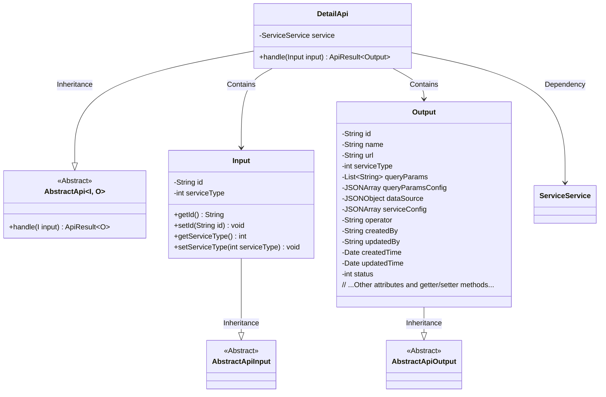

# Basic Information

|      |      |
|------|------|
| Name | DetailApi |
| Language | .java |
| Code Path | WeFe/serving/serving-service/src/main/java/com/welab/wefe/serving/service/api/service/DetailApi.java |
| Package Name | com.welab.wefe.serving.service.api.service |
| Dependencies | ['com.alibaba.fastjson.JSONArray', 'com.alibaba.fastjson.JSONObject', 'com.welab.wefe.common.exception.StatusCodeWithException', 'com.welab.wefe.common.fieldvalidate.annotation.Check', 'com.welab.wefe.common.util.JObject', 'com.welab.wefe.common.web.api.base.AbstractApi', 'com.welab.wefe.common.web.api.base.Api', 'com.welab.wefe.common.web.dto.AbstractApiInput', 'com.welab.wefe.common.web.dto.AbstractApiOutput', 'com.welab.wefe.common.web.dto.ApiResult', 'com.welab.wefe.common.wefe.enums.Algorithm', 'com.welab.wefe.common.wefe.enums.FederatedLearningType', 'com.welab.wefe.common.wefe.enums.JobMemberRole', 'com.welab.wefe.common.wefe.enums.PredictFeatureDataSource', 'com.welab.wefe.serving.service.dto.ModelSqlConfigOutput', 'com.welab.wefe.serving.service.dto.ModelStatusOutput', 'com.welab.wefe.serving.service.dto.TreeNode', 'com.welab.wefe.serving.service.service.ServiceService', 'org.springframework.beans.factory.annotation.Autowired', 'java.io.IOException', 'java.util.Date', 'java.util.List'] |
| Brief Description | Service Details API class, processes the input ID and service type, and returns output containing detailed information such as service configuration, data sources, status, etc. |

# Description

The DetailApi is an API class for handling service details, which inherits from AbstractApi and has the path "service/detail". It accepts Input parameters, including the mandatory primary key id and service type, retrieves detail data through ServiceService, and returns the Output result. The Output includes basic service information such as id, name, URL, and service type, as well as detailed fields like query parameters, data sources, and configurations. It also covers extended information such as algorithms, federated learning types, model parameters, and SQL scripts. Exceptions are caught during processing, and failure messages are returned.

# Class Summary

| Name   | Type  | Description |
|-------|------|-------------|
| DetailApi | class | Service Details API class, which processes the input ID and service type, and returns an output containing detailed information such as service configuration, data sources, and model parameters. |

## Class DetailApi

|      |      |
|------|------|
| Access Modifier | @Api(path = "service/detail", name = "服务详情");public |
| Type | class |
| Name | DetailApi |
| Description | Service Details API class, which processes the input ID and service type, and returns an output containing detailed information such as service configuration, data sources, and model parameters. |

### UML Class Diagram

This code defines a service detail API (DetailApi) that inherits from the generic abstract class AbstractApi, handling input (Input) and output (Output) types. The Input class contains id and serviceType fields with validation annotations, while the Output class includes numerous service detail-related fields. DetailApi retrieves detail data through ServiceService and handles potential exceptions. The class diagram illustrates inheritance and dependency relationships, with Input and Output as nested classes extending abstract input/output base classes respectively.

### Internal Method Call Graph

```mermaid
graph TD
    A["Class DetailApi"]
    B["Annotation: @Api(path='service/detail', name='Service Details')"]
    C["Inheritance: AbstractApi<Input, Output>"]
    D["Dependency Injection: @Autowired ServiceService service"]
    E["Overridden Method: handle(Input input)"]
    F["Nested Class: Input"]
    G["Nested Class: Output"]
    H["Input Properties: String id, int serviceType"]
    I["Input Methods: getter/setter"]
    J["Output Properties: 25 fields"]
    K["Output Methods: getter/setter"]

    A --> B
    A --> C
    A --> D
    A --> E
    A --> F
    A --> G
    F --> H
    F --> I
    G --> J
    G --> K
    E -->|try| L["Invoke: service.detail(input)"]
    E -->|catch| M["Handle Exception: e.printStackTrace(), fail(e.getMessage())"]
    L --> N["Return: success(result)"]
    M --> O["Return: fail(message)"]
```

This flowchart illustrates the core structure of the DetailApi class, including class annotations, inheritance relationships, dependency injection, and the main method call chain. It highlights the exception handling flow of the handle method: normally invoking service.detail and returning a success result, while printing the stack trace and returning an error message in case of exceptions. The nested Input and Output classes contain validation-annotated fields and complex output data structures, respectively, with properties exposed via getter/setter methods. The diagram presents the core path of API request processing and the relationships between data structures.

### Field List

| Name  | Type  | Description |
|-------|-------|------|
| service | ServiceService | Automatically inject the ServiceService instance. |

### Method List

| Name  | Type  | Description |
|-------|-------|------|
| handle | ApiResult<Output> | Process the input and return the service details result. Return the details upon success, or an error message upon failure. |

