# Basic Information

|      |      |
|------|------|
| Name | ExportSDKApi |
| Language | .java |
| Code Path | WeFe/serving/serving-service/src/main/java/com/welab/wefe/serving/service/api/service/ExportSDKApi.java |
| Package Name | com.welab.wefe.serving.service.api.service |
| Dependencies | ['java.io.IOException', 'org.springframework.beans.factory.annotation.Autowired', 'org.springframework.http.ResponseEntity', 'com.welab.wefe.common.exception.StatusCodeWithException', 'com.welab.wefe.common.web.api.base.AbstractApi', 'com.welab.wefe.common.web.api.base.Api', 'com.welab.wefe.common.web.dto.AbstractApiInput', 'com.welab.wefe.common.web.dto.ApiResult', 'com.welab.wefe.serving.service.service.ServiceService'] |
| Brief Description | This is a Java class named ExportSDKApi, designed to handle API requests for exporting the SDK. It extends AbstractApi, accepts an Input parameter, and returns a ResponseEntity. The Input class includes a serviceId field, and the export request is processed via the ServiceService. |

# Description

This is a Java class named `ExportSDKApi`, designed to handle API requests for exporting an SDK. It extends the `AbstractApi` class, with generic parameters specifying the input type as the inner class `Input` and the return type as `ResponseEntity<?>`. The class is annotated with `@Api`, defining the API path as `"service/export_sdk"` and the name as `"export sdk"`. An instance of `ServiceService` is injected via the `@Autowired` annotation. The core method `handle` takes an `Input` parameter, invokes the `service.exportSdk` method, and returns the file result. `Input` is an inner static class that extends `AbstractApiInput` and includes a `serviceId` string property along with its getter and setter methods.

# Class Summary

| Name   | Type  | Description |
|-------|------|-------------|
| ExportSDKApi | class | The `ExportSDKApi` class handles export SDK requests, receives the `serviceId` parameter, calls the `ServiceService` to export the file, and returns the result. The input class `Input` contains the `serviceId` field and its getter/setter methods. |


## Class ExportSDKApi

|      |      |
|------|------|
| Access Modifier | @Api(path = "service/export_sdk", name = "export sdk");public |
| Type | class |
| Name | ExportSDKApi |
| Description | The `ExportSDKApi` class handles export SDK requests, receives the `serviceId` parameter, calls the `ServiceService` to export the file, and returns the result. The input class `Input` contains the `serviceId` field and its getter/setter methods. |


### UML Class Diagram

```mermaid
classDiagram
    class ExportSDKApi {
        -ServiceService service
        +handle(Input input) ApiResult~ResponseEntity~?~
    }
    class AbstractApi~T, R~ {
        <<Abstract>>
        +handle(T input) ApiResult~R~
    }
    class AbstractApiInput {
        <<Abstract>>
    }
    class Input {
        -String serviceId
        +String getServiceId()
        +void setServiceId(String serviceId)
    }
    class ServiceService {
        <<Interface>>
        +exportSdk(String serviceId) Object
    }

    ExportSDKApi --|> AbstractApi~Input, ResponseEntity~?~ : Inheritance
    Input --|> AbstractApiInput : Inheritance
    ExportSDKApi --> ServiceService : Dependency
    ExportSDKApi --> Input : Composition
```

Class Diagram Description: This diagram illustrates a Spring framework-based API implementation structure. The ExportSDKApi inherits from the generic abstract class AbstractApi, processes Input parameters, and returns ResponseEntity. The Input, as an inner class, extends AbstractApiInput and contains a serviceId field. ExportSDKApi utilizes the exportSdk method of the ServiceService interface through dependency injection, forming a typical controller-service layered architecture that complies with RESTful API design specifications.


### Internal Method Call Graph

```mermaid
graph TD
    A["Class ExportSDKApi"]
    B["Annotation: @Api(path='service/export_sdk', name='export sdk')"]
    C["Inheritance: AbstractApi<Input, ResponseEntity<?>>"]
    D["Dependency Injection: @Autowired ServiceService service"]
    E["Overridden Method: handle(Input input)"]
    F["Inner Class: Input"]
    G["Field: String serviceId"]
    H["Method: getServiceId()"]
    I["Method: setServiceId(String)"]
    J["Invocation: service.exportSdk(input.getServiceId())"]
    K["Return: file(export result)"]

    A --> B
    A --> C
    A --> D
    A --> E
    A --> F
    F --> G
    F --> H
    F --> I
    E --> J
    J --> K
```



This flowchart illustrates the complete structure of the ExportSDKApi class, including API annotations, parent class inheritance, service injection, and core processing logic. The handle method invokes the exportSdk service via serviceId and ultimately returns the encapsulated file result. The inner class Input is responsible for encapsulating the service ID parameter and provides standard getter/setter methods. The overall design adheres to Spring Boot API development standards, achieving clear parameter passing and separation of business processing.

### Field List

| Name  | Type  | Description |
|-------|-------|------|
| service | ServiceService | Automatically injects a private member variable `service` of type `ServiceService`. |

### Method List

| Name  | Type  | Description |
|-------|-------|------|
| handle | ApiResult<ResponseEntity<?>> | Process the input and invoke the service export SDK, returning file results or exceptions. |


