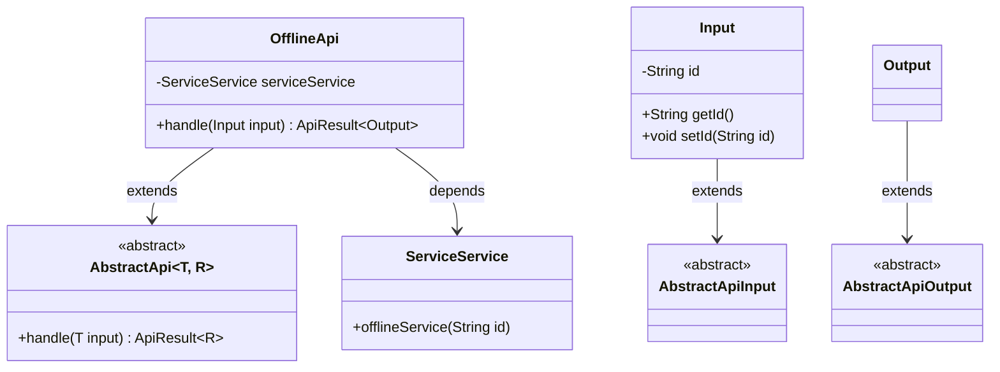

# Basic Information

|      |      |
|------|------|
| Name | OfflineApi |
| Language | .java |
| Code Path | WeFe/serving/serving-service/src/main/java/com/welab/wefe/serving/service/api/service/OfflineApi.java |
| Package Name | com.welab.wefe.serving.service.api.service |
| Dependencies | ['java.io.IOException', 'org.springframework.beans.factory.annotation.Autowired', 'com.welab.wefe.common.exception.StatusCodeWithException', 'com.welab.wefe.common.fieldvalidate.annotation.Check', 'com.welab.wefe.common.web.api.base.AbstractApi', 'com.welab.wefe.common.web.api.base.Api', 'com.welab.wefe.common.web.dto.AbstractApiInput', 'com.welab.wefe.common.web.dto.AbstractApiOutput', 'com.welab.wefe.common.web.dto.ApiResult', 'com.welab.wefe.serving.service.service.ServiceService'] |
| Brief Description | Offline service API class, handles service deactivation requests, requires passing the ID parameter, invokes serviceService to complete the operation, and returns a successful result. |

# Description

The code defines an API class named `OfflineApi` for handling service deactivation operations. The class annotation specifies the API path as `service/offline` and the name as `offline service`. It inherits from `AbstractApi`, using generics to designate the input type as the inner class `Input` and the output type as the inner class `Output`.  

The `Input` class contains a string property named `id`, annotated with a primary key validation annotation, and provides getter and setter methods. The `Output` class is empty and inherits from `AbstractApiOutput`.  

The `handle` method invokes the `offlineService` method of the injected `ServiceService` to perform the deactivation operation, with `id` as the input parameter, and returns an empty result upon success. The entire API design is concise and focused on a single functionality.

# Class Summary

| Name   | Type  | Description |
|-------|------|-------------|
| OfflineApi | class | The OfflineApi class handles offline service requests, receives input containing an ID, calls the serviceService to take the service offline, and returns a successful result. |

## Class OfflineApi

|      |      |
|------|------|
| Access Modifier | @Api(path = "service/offline", name = "offline service");public |
| Type | class |
| Name | OfflineApi |
| Description | The OfflineApi class handles offline service requests, receives input containing an ID, calls the serviceService to take the service offline, and returns a successful result. |

### UML Class Diagram

Class Diagram Description: This diagram illustrates the structure where the OfflineApi class inherits from the generic abstract class AbstractApi<Input, Output>, with Input and Output extending AbstractApiInput and AbstractApiOutput respectively. OfflineApi injects the ServiceService dependency via @Autowired and overrides the handle method to implement specific business logic. The input class Input contains an id field and its accessors, while the output class Output is an empty implementation. Together, they form a typical API processing class hierarchy.

### Internal Method Call Graph

```mermaid
graph TD
    A["Class OfflineApi"]
    B["Annotation: @Api(path='service/offline', name='offline service')"]
    C["Inheritance: AbstractApi<Input, Output>"]
    D["Dependency Injection: @Autowired ServiceService"]
    E["Overridden Method: handle(Input input)"]
    F["Invocation: serviceService.offlineService(input.getId())"]
    G["Return: success()"]
    H["Nested Class Input"]
    I["Property: @Check String id"]
    J["Nested Class Output"]
    K["getter/setter: getId()/setId()"]

    A --> B
    A --> C
    A --> D
    A --> E
    E --> F
    E --> G
    A --> H
    H --> I
    H --> K
    A --> J
```

This code describes an API class named OfflineApi, which inherits from AbstractApi and handles offline service requests. The class structure includes an Input parameter (with ID validation) and an empty Output. The core logic invokes serviceService through the handle method to complete the service offline operation. The flowchart illustrates the complete structure including class annotations, inheritance relationships, dependency injection, method invocations, and nested classes.

### Field List

| Name  | Type  | Description |
|-------|-------|------|
| serviceService | ServiceService | Using @Autowired to automatically inject the ServiceService instance. |

### Method List

| Name  | Type  | Description |
|-------|-------|------|
| handle | ApiResult<Output> | Method override, process the input and invoke the service offline, returning the result upon success. |

