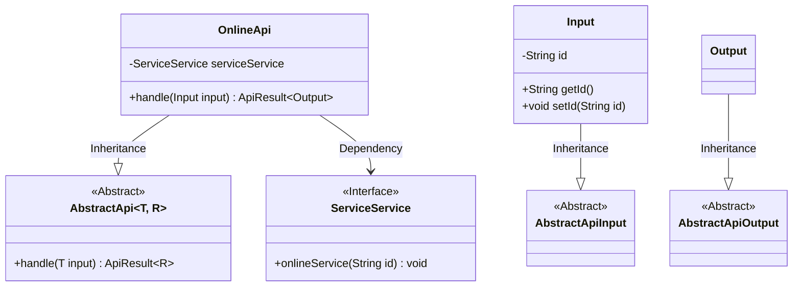

# Basic Information

|      |      |
|------|------|
| Name | OnlineApi |
| Language | .java |
| Code Path | WeFe/serving/serving-service/src/main/java/com/welab/wefe/serving/service/api/service/OnlineApi.java |
| Package Name | com.welab.wefe.serving.service.api.service |
| Dependencies | ['java.io.IOException', 'org.springframework.beans.factory.annotation.Autowired', 'com.welab.wefe.common.exception.StatusCodeWithException', 'com.welab.wefe.common.fieldvalidate.annotation.Check', 'com.welab.wefe.common.web.api.base.AbstractApi', 'com.welab.wefe.common.web.api.base.Api', 'com.welab.wefe.common.web.dto.AbstractApiInput', 'com.welab.wefe.common.web.dto.AbstractApiOutput', 'com.welab.wefe.common.web.dto.ApiResult', 'com.welab.wefe.serving.service.service.ServiceService'] |
| Brief Description | The OnlineApi class provides an online service interface, which receives input containing an ID, calls the serviceService.onlineService for processing, and returns a successful result. |

# Description

The code defines an API class named OnlineApi for handling online service requests. The class annotation specifies the API path as "service/online" and the name as "online service". It inherits from AbstractApi, using generics to designate the input type as OnlineApi.Input and the output type as OnlineApi.Output. The ServiceService dependency is injected via @Autowired. The handle method accepts an Input object, invokes the onlineService method of serviceService to process the request, and returns a successful result. The Input inner class extends AbstractApiInput and contains a string property named id, validated with the @Check annotation. The Output inner class extends AbstractApiOutput and is currently empty. The entire API implements basic online service functionality.

# Class Summary

| Name   | Type  | Description |
|-------|------|-------------|
| OnlineApi | class | The OnlineApi class provides an online service interface. It invokes the serviceService.onlineService method by passing an id and returns a successful result. The input parameter is id, and the output is empty. |

## Class OnlineApi

|      |      |
|------|------|
| Access Modifier | @Api(path = "service/online", name = "online service");public |
| Type | class |
| Name | OnlineApi |
| Description | The OnlineApi class provides an online service interface. It invokes the serviceService.onlineService method by passing an id and returns a successful result. The input parameter is id, and the output is empty. |

### UML Class Diagram

This code illustrates the implementation structure of an online service API. OnlineApi inherits from the generic abstract class AbstractApi, processing data of Input and Output types. The Input class contains a service ID field with its accessors, inheriting from AbstractApiInput; Output is an empty implementation inheriting from AbstractApiOutput. OnlineApi utilizes the onlineService method of the ServiceService interface through dependency injection. The overall design follows the Template Method pattern, where the abstract class defines the processing framework and subclasses implement specific business logic.

### Internal Method Call Graph

```mermaid
graph TD
    A["Class OnlineApi"]
    B["Annotation: @Api(path='service/online', name='online service')"]
    C["Inheritance: AbstractApi<Input, Output>"]
    D["Dependency Injection: @Autowired ServiceService"]
    E["Overridden Method: handle(Input input)"]
    F["Inner Class: Input"]
    G["Inner Class: Output"]
    H["Input Property: String id"]
    I["Input Methods: getId/setId"]
    J["Invocation: serviceService.onlineService"]
    K["Return: success()"]

    A --> B
    A --> C
    A --> D
    A --> E
    A --> F
    A --> G
    F --> H
    F --> I
    E --> J
    E --> K
```

This flowchart illustrates the structure and key behaviors of the OnlineApi class. OnlineApi is an API-annotated class that inherits from the generic abstract class AbstractApi, containing two nested Input and Output classes. The core logic resides in the handle method, which invokes the onlineService method through the injected serviceService and returns a success result. The Input class includes an id field with validation annotations and its corresponding getter/setter methods.

### Field List

| Name  | Type  | Description |
|-------|-------|------|
| serviceService | ServiceService | Using @Autowired to automatically inject the ServiceService instance. |

### Method List

| Name  | Type  | Description |
|-------|-------|------|
| handle | ApiResult<Output> | Rewrite the handle method to call the onlineService for processing the input ID, returning the result upon success. Throw a StatusCodeWithException or IOException in case of exceptions. |

