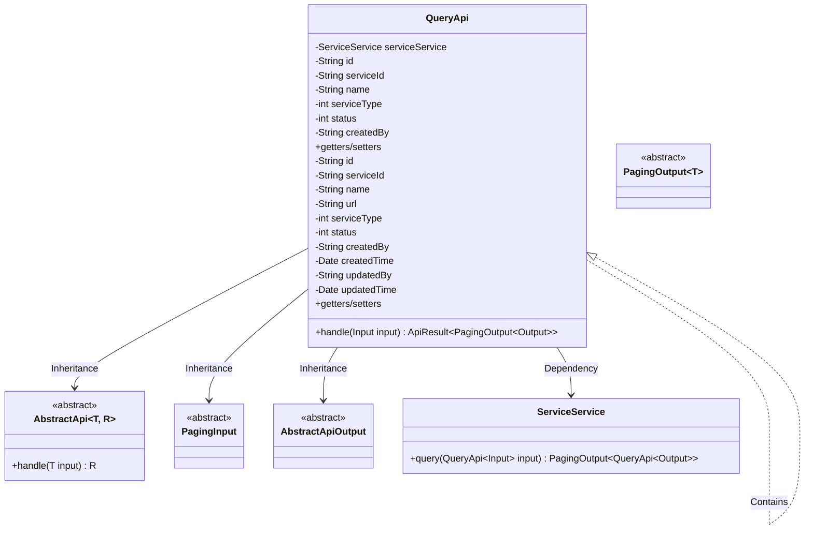

# Basic Information

|      |      |
|------|------|
| Name | QueryApi |
| Language | .java |
| Code Path | WeFe/serving/serving-service/src/main/java/com/welab/wefe/serving/service/api/service/QueryApi.java |
| Package Name | com.welab.wefe.serving.service.api.service |
| Dependencies | ['java.io.IOException', 'java.util.Date', 'org.springframework.beans.factory.annotation.Autowired', 'com.welab.wefe.common.exception.StatusCodeWithException', 'com.welab.wefe.common.web.api.base.AbstractApi', 'com.welab.wefe.common.web.api.base.Api', 'com.welab.wefe.common.web.dto.AbstractApiOutput', 'com.welab.wefe.common.web.dto.ApiResult', 'com.welab.wefe.serving.service.dto.PagingInput', 'com.welab.wefe.serving.service.dto.PagingOutput', 'com.welab.wefe.serving.service.service.ServiceService'] |
| Brief Description | The QueryApi class is used to query service lists, including the definitions of input parameters and output results. The input supports pagination, service type, and status filtering, while the output includes service details and pagination information. |

# Description

The QueryApi class is an API interface designed for querying service lists, inheriting from AbstractApi. It processes Input parameters and returns paginated results in the form of PagingOutput<Output>. The Input class includes pagination parameters as well as query conditions such as service ID, name, type, status, and creator. The Output class contains detailed information like service ID, name, URL, type, status, creation time, and update time. This API implements the query logic through the query method of ServiceService, encapsulating the results as ApiResult.

# Class Summary

| Name   | Type  | Description |
|-------|------|-------------|
| QueryApi | class | The QueryApi class provides paginated query functionality for service lists, including definitions for input parameters and output results. The input supports filtering by service name, type, status, etc., while the output includes service ID, name, URL, type, status, and creation/update information. |

## Class QueryApi

|      |      |
|------|------|
| Access Modifier | @Api(path = "service/query", name = "query service list");public |
| Type | class |
| Name | QueryApi |
| Description | The QueryApi class provides paginated query functionality for service lists, including definitions for input parameters and output results. The input supports filtering by service name, type, status, etc., while the output includes service ID, name, URL, type, status, and creation/update information. |

### UML Class Diagram

This code demonstrates a query service API implementation, including input/output data structures and business logic processing. QueryApi inherits from the generic abstract class AbstractApi and utilizes ServiceService to handle specific query operations. The input class Input extends PagingInput to implement pagination parameters, while the output class Output extends AbstractApiOutput and contains service detail fields. The class diagram clearly illustrates the inheritance, dependency, and containment relationships between components, reflecting principles of layered design and separation of responsibilities.

### Internal Method Call Graph

```mermaid
graph TD
    A["Class QueryApi"]
    B["Annotation: @Api"]
    C["Inheritance: AbstractApi<Input, PagingOutput<Output>>"]
    D["Dependency Injection: @Autowired ServiceService"]
    E["Overridden Method: handle(Input input)"]
    F["Inner Class: Output"]
    G["Inner Class: Input"]
    H["Output Properties: id, serviceId, name, url..."]
    I["Input Properties: id, serviceId, name, serviceType..."]
    J["Method Invocation: serviceService.query(input)"]
    K["Return Result: success()"]

    A --> B
    A --> C
    A --> D
    A --> E
    A --> F
    A --> G
    F --> H
    G --> I
    E --> J
    J --> K
```

This code demonstrates a Spring framework-based query API implementation, primarily consisting of the main QueryApi class and its two nested classes Input and Output. The flowchart clearly illustrates the class structure relationships: QueryApi inherits basic functionality from AbstractApi, utilizes @ServiceService for business logic processing, and returns paginated results through the handle method after processing input parameters. The nested Input class encapsulates query condition parameters, while Output defines the structure of returned data. The entire flow starts from the API entry point, proceeds through service invocation, and ultimately returns properly encapsulated result data.

### Field List

| Name  | Type  | Description |
|-------|-------|------|
| serviceService | ServiceService | Using @Autowired to automatically inject the ServiceService instance. |

### Method List

| Name  | Type  | Description |
|-------|-------|------|
| handle | ApiResult<PagingOutput<Output>> | Rewrite the handle method to call serviceService.query for processing the input and return paginated results. |

