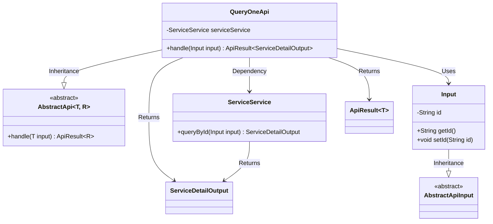

# Basic Information

|      |      |
|------|------|
| Name | QueryOneApi |
| Language | .java |
| Code Path | WeFe/serving/serving-service/src/main/java/com/welab/wefe/serving/service/api/service/QueryOneApi.java |
| Package Name | com.welab.wefe.serving.service.api.service |
| Dependencies | ['org.springframework.beans.factory.annotation.Autowired', 'com.welab.wefe.common.web.api.base.AbstractApi', 'com.welab.wefe.common.web.api.base.Api', 'com.welab.wefe.common.web.dto.AbstractApiInput', 'com.welab.wefe.common.web.dto.ApiResult', 'com.welab.wefe.serving.service.dto.ServiceDetailOutput', 'com.welab.wefe.serving.service.service.ServiceService'] |
| Brief Description | QueryOneApi is an API for querying services by ID. It takes an ID as input and outputs service details, utilizing the serviceService.queryById method to perform the query. |

# Description

This code defines an API class named QueryOneApi, which is used to query service details by ID. The class inherits from AbstractApi, specifying the input type as Input and the output type as ServiceDetailOutput. The API path is "service/query-one", and its name is "query service by id". The inner class Input contains a string-type id field along with its getter and setter methods. The handle method processes the input parameters by invoking the queryById method of the injected ServiceService and returns a successful result encapsulated as ApiResult.

# Class Summary

| Name   | Type  | Description |
|-------|------|-------------|
| QueryOneApi | class | QueryOneApi is an interface for querying services by ID, which takes an ID as input and outputs service details, processing the request by invoking the queryById method of serviceService. |

## Class QueryOneApi

|      |      |
|------|------|
| Access Modifier | @Api(path = "service/query-one", name = "query service by id");public |
| Type | class |
| Name | QueryOneApi |
| Description | QueryOneApi is an interface for querying services by ID, which takes an ID as input and outputs service details, processing the request by invoking the queryById method of serviceService. |

### UML Class Diagram

Class Diagram Description: The diagram illustrates that the QueryOneApi class inherits from the generic AbstractApi class and depends on ServiceService to query service details. Input, as an inner class, inherits from AbstractApiInput and contains an id attribute with getter/setter methods. ApiResult and ServiceDetailOutput are used as return types. The overall structure demonstrates an abstract template-based API implementation pattern, where data is retrieved through the service layer and returned as wrapped results.

### Internal Method Call Graph

```mermaid
graph TD
    A["Class QueryOneApi"]
    B["Annotation: @Api(path='service/query-one', name='query service by id')"]
    C["Inheritance: AbstractApi<Input, ServiceDetailOutput>"]
    D["Dependency Injection: @Autowired ServiceService"]
    E["Overridden Method: handle(Input input)"]
    F["Inner Class: Input"]
    G["Field: String id"]
    H["Method: String getId()"]
    I["Method: void setId(String id)"]
    J["Invocation: serviceService.queryById(input)"]
    K["Return: ApiResult.success(result)"]

    A --> B
    A --> C
    A --> D
    A --> E
    E --> J
    J --> K
    A -.-> F
    F --> G
    F --> H
    F --> I
```

This code defines an API class named QueryOneApi for querying service details by ID. The class inherits from AbstractApi, utilizes @ServiceService for business logic processing, and invokes queryById through the handle method to query services. The inner class Input encapsulates the request parameter id along with its getter/setter methods. The flowchart illustrates the class structure, method invocation relationships, and data processing flow, demonstrating the complete chain from request handling to result return.

### Field List

| Name  | Type  | Description |
|-------|-------|------|
| serviceService | ServiceService | Automatically inject the ServiceService instance. |

### Method List

| Name  | Type  | Description |
|-------|-------|------|
| handle | ApiResult<ServiceDetailOutput> | This code rewrites a method, which calls the queryById method of serviceService to process the input parameters and returns the result encapsulated as a successful ApiResult. |

