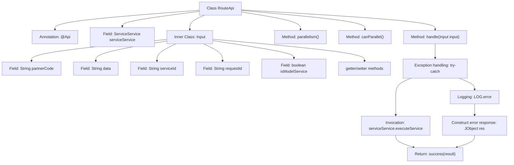

# Basic Information

|      |      |
|------|------|
| Name | RouteApi |
| Language | .java |
| Code Path | WeFe/serving/serving-service/src/main/java/com/welab/wefe/serving/service/api/service/RouteApi.java |
| Package Name | com.welab.wefe.serving.service.api.service |
| Dependencies | ['org.springframework.beans.factory.annotation.Autowired', 'com.welab.wefe.common.fieldvalidate.annotation.Check', 'com.welab.wefe.common.util.JObject', 'com.welab.wefe.common.web.api.base.AbstractApi', 'com.welab.wefe.common.web.api.base.Api', 'com.welab.wefe.common.web.api.base.Caller', 'com.welab.wefe.common.web.dto.AbstractApiInput', 'com.welab.wefe.common.web.dto.ApiResult', 'com.welab.wefe.serving.service.enums.ServiceResultEnum', 'com.welab.wefe.serving.service.service.ServiceService'] |
| Brief Description | RouteApi is an API service class that processes input and invokes services for execution, supporting concurrency with a maximum parallelism of 20. The input includes fields such as collaborator ID and request data. Upon successful execution, it returns the result; otherwise, it returns an error message. |

# Description

RouteApi is an API class that inherits from AbstractApi, with the path "api", name "api service", allowing forwarding and signed access, and domain as Caller.Customer. It processes requests with input type Input and output type JObject. The class injects ServiceService, and the handle method calls executeService to execute the service, returning the result upon success or an error code and message upon failure. The maximum parallelism is 20, allowing concurrency. The Input inner class includes fields such as collaborator ID, request data, service ID, mandatory request ID, and whether it is a model service, all with getter and setter methods.

# Class Summary

| Name   | Type  | Description |
|-------|------|-------------|
| RouteApi | class | RouteApi is an API service class with the path "api," allowing signed access. It processes input and invokes service execution, supporting concurrency with a maximum parallelism of 20. The input includes mandatory fields such as collaborator ID, request data, and service ID. |


## Class RouteApi

|      |      |
|------|------|
| Access Modifier | @Api(path = "api", name = "api service", forward = true, allowAccessWithSign = true, domain = Caller.Customer);public |
| Type | class |
| Name | RouteApi |
| Description | RouteApi is an API service class with the path "api," allowing signed access. It processes input and invokes service execution, supporting concurrency with a maximum parallelism of 20. The input includes mandatory fields such as collaborator ID, request data, and service ID. |


### UML Class Diagram

```mermaid
classDiagram
    class RouteApi {
        -ServiceService serviceService
        +handle(Input input) ApiResult~JObject~
        +parallelism() int
        +canParallel() boolean
    }

    class AbstractApi~T, R~ {
        <<Abstract>>
        +handle(T input) ApiResult~R~
        +parallelism() int
        +canParallel() boolean
    }

    class ServiceService {
        +executeService(RouteApi.Input input) JObject
    }

    class ApiResult~T~ {
        +success(T data) ApiResult~T~
    }

    class JObject {
        +put(String key, Object value) void
    }

    class RouteApi$Input {
        -String partnerCode
        -String data
        -String serviceId
        -String requestId
        -boolean isModelService
        +getPartnerCode() String
        +setPartnerCode(String partnerCode) void
        +getData() String
        +setData(String data) void
        +getServiceId() String
        +setServiceId(String serviceId) void
        +getRequestId() String
        +setRequestId(String requestId) void
        +isModelService() boolean
        +setModelService(boolean modelService) void
    }

    class AbstractApiInput {
        <<Abstract>>
    }

    RouteApi --|> AbstractApi~RouteApi$Input, JObject~ : Inheritance
    RouteApi --> ServiceService : Dependency
    RouteApi$Input --|> AbstractApiInput : Inheritance
    RouteApi ..> RouteApi$Input : Composition
    AbstractApi~T, R~ ..> ApiResult~R~ : Usage
    ServiceService ..> JObject : Returns
```

This code demonstrates the implementation architecture of a routing API, where RouteApi inherits from the generic abstract class AbstractApi, processes specific input type Input, and returns JObject results. RouteApi relies on ServiceService to execute business logic, with Input as a static inner class encapsulating request parameters. The class diagram clearly illustrates inheritance relationships, dependency relationships, and composition relationships, reflecting the principle of separation of abstraction and implementation in object-oriented design while maintaining type safety through generics. Exception handling flows and concurrency control methods are also represented through class methods.


### Internal Method Call Graph



This code illustrates an API routing class RouteApi, extending AbstractApi, primarily handling service requests. The flowchart clearly presents the class structure, including annotations, fields, core method handle() with its exception handling flow, and the field structure of inner class Input. The handle method attempts to execute the service, returning results upon success or logging errors and returning error-code responses upon failure. The class also defines parallelism control and concurrency permission methods, demonstrating a complete API request processing mechanism.

### Field List

| Name  | Type  | Description |
|-------|-------|------|
| serviceService | ServiceService | Automatically inject the ServiceService instance. |

### Method List

| Name  | Type  | Description |
|-------|-------|------|
| handle | ApiResult<JObject> | Process the input and invoke the service, return the result upon success, and log errors while returning failure messages in case of exceptions. |
| parallelism | int | Rewrite the method parallelism to return a parallelism of 20. |
| canParallel | boolean | The method canParallel returns true, indicating support for parallel processing. |


